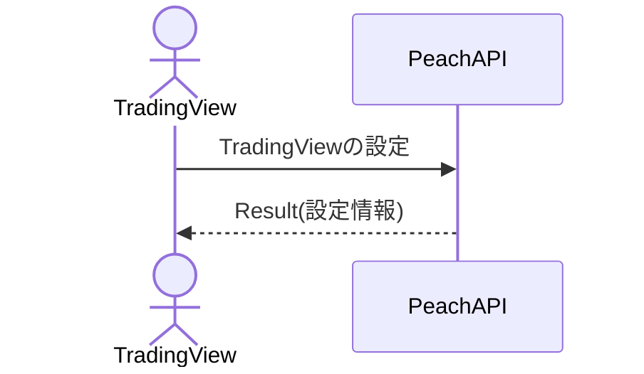

# 概要設計書_120_データフィード構成データ取得(TV)

## 処理概要

---

APIは、TradingViewチャートの各種設定を取得する。

## データフロー

## テーブル等一覧

---

## 処理詳細

1. token 認証

   トークンの有効性を確認する。

   補足資料「S-01.ログイン状態チェック」を参照。

2. データフィード構成DTOへのデータのマッピング

   | データフィード構成DTO    | 価値                                                    | 説明                                                   |
   |--------------------------|---------------------------------------------------------|--------------------------------------------------------|
   | supports_search          | 「外部設定情報」の tradingview.supports_search          | 検索がサポートされているかどうかを示す                 |
   | supports_marks           | 「外部設定情報」の tradingview.supports_marks           | マークがサポートされているかどうかを示す               |
   | supports_timescale_marks | 「外部設定情報」の tradingview.supports_timescale_marks | タイムスケールマークがサポートされているかどうかを示す |
   | supports_time            | 「外部設定情報」の tradingview.supports_time            | 時間がサポートされているかどうかを示す                 |
   | exchanges                | 「外部設定情報」の tradingview.exchanges                | 使用されている取引所リスト                             |
   | symbols_types            | 「外部設定情報」の tradingview.symbols_types            | 使用されている通貨ペアの種類                           |
   | supported_resolutions    | 「外部設定情報」の tradingview.supported_resolutions    | サポートされているチャート種別のリスト                 |

## 外部設定情報

| 設定名                               | 値（参考）                                                   | 備考                                                   |
|--------------------------------------|--------------------------------------------------------------|--------------------------------------------------------|
| tradingview.supports_search          | `true`                                                       | 検索がサポートされているかどうかを示す                 |
| tradingview.supports_marks           | `true`                                                       | マークがサポートされているかどうかを示す               |
| tradingview.supports_timescale_marks | `true`                                                       | タイムスケールマークがサポートされているかどうかを示す |
| tradingview.supports_time            | `true`                                                       | 時間がサポートされているかどうかを示す                 |
| tradingview.exchanges                | `CTFX`                                                       | 使用されている取引所リスト                             |
| tradingview.symbols_types            | `FOREX`                                                      | 使用されている通貨ペアの種類                           |
| tradingview.supported_resolutions    | `1S`,`1`,`5`,`15`,`30`,`60`,`120`,`240`,`480`,`1D`,`1W`,`1M` | サポートされているチャート種別のリスト                 |

## 更新条件

---

## 更新履歴

| 更新日     | 更新者 | 更新内容 |
|------------|--------|----------|
| 2024/07/16 | Hung   | 新規作成 |
