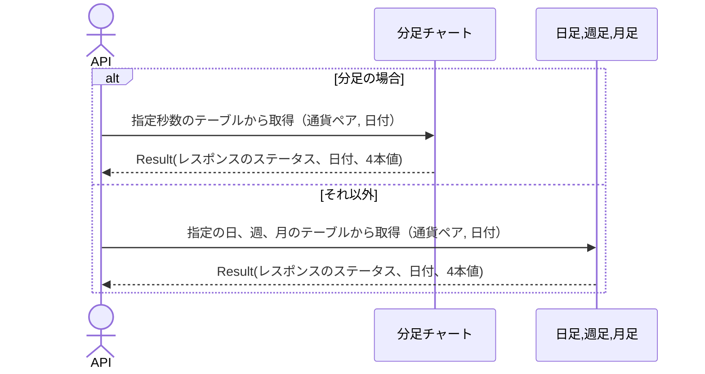

# 概要設計書_121_バー取得(TV)

## 処理概要

---

APIは、4本値(high,low,close,open)の情報を取得する。

   1. リクエスト情報（「BidAsk平均」、「通貨ペアCD」、「チャート種別」、「開始時間＊」、「終了時間＊」）を受け取る

   2. キャッシュデータを取得する

   3. レスポンス情報（「レスポンスのステータス」、「日時」、「高値」「安値」、「始値」、「終値」」）を返す

リクエストとレスポンスのプロパティ等は、別紙「Peach API」を参照。

＊は、任意

チャート種別：
- 1S:1秒、1:1分、5:5分、10:10分、15:15分、30:30分、60:1時間、120:2時間、240:4時間、480:8時間、1D:日足、1W:週足、1M:月足

APIのキャッシュデータ取得処理と別スレッドのデータキャッシュ処理が同時にキャッシュにアクセスしないように同期化（synchronized）する。

## データフロー

## 仕様変更

---

## テーブル等一覧

---

| #  | テーブル名    | テーブル名称 | スキーマ  | 参照(x) | 備考 |
|----|---------------|--------------|-----------|---------|------|
| 1  | t_chart_1     | 1秒足        | plum_info | x       | -    |
| 2  | t_chart_60    | 1分足        | plum_info | x       | -    |
| 3  | t_chart_300   | 5分足        | plum_info | x       | -    |
| 4  | t_chart_600   | 10分足       | plum_info | x       | -    |
| 5  | t_chart_900   | 15分足       | plum_info | x       | -    |
| 6  | t_chart_1800  | 30分足       | plum_info | x       | -    |
| 7  | t_chart_3600  | 1時間足      | plum_info | x       | -    |
| 8  | t_chart_7200  | 2時間足      | plum_info | x       | -    |
| 9  | t_chart_14400 | 4時間足      | plum_info | x       | -    |
| 10 | t_chart_28800 | 8時間足      | plum_info | x       | -    |
| 11 | t_chart_day   | 日足         | plum_info | x       | -    |
| 12 | t_chart_week  | 週足         | plum_info | x       | -    |
| 13 | t_chart_month | 月足         | plum_info | x       | -    |

## 処理詳細

### データ取得

1. バリデーション確認

   | パラメータ | 必須 | 長さ | 範囲 | 形式(型、メール等) | メモ                                                                           |
   |------------|------|------|------|--------------------|--------------------------------------------------------------------------------|
   | bid_ask    | x    | 3    | -    | 文字               | `BID`,`MID`,`ASK`だけ                                                          |
   | symbol     | x    | 6    | -    | 文字               |                                                                                |
   | resolution | x    | 3    | -    | 文字               | `1S`、`1`、`5`、`10`、`15` 、`30`、`60`、`120`、`240`、`480`、`1D`、`1W`、`1M` |
   | from       | *1   | -    | -    | 数値               | UNIX タイムスタンプ (UTC) 例：1721037907                                   |
   | to         | *1   | -    | -    | 数値               | UNIX タイムスタンプ (UTC) 例：1721037907, to >= from                       |

   *1 fromがセットされている場合は、toは必須（逆も同様）。

   エラーの場合は、ステータスコード(`422`)、メッセージ（`CODE:30020`）を返す。

2. ヒストリカルデータ取得

   1. 「キャッシュマッピング設定情報」を参照し、該当キャッシュ情報を判断する

   2. TradingView ウィジェットの「resolution」をPeachAPIの「chart_type」にマッピングする
      | TradingView ウィジェット | PeachAPI |
      |--------------------------|----------|
      | 1S                       | 1S       |
      | 1                        | 1M       |
      | 5                        | 5M       |
      | 10                       | 10M      |
      | 15                       | 15M      |
      | 30                       | 30M      |
      | 60                       | 60M      |
      | 120                      | 120M     |
      | 240                      | 240M     |
      | 480                      | 480M     |
      | 1D                       | DAY      |
      | 1W                       | WEEK     |
      | 1M                       | MONTH    |

   3. パラメータの「resolution」が該当チャート種別（`1S`、`1`、`5`、`15`等）の場合は、該当キャッシュ情報（`cache_set_1s`、`cache_set_1m`、`cache_set_5m`、`cache_set_15m`等）から以下の条件と一致するデータを取得（「ヒストリカルデータリスト」）する

      - 「通貨ペアCD」は、パラメータの「symbol」で検索する。

      - パラメータの「from」が指定されている場合は、「チャート日時」がパラメータの「from」以上のデータを検索する。

      - パラメータの「to」が指定されている場合は、「チャート日時」がパラメータの「to」以下のデータを検索する。

      - パラメータの「from」または、パラメータの「to」が指定されていない場合は、キャッシュしている全データを検索する。

      並び順は、チャート日時（昇順）とする。
       
   4. 「ヒストリカルデータリスト」を「バーDTO」にマッピングする

      | バーDTO | 「ヒストリカルデータリスト」の値                   | 説明                               | 備考                                                                                                                                            |
      |---------|----------------------------------------------------|------------------------------------|-------------------------------------------------------------------------------------------------------------------------------------------------|
      | s       | ok                                                 | データが利用可能な場合のステータス |                                                                                                                                                 |
      | t       | 該当キャッシュ情報の「date」,（Unix エポック時間） | チャート日時                       |                                                                                                                                                 |
      | o       | 同「open」                                         | 始値                               | パラメータの「bid_ask」が`BID`の場合、「bid_open」の値、`ASK`の場合は、「ask_open」の値、`MID`の場合は、（「ask_open」+「bid_open」）/2の値     |
      | h       | 同「high」                                         | 高値                               | パラメータの「bid_ask」が`BID`の場合、「bid_high」の値、`ASK`の場合は、「ask_high」の値、`MID`の場合は、（「ask_high」+「bid_high」）/2の値     |
      | l       | 同「low」                                          | 安値                               | パラメータの「bid_ask」が`BID`の場合、「bid_low」の値、`ASK`の場合は、「ask_low」の値、`MID`の場合は、（「ask_low」+「bid_low」）/2の値         |
      | c       | 同「close」                                        | 終値                               | パラメータの「bid_ask」が`BID`の場合、「bid_close」の値、`ASK`の場合は、「ask_close」の値、`MID`の場合は、（「ask_close」+「bid_close」）/2の値 |

      「バーDTO」をレスポンスとして返す。
   
   5. 指定した範囲内にバーが見つからない場合

      - 「from」クエリパラメータより前の日付を持つバーの中で最大のタイムスタンプを見つけ、それを次に使用可能なタイムスタンプとして計算する。

         例:
         「From」パラメータの場合は 2024 年 8 月 24 日である。

            データ キャッシュの内容:
               2024年8月20日
               2024年8月21日
               2024年8月22日
               2024年8月23日
               2024年8月26日
               2024年8月27日
            24日、25日は土日のためデータがない。
            2024年8月23日は2024年8月24日より前の最新の日付であるため、「nextTime」 は2024年8月23日に相当するUnixタイムスタンプに設定される。

      - 「バーDTO」へデータをマッピングする。   
         | バーDTO  | 値                                                    | 説明                   |
         |----------|-------------------------------------------------------|------------------------|
         | s        | no_data                                               | データがないときの状態 |
         | t        | 空のリスト                                            |                        |
         | o        | 空のリスト                                            |                        |
         | h        | 空のリスト                                            |                        |
         | l        | 空のリスト                                            |                        |
         | c        | 空のリスト                                            |                        |
         | nextTime | 「指定した範囲内にバーが見つからない場合」 の処理結果 |                        |

         「バーDTO」をレスポンスとして返す。

## 外部設定情報

---

## キャッシュマッピング設定情報

| チャート種別 | テーブル名    | キャッシュネームスペース名 |
|--------------|---------------|----------------------------|
| 1S           | t_chart_1     | cache_set_1s               |
| 1M           | t_chart_60    | cache_set_1m               |
| 5M           | t_chart_300   | cache_set_5m               |
| 10M          | t_chart_600   | cache_set_10m              |
| 15M          | t_chart_900   | cache_set_15m              |
| 30M          | t_chart_1800  | cache_set_30m              |
| 60M          | t_chart_3600  | cache_set_60m              |
| 120M         | t_chart_7200  | cache_set_120m             |
| 240M         | t_chart_14400 | cache_set_240m             |
| 480M         | t_chart_28800 | cache_set_480m             |
| DAY          | t_chart_day   | cache_set_day              |
| WEEK         | t_chart_week  | cache_set_week             |
| MONTH        | t_chart_month | cache_set_month            |

## 更新条件

---

## 更新履歴

---
| 更新日     | 更新者 | 更新内容 |
|------------|--------|----------|
| 2024/07/16 | Hung   | 新規作成 |
