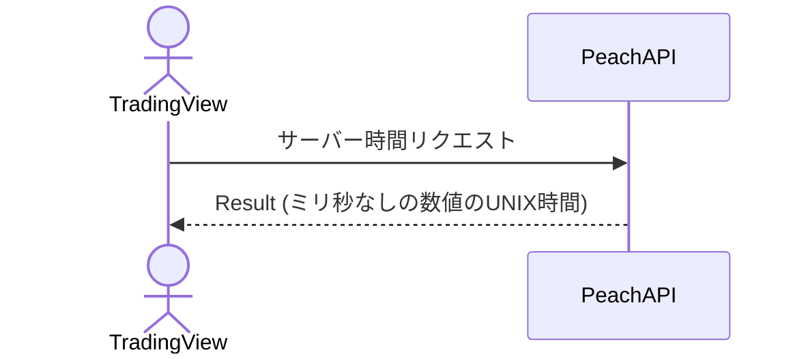

# 概要設計書_122_サーバー時間取得(TV)

## 処理概要

---

APIは、サーバーから Epoch Unix タイムスタンプを取得する。

## データフロー

## テーブル等一覧

---

## 処理詳細
1. レスポンスの「DTO」にマッピングして返す

   | DTO | サーバー時間               | 説明            |
   |-----|----------------------------|-----------------|
   | t   | ミリ秒なしの数値のUNIX時間 | 例： 1445324591 |

   「DTO」をレスポンスとして返す。

## 外部設定情報

## 更新条件

---

## 更新履歴

---
| 更新日     | 更新者 | 更新内容 |
|------------|--------|----------|
| 2024/07/16 | Hung   | 新規作成 |