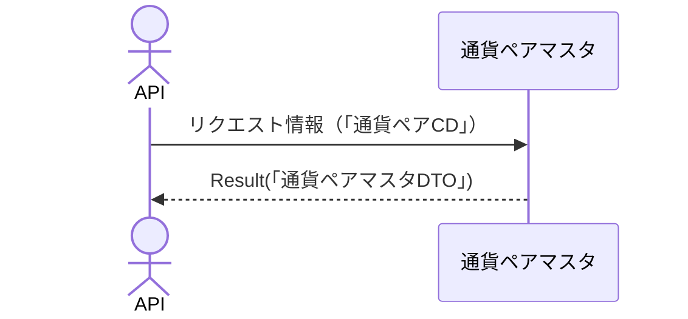

# 概要設計書_123_シンボル情報取得(TV)

## 処理概要

APIは、指定されたシンボル情報をもとに通貨ペア情報を取得する。

   1. リクエスト情報（「通貨ペアCD」）を受け取る

   2. 「通貨ペアマスタ」から情報を取得（「通貨ペアCD」、「通貨ペア名日本語」、「通貨レート単位」）する

   3. レスポンス情報（「通貨ペアマスタDTO」）を返す

リクエストとレスポンスのプロパティ等は、別紙「Peach API」を参照。

## データフロー

## テーブル等一覧

| # | テーブル名 | テーブル名称   | スキーマ | 参照(x) | 備考 |
|---|------------|----------------|----------|---------|------|
| 1 | m_ccypairs | 通貨ペアマスタ | plum     | x       | -    |
| 2 | M_SEASON   | 時期マスタ     | plum     | x       | -    |

## 処理詳細

### 通貨ペア取得

1. token 認証

   トークンの有効性を確認する。

   補足資料「S-01.ログイン状態チェック」を参照。

2. リクエストボディーのバリデーション確認

   | パラメータ | 必須 | 長さ | 範囲 | 形式(型、メール等) | メモ |
   |------------|------|------|------|--------------------|------|
   | symbol     | x    | 6    | -    | 文字               |      |

   エラーの場合は、ステータスコード(`422`)、メッセージ（`CODE:30020`）を返す。

3. 通貨ペア取得

   [1]から以下の条件で取得（「通貨ペア」）する。

      - 「通貨ペアCD」はパラメータの「symbol」と一致する。

      - 「削除済」 が`0`と一致する。

   データが取得できない場合は、ステータスコード(`404`)、メッセージ（`CODE:30404`）を返す。

4. 「通貨ペア」を「通貨ペアマスタDTO」にマッピングする

    | 通貨ペアマスタDTO     | 「通貨ペア」の値                                    | 説                                                                                                                       |
    |-----------------------|-----------------------------------------------------|--------------------------------------------------------------------------------------------------------------------------|
    | name                  | [1]の「ccypair_cd」                                 | 通貨ペアCD                                                                                                               |
    | description           | 同「ccypair_jp」                                    | 通貨ペアの説明。この通貨ペアのチャートの凡例に表示される                                                                 |
    | timezone              | 「外部設定情報」のtradingview.timezone              | デフォルトのタイムゾーン                                                                                                 |
    | exchange              | 「外部設定情報」のtradingview.exchanges             | この通貨ペアが取引されている取引所の短縮名（実際の上場取引所）。この名前は、この通貨ペアのチャートの凡例に表示される     |
    | minmov                | `1`                                                 | 1 ティックを構成する単位の数                                                                                             |
    | pricescale            | 10^ [1]の「rate_unit」                              | `10^n`にする必要がある。ここで、`n`は小数点以下の桁数である。例：価格が `1.01` の場合、「pricescale」を `100` に設定する |
    | type                  | 「外部設定情報」の tradingview.symbols_types        | 使用される通貨ペアの種類                                                                                                 |
    | session               | ＊1                                                 | セッション                                                                                                               |
    | has_intraday          | 「外部設定情報」のtradingview.has_intraday          | 値が `true` に設定されている場合、そのシンボルには分単位の履歴データが含まれる                                           |
    | visible_plots_set     | 「外部設定情報」のtradingview.visible_plots_set     | シンボルは始値、高値、安値、終値、価格をサポートするが、出来高はない                                                     |
    | supported_resolutions | 「外部設定情報」のtradingview.supported_resolutions | サポートされているチャート種別のリスト                                                                                   |
    | intraday_multipliers  | 「外部設定情報」のtradingview.intraday_multipliers  | データ フィードによって直接サポートされるチャート種別 (分単位) の配列                                                    |
    | has_seconds           | 「外部設定情報」のtradingview.has_seconds           | シンボルに履歴データの秒数が含まれているかどうかを示すブール値                                                           |

    ＊1：セッションは以下の条件で設定する。
    
      - [2]から以下の条件で取得（「時期情報」）する。

         - 「時期CD」が`1:夏時間`、`2:冬時間`のいずれかである

         - 現在時刻が「システム開始日」～「システム終了日」の期間内に含まれていること

      - データが取得できた場合：
         「時期CD」が`1：夏時間`の場合は外部設定情報の「夏時間の取引時間」を、それ以外の場合は、外部設定情報の「冬時間の取引時間」を設定する。

      - データが取得できない場合：
         `システムエラー`を返す。

   「通貨ペアマスタDTO」をレスポンスとして返す。

## 外部設定情報

| 設定名                            | 値（参考）                                                   | 備考                                                                                                                 |
|-----------------------------------|--------------------------------------------------------------|----------------------------------------------------------------------------------------------------------------------|
| tradingview.exchanges             | `CTFX`                                                       | この通貨ペアが取引されている取引所の短縮名（実際の上場取引所）。この名前は、この通貨ペアのチャートの凡例に表示される |
| tradingview.symbols_types         | `FOREX`                                                      | 使用される通貨ペアの種類                                                                                             |
| tradingview.timezone              | `Asia/Tokyo`                                                 | デフォルトのタイムゾーン                                                                                             |
| tradingview.has_intraday          | `true`                                                       | 値が `true` に設定されている場合、そのシンボルには分単位の履歴データが含まれる                                       |
| tradingview.visible_plots_set     | `ohlc`                                                       | シンボルは始値、高値、安値、終値、価格をサポートするが、出来高はない                                                 |
| tradingview.supported_resolutions | `1S`,`1`,`5`,`15`,`30`,`60`,`120`,`240`,`480`,`1D`,`1W`,`1M` | サポートされているチャート種別のリスト                                                                               |
| tradingview.intraday_multipliers  | `1`,`5`,`15`,`30`,`60`,`120`,`240`,`480`                     | データ フィードによって直接サポートされるチャート種別 (分単位) の配列                                                |
| tradingview.has_seconds           | `true`                                                       | シンボルに履歴データの秒数が含まれているかどうかを示すブール値                                                       |
| tradingview.time_summer           | `${TIME_SUMMER:0700-3000:2\|0600-3000:345\|0600-2940:6}`     | 夏時間の取引時間                                                                                                     |
| tradingview.time_winter           | `${TIME_WINTER:0700-3100:2\|0700-3100:345\|0700-3040:6}`     | 冬時間の取引時間                                                                                                     |

## 更新条件

---

## システムエラー

---

| 項目名        | 値                             | 説明             |
|---------------|--------------------------------|------------------|
| status        | 500                            | ステータスコード |
| error code    | E_SERVER                       | エラーコード     |
| error message | システムエラーが発生しました。 | メッセージ       |

## 更新履歴

| 更新日     | 更新者 | 更新内容 |
|------------|--------|----------|
| 2024/07/26 | Hung   | 新規作成 |