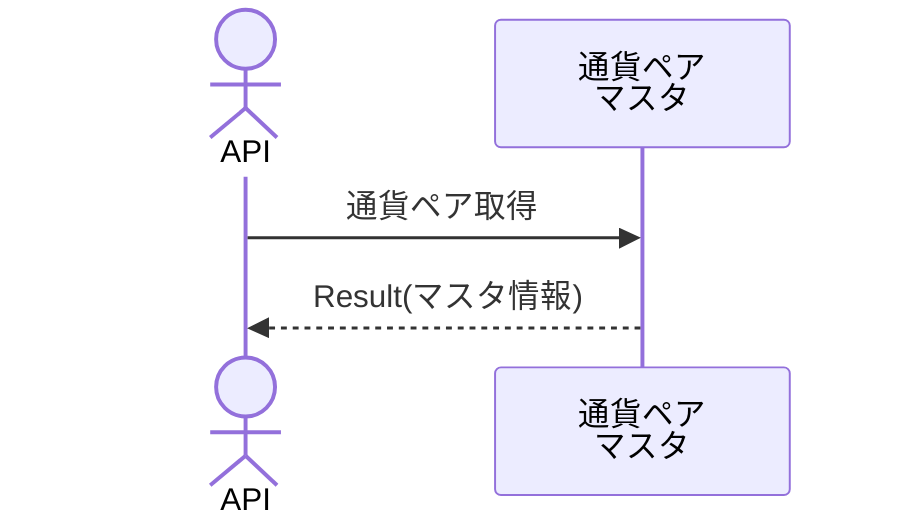

# 概要設計書_124_シンボル一覧取得(TV)

## 処理概要

---

APIは、指定されたシンボル情報をもとに通貨ペア情報を取得する。

   1. リクエスト情報（「通貨ペアCD＊」、「制限＊」）を受け取る

   2. 「通貨ペアマスタ」からデータを取得（「通貨ペアCD」、「通貨ペア名日本語」、「タイプ」、「取引所」）する

      「通貨ペアCD」または「通貨ペア名日本語」が、パラメーターで入力された「query」の完全な名前または一部と一致するデータを取得する。

   3. レスポンス情報（「通貨ペアCD」、「通貨ペア名日本語」、「タイプ」、「取引所」）を返す

リクエストとレスポンスのプロパティ等は、別紙「Peach API」を参照する。

＊は、任意

## データフロー

リクエストとレスポンスのプロパティ等は、別紙「Peach API」を参照。

## テーブル等一覧

---

| # | テーブル名 | テーブル名称   | スキーマ | 参照(x) | 備考 |
|---|------------|----------------|----------|---------|------|
| 1 | m_ccypairs | 通貨ペアマスタ | plum     | x       | -    |

## 処理詳細

1. token 認証

   トークンの有効性を確認する。

   補足資料「S-01.ログイン状態チェック」を参照。

2. リクエストボディーのバリデーション確認

   | パラメータ | 必須 | 長さ | 範囲                      | 形式(型、メール等) | メモ             |
   |------------|------|------|---------------------------|--------------------|------------------|
   | query      | -    | 10   | -                         | 文字               | 通貨ペア検索文字 |
   | limit      | -    | -    | 1～外部設定情報の最大件数 | 数値               |                  |

   エラーの場合は、ステータスコード(`422`)、メッセージ（`CODE:30020`）を返す。

3. パラメータの初期値設定

   パラメータに値が設定されていない場合は、以下のとおり

   | パラメータ | 初期値                             |
   |------------|------------------------------------|
   | limit      | 外部設定情報の「取得件数の初期値」 |

4. 通貨ペアマスタ情報取得

   1. [1]から次の条件に一致するデータを取得

      - 「通貨ペアCD」または「通貨ペア名日本語」は、パラメータに入力された名称「query」の完全名または部分名と一致する。

      - 「is_deleted」が`0`である条件。

      - 並び替え順は「優先度」の昇順となる。

    2. 「通貨ペアマスタ」内の各データを以下の「通貨ペアマスタDTO」にマッピングして、「通貨ペアマスタリストDTO」に追加する

        | 通貨ペアマスタDTO | 「通貨ペアマスタ」の値    | 説明             |
        |-------------------|---------------------------|------------------|
        | symbol            | [1]の「ccypair_cd」       | 通貨ペアCD       |
        | description       | 同「ccypair_jp」          | 通貨ペア名日本語 |
        | type              | 「外部設定情報」の タイプ |                  |
        | exchange          | 「外部設定情報」の 取引所 |                  |

      「通貨ペアマスタリストDTO」をレスポンスとして返す。

## 外部設定情報

---

| 設定名           | 値（参考） | 備考           |
|------------------|------------|----------------|
| 最大件数         | `100`      | 単位（件）     |
| 取得件数の初期値 | `100`      | 単位（件）     |
| 取引所           | `CTFX`     | 取引所名       |
| タイプ           | `FOREX`    | シンボルタイプ |

## 更新条件

---

## 更新履歴

---
| 更新日     | 更新者    | 更新内容 |
|------------|-----------|----------|
| 2024/07/29 | Tri Trinh | 新規作成 |
