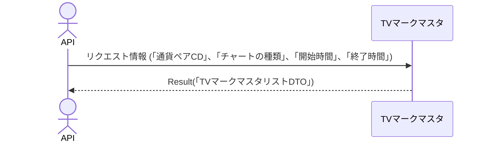

# 概要設計書_125_マーク一覧取得(TV)

## 処理概要

---

APIは、TradingViewに表示するマークを取得（「マークID」、「マークの日時」、「マークの説明」、「マークのラベル」、「マークの色」）する。

   1. リクエスト情報（「通貨ペアCD」、「チャートの種類」、「開始時間」、「終了時間」）を受け取る

   2. 「TVマークマスタ」から情報を取得（「マークID」、「マークの日時」、「マークの説明」、「マークのラベル」、「マークの色」）する

   3. レスポンス情報（「TVマークマスタリストDTO」）を返す

リクエストとレスポンスのプロパティ等は、別紙「Peach API」を参照。

マークは、チャートの上部に表示される。

## データフロー

## テーブル等一覧

---

| # | テーブル名 | テーブル名称   | スキーマ  | 参照(x) | 備考 |
|---|------------|----------------|-----------|---------|------|
| 1 | m_tv_mark  | TVマークマスタ | plum_info | x       | -    |

## 処理詳細

1. token 認証

   トークンの有効性を確認する。

   補足資料「S-01.ログイン状態チェック」を参照。

2. バリデーション確認

   | パラメータ | 必須 | 長さ | 範囲 | 形式(型、メール等) | メモ                                                                     |
   |------------|------|------|------|--------------------|--------------------------------------------------------------------------|
   | symbol     | x    | 6    | -    | 文字               |                                                                          |
   | resolution | x    | 3    | -    | 文字               | `1S`、`1`、`5`、`15` 、`30`、`60`、`120`、`240`、`480`、`1D`、`1W`、`1M` |
   | from       | x    | -    | -    | 数値               | UNIX タイムスタンプ (UTC) 例：1721037907                             |
   | to         | x    | -    | -    | 数値               | UNIX タイムスタンプ (UTC) 例：1721037907, to >= from                 |

   エラーの場合は、ステータスコード(`422`)、メッセージ（`CODE:30020`）を返す。

3. マーク取得

   [1]から以下の条件で取得（「マークリスト」）する。

   - 「チャートの種類」が、パラメータの「resolution」と一致する。

   - 「通貨ペアCD」が、パラメータの「symbol」と一致する。

   - パラメータの「from」が指定されている場合は、「マークの日時」がパラメータの「from」以上である。

   - パラメータの「to」が指定されている場合は、「マークの日時」がパラメータの「to」以下である。

4. 「マークリスト」を「TVマークマスタDTO」にマッピングし、「TVマークマスタリストDTO」に追加する

   | TVマークマスタDTO | 「マークリスト」の値 | 説明           | 備考                             |
   |-------------------|----------------------|----------------|----------------------------------|
   | color             | [1]の「color」       | マークの色     | 例："green" は買い、"red" は売り |
   | id                | 同「id」             | マークID       |                                  |
   | label             | 同「label」          | マークのラベル | 例："B" は買い、"S" は売り       |
   | text              | 同「text」           | マークの説明   |                                  |
   | time              | 同「mark_at」        | マークの日時   | （Unix エポック時間）            |

   「TVマークマスタリストDTO」をレスポンスとして返す。

## 外部設定情報

---

## 更新条件

## 更新履歴

---
| 更新日     | 更新者 | 更新内容 |
|------------|--------|----------|
| 2024/07/19 | Hung   | 新規作成 |
