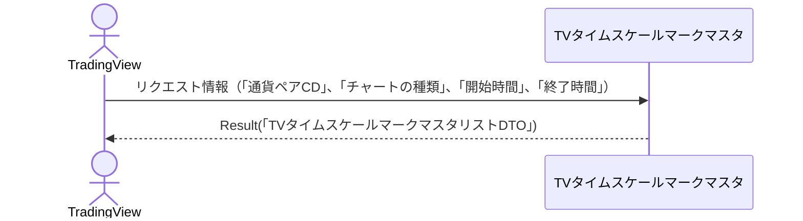

# 概要設計書_126_タイムスケールマーク一覧取得(TV)

## 処理概要

---

APIは、TradingViewに表示するタイムスケールマークを取得する。

   1. リクエスト情報（「通貨ペアCD」、「チャートの種類」、「開始時間」、「終了時間」）を受け取る

   2. 「TVタイムスケールマークマスタ」を取得（「タイムスケールマークID」、「タイムスケールマークの色」、「タイムスケールマークのラベル」、「タイムスケールマークの日時」、「ツールチップ」）する

   3. レスポンス情報（「TVタイムスケールマークマスタリストDTO」）を返す

リクエストとレスポンスのプロパティ等は、別紙「Peach API」を参照。

## データフロー

## テーブル等一覧

---

| # | テーブル名          | テーブル名称                 | スキーマ  | 参照(x) | 備考 |
|---|---------------------|------------------------------|-----------|---------|------|
| 1 | m_tv_timescale_mark | TVタイムスケールマークマスタ | plum_info | x       | -    |

## 処理詳細

1. token 認証

   トークンの有効性を確認する。

   補足資料「S-01.ログイン状態チェック」を参照。

2. バリデーション確認

   | パラメータ | 必須 | 長さ | 範囲 | 形式(型、メール等) | メモ                                                                     |
   |------------|------|------|------|--------------------|--------------------------------------------------------------------------|
   | symbol     | x    | 6    | -    | 文字               |                                                                          |
   | resolution | x    | 3    | -    | 文字               | `1S`、`1`、`5`、`15` 、`30`、`60`、`120`、`240`、`480`、`1D`、`1W`、`1M` |
   | from       | x    | -    | -    | 数値               | UNIX タイムスタンプ (UTC) 例：1721037907                             |
   | to         | x    | -    | -    | 数値               | UNIX タイムスタンプ (UTC) 例：1721037907, to >= from                 |

   エラーの場合は、ステータスコード(`422`)、メッセージ（`CODE:30020`）を返す。

3. タイムスケールマーク取得

   [1]から以下の条件で取得（「タイムスケールマークリスト」）する。

   - 「チャートの種類」が、パラメータの「resolution」と一致する。

   - 「通貨ペアCD」が、パラメータの「symbol」と一致する。

   - パラメータの「from」が指定されている場合は、「タイムスケールマークの日時」がパラメータの「from」以上である。

   - パラメータの「to」が指定されている場合は、「タイムスケールマークの日時」がパラメータの「to」以下である。

4. 「タイムスケールマークリスト」を「TVタイムスケールマークマスタDTO」にマッピングし、「TVタイムスケールマークマスタリストDTO」に追加する

   | TVタイムスケールマークマスタDTO | 「タイムスケールマークリスト」の値 | 説明                         | 備考                       |
   |---------------------------------|------------------------------------|------------------------------|----------------------------|
   | id                              | [1]の「id」                        | タイムスケールマークID       |                            |
   | color                           | 同「color」                        | タイムスケールマークの色     | 例：rgba(255, 99, 71, 0.2) |
   | label                           | 同「label」                        | タイムスケールマークのラベル | 例："B" は買い、"S" は売り |
   | time                            | 同「timescale_mark_at」            | タイムスケールマークの日時   | （Unix エポック時間）      |
   | tooltip                         | 同「tooltip」                      | ツールチップ                 |                            |
   
   「TVタイムスケールマークマスタリストDTO」をレスポンスとして返す。

## 外部設定情報

---

## 更新条件

## 更新履歴

---
| 更新日     | 更新者 | 更新内容 |
|------------|--------|----------|
| 2024/07/26 | Hung   | 新規作成 |
