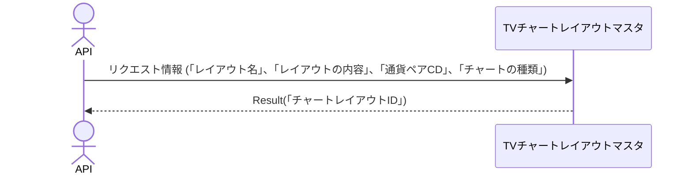

# 概要設計書_127_チャートレイアウト登録(TV)

## 処理概要

---

APIは、チャートレイアウトの情報を登録する。

   1. リクエスト情報 (「レイアウト名」、「レイアウトの内容」、「通貨ペアCD」、「チャートの種類」) を受け取る

   2. 同情報を「TVチャートレイアウトマスタ」に登録する

   3. レスポンス情報 (「チャートレイアウトID」) を返す

リクエストとレスポンスのプロパティ等は、別紙「Peach API」を参照。

## データフロー

## テーブル等一覧

---

| # | テーブル名        | テーブル名称               | スキーマ | 参照(x) | 備考 |
|---|-------------------|----------------------------|----------|---------|------|
| 1 | m_tv_chart_layout | TVチャートレイアウトマスタ | plum     | x       | -    |
| 2 | m_ccypairs        | 通貨ペアマスタ             | plum     | x       | -    |

## 処理詳細

1. token 認証

   トークンの有効性を確認する。

   補足資料「S-01.ログイン状態チェック」を参照。

2. リクエストボディーのバリデーション確認

   | パラメータ | 必須 | 長さ | 範囲 | 形式(型、メール等) | メモ                                 |
   |------------|------|------|------|--------------------|--------------------------------------|
   | name       | x    | 64   | -    | 文字               |                                      |
   | content    | x    | -    | -    | 文字               |                                      |
   | symbol     | x    | 6    | -    | 文字               |                                      |
   | resolution | x    | 3    | -    | 文字               | 1S,1,5,15,30,60,120,240,480,1D,1W,1M |

   エラーの場合は、ステータスコード(`422`)、メッセージ（`CODE:30020`）を返す。

3. [2]から次の条件に一致するデータを取得する

   - 「通貨ペアCD」はパラメータの「symbol」と一致する。

   - 「削除済」 が`0`と一致する。

   データが取得できない場合は、ステータスコード(`404`)、メッセージ（`CODE:30404`）を返す。

4. [1]の登録

   更新項目は、以下`更新条件（登録）`を参照。

   [1]の「チャートレイアウトID」の値をレスポンスに返す。

## 外部設定情報

---

## 更新条件

### m_tv_chart_layout登録

   | 項目名      | 登録                 |
   |-------------|----------------------|
   | customer_no | Tokenの「顧客NO」    |
   | name        | パラメータの「name」 |
   | content     | 同「content」        |
   | ccypair_cd  | 同「symbol」         |
   | chart_type  | 同「resolution」     |

---

## 更新履歴

---
| 更新日     | 更新者    | 更新内容 |
|------------|-----------|----------|
| 2024/08/01 | Tri Trinh | 新規作成 |
