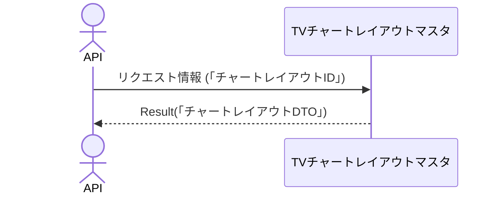

# 概要設計書_129_チャートレイアウト取得(TV)

## 処理概要

---

APIは、チャートレイアウトの情報を取得する。

   1. リクエスト情報 (「チャートレイアウトID」) を受け取る

   2. 「TVチャートレイアウトマスタ」を「チャートレイアウトID」を条件に取得する

      「チャートレイアウトID」、「レイアウト名」、「更新日時」、「レイアウトの内容」を取得（「チャートレイアウトDTO」）する。

   3. レスポンス情報（「チャートレイアウトDTO」）を返す

リクエストとレスポンスのプロパティ等は、別紙「Peach API」を参照。

## データフロー

## テーブル等一覧

---

| # | テーブル名        | テーブル名称               | スキーマ | 参照(x) | 備考 |
|---|-------------------|----------------------------|----------|---------|------|
| 1 | m_tv_chart_layout | TVチャートレイアウトマスタ | plum     | x       | -    |

## 処理詳細

1. token 認証

   トークンの有効性を確認する。

   補足資料「S-01.ログイン状態チェック」を参照。

2. パスパラメータ確認

   補足資料「S-11.パスパラメータ確認」を参照。

   パスパラメータの「チャートレイアウトID」が数字ではない場合は、ステータスコード(`422`)、メッセージ（`CODE:30020`）を返す。

3. チャートレイアウト取得

   [1]から以下の条件で取得（「チャートレイアウト」）する。

   - 「チャートレイアウトID」はパスパラメータ内の「チャートレイアウトID」と一致する。

   データが取得できない場合は、ステータスコード(`404`)、メッセージ（`CODE:30404`）を返す。

4. 「チャートレイアウト」を「チャートレイアウトDTO」にマッピングして返す

     | チャートレイアウトDTO | 「チャートレイアウト」の値    | 説明                 |
     |-----------------------|-------------------------------|----------------------|
     | id                    | [1]の「チャートレイアウトID」 | チャートレイアウトID |
     | name                  | 同「レイアウト名」            | レイアウト名         |
     | timestamp             | 同「更新日時」(UNIX時間)      | 更新日時             |
     | content               | 同「レイアウトの内容」        | レイアウトの内容     |

   「チャートレイアウトDTO」をレスポンスとして返す。

## 外部設定情報

---

## 更新条件

---

## 更新履歴

---
| 更新日     | 更新者    | 更新内容 |
|------------|-----------|----------|
| 2024/08/05 | Tri Trinh | 新規作成 |
