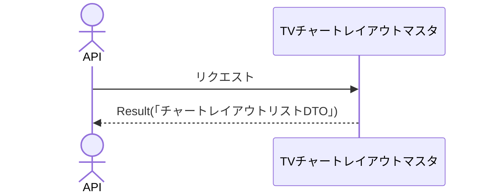

# 概要設計書_130_チャートレイアウト一覧取得(TV)

## 処理概要

---

APIは、チャートレイアウトの一覧情報を取得する。

   1. リクエスト情報を受け取る

   2. 「TVチャートレイアウトマスタ」を取得（「チャートレイアウトID」、「レイアウト名」、「チャートの種類」、「通貨ペアCD」、「更新日時」）する

      トークンの「顧客NO」と一致する「顧客NO」を持つデータを取得する。

   3. レスポンス情報（「チャートレイアウトリストDTO」）を返す

リクエストとレスポンスのプロパティ等は、別紙「Peach API」を参照。

## データフロー

## テーブル等一覧

---

| # | テーブル名        | テーブル名称               | スキーマ | 参照(x) | 備考 |
|---|-------------------|----------------------------|----------|---------|------|
| 1 | m_tv_chart_layout | TVチャートレイアウトマスタ | plum     | x       | -    |

## 処理詳細

1. token 認証

   トークンの有効性を確認する。

   補足資料「S-01.ログイン状態チェック」を参照。

2. チャートレイアウトリスト取得

   [1]から以下の条件で取得（「チャートレイアウトリスト」）する。

      - 「顧客NO」がTokenの顧客NOと一致する。
      
         並び順は「更新日時」の降順である。

3. 「チャートレイアウトリスト」を「チャートレイアウトDTO」にマッピングし、「チャートレイアウトリストDTO」に追加する

     | チャートレイアウトDTO | 「チャートレイアウトリスト」の値 | 説明                 |
     |-----------------------|----------------------------------|----------------------|
     | id                    | [1]の「チャートレイアウトID」    | チャートレイアウトID |
     | name                  | 同「レイアウト名」               | レイアウト名         |
     | resolution            | 同「チャートの種類」             | チャートの種類       |
     | symbol                | 同「通貨ペアCD」                 | 通貨ペアCD           |
     | timestamp             | 同「更新日時」(UNIX時間)         | 更新日時             |

   返答として「チャートレイアウトリストDTO」を返す。

## 外部設定情報

---

## 更新条件

---

## 更新履歴

---
| 更新日     | 更新者    | 更新内容 |
|------------|-----------|----------|
| 2024/07/31 | Tri Trinh | 新規作成 |
