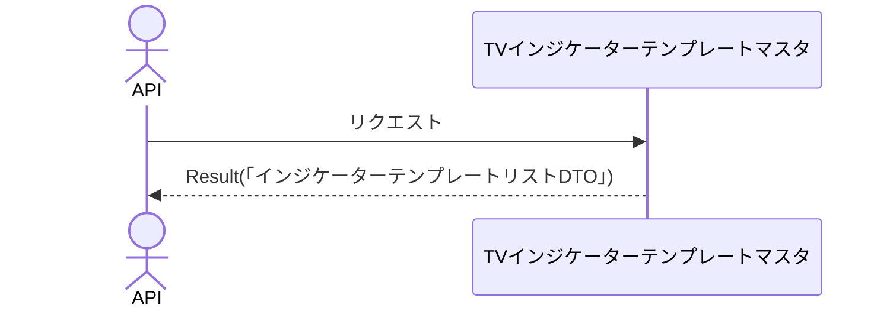

# 概要設計書_132_インジケーターテンプレート一覧取得(TV)

## 処理概要

---

APIは、インジケーターテンプレートの一覧情報を取得する。

   1. リクエスト情報を受け取る

   2. 「TVインジケーターテンプレートマスタ」を取得（「インジケータテンプレート名」）する

      トークンの「顧客NO」と一致する「顧客NO」を持つデータを取得する。

   3. レスポンス情報（「インジケーターテンプレートリストDTO」）を返す

リクエストとレスポンスのプロパティ等は、別紙「Peach API」を参照。

## データフロー

## テーブル等一覧

---

| # | テーブル名              | テーブル名称                       | スキーマ | 参照(x) | 備考 |
|---|-------------------------|------------------------------------|----------|---------|------|
| 1 | m_tv_indicator_template | TVインジケーターテンプレートマスタ | plum     | x       | -    |

## 処理詳細

1. token 認証

   トークンの有効性を確認する。

   補足資料「S-01.ログイン状態チェック」を参照。

2. インジケーターテンプレート取得

   [1]から以下の条件で取得（「インジケーターテンプレートリスト」）する。

   - 「顧客NO」がTokenの顧客NOと一致する。

3. 「インジケーターテンプレートリスト」を「インジケーターテンプレートDTO」にマッピングし、「インジケーターテンプレートリストDTO」に追加する

     | インジケーターテンプレートDTO | 「インジケーターテンプレートリスト」の値 | 説明                       |
     |-------------------------------|------------------------------------------|----------------------------|
     | name                          | [1]の「インジケータテンプレート名」      | インジケータテンプレート名 |

   「インジケーターテンプレートリストDTO」をレスポンスとして返す。

## 外部設定情報

---

## 更新条件

---

## 更新履歴

---
| 更新日     | 更新者    | 更新内容 |
|------------|-----------|----------|
| 2024/07/18 | Tri Trinh | 新規作成 |
