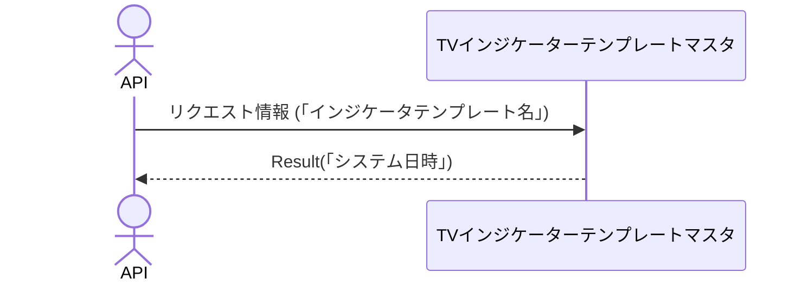

# 概要設計書_135_インジケーターテンプレート削除(TV)

## 処理概要

---

APIは、インジケーターテンプレートの情報を削除する。

   1. リクエスト情報（「インジケータテンプレート名」）を受け取る

   2.「TVインジケーターテンプレートマスタ」を「インジケータテンプレート名」を条件に削除する

   3. レスポンス情報（「システム日時」）を返す

リクエストとレスポンスのプロパティ等は、別紙「Peach API」を参照。

## データフロー

## テーブル等一覧

---

| # | テーブル名              | テーブル名称                       | スキーマ | 参照(x) | 備考 |
|---|-------------------------|------------------------------------|----------|---------|------|
| 1 | m_tv_indicator_template | TVインジケーターテンプレートマスタ | plum     | x       | -    |

## 処理詳細

1. token 認証

   トークンの有効性を確認する。

   補足資料「S-01.ログイン状態チェック」を参照。

2. バリデーション確認

   | パラメータ | 必須 | 長さ | 範囲 | 形式(型、メール等) | メモ |
   |------------|------|------|------|--------------------|------|
   | name       | x    | 64   | -    | 文字               |      |

   エラーの場合は、ステータスコード(`422`)、メッセージ（`CODE:30020`）を返す。

3. [1]から次の条件に一致するデータを取得する

   - 「顧客NO」がTokenの顧客NOと一致する。

   - 「インジケータテンプレート名」はパラメータの「name」と一致する。

   データが取得できない場合は、ステータスコード(`404`)、メッセージ（`CODE:30404`）を返す。

4. [1]のデータを削除する

   `[システム日時]`をレスポンスとして返す。

## 外部設定情報

---

## 更新条件

---

## 更新履歴

---
| 更新日     | 更新者    | 更新内容 |
|------------|-----------|----------|
| 2024/07/25 | Tri Trinh | 新規作成 |
