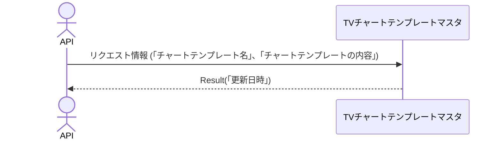

# 概要設計書_137_チャートテンプレート登録更新(TV)

## 処理概要

---

APIは、チャートテンプレートの情報を登録または更新する。

   1. リクエスト情報（「チャートテンプレート名」、「チャートテンプレートの内容」）を受け取る

   2. 同情報を「TVチャートテンプレートマスタ」に登録または更新する

   3. レスポンス情報（「更新日時」）を返す

リクエストとレスポンスのプロパティ等は、別紙「Peach API」を参照。

## データフロー

## テーブル等一覧

---

| # | テーブル名           | テーブル名称                 | スキーマ | 参照(x) | 備考 |
|---|----------------------|------------------------------|----------|---------|------|
| 1 | m_tv_chart_templates | TVチャートテンプレートマスタ | plum     | x       | -    |

## 処理詳細

1. token 認証

   トークンの有効性を確認する。

   補足資料「S-01.ログイン状態チェック」を参照。

2. リクエストボディーのバリデーション確認

   | パラメータ | 必須 | 長さ | 範囲 | 形式(型、メール等) | メモ |
   |------------|------|------|------|--------------------|------|
   | name       | x    | 64   | -    | 文字               |      |
   | content    | x    | -    | -    | 文字               |      |

   エラーの場合は、ステータスコード(`422`)、メッセージ（`CODE:30020`）を返す。

3. [1]の登録または更新

   1. [1]から次の条件に一致するデータを取得する

      - 「顧客NO」がTokenの顧客NOと一致する。

      - 「チャートテンプレート名」はパラメータの「name」と一致する。

   2. 新規登録または更新

      データが取得できれば、[1]を更新する。

         更新項目は、以下`更新条件(更新）`を参照。

      データが取得できない場合、[1]を登録する。

         更新項目は、以下`更新条件(登録）`を参照。

      [1]の「更新日時」の値をレスポンスに返す。

## 外部設定情報

---

## 更新条件

### m_tv_chart_templates

   | 項目名      | 登録                 | 更新                    |
   |-------------|----------------------|-------------------------|
   | customer_no | Tokenの「顧客NO」    | -                       |
   | name        | パラメータの「name」 | -                       |
   | content     | 同「content」        | パラメータの「content」 |

---

## 更新履歴

---
| 更新日     | 更新者    | 更新内容 |
|------------|-----------|----------|
| 2024/08/06 | Tri Trinh | 新規作成 |
