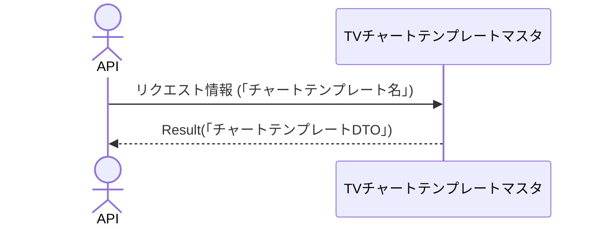

# 概要設計書_138_チャートテンプレート取得(TV)

## 処理概要

---

APIは、チャートテンプレートの情報を取得する。

   1. リクエスト情報（「チャートテンプレート名」）を受け取る

   2. 「TVチャートテンプレートマスタ」を「チャートテンプレート名」を条件に取得する

      「チャートテンプレート名」、「チャートテンプレートの内容」を取得（「チャートテンプレートDTO」）する。

   3. レスポンス情報（「チャートテンプレートDTO」）を返す

リクエストとレスポンスのプロパティ等は、別紙「Peach API」を参照。

## データフロー

## テーブル等一覧

---

| # | テーブル名           | テーブル名称                 | スキーマ | 参照(x) | 備考 |
|---|----------------------|------------------------------|----------|---------|------|
| 1 | m_tv_chart_templates | TVチャートテンプレートマスタ | plum     | x       | -    |

## 処理詳細

1. token 認証

   トークンの有効性を確認する。

   補足資料「S-01.ログイン状態チェック」を参照。

2. バリデーション確認

   | パラメータ | 必須 | 長さ | 範囲 | 形式(型、メール等) | メモ |
   |------------|------|------|------|--------------------|------|
   | name       | x    | 64   | -    | 文字               |      |

   エラーの場合は、ステータスコード(`422`)、メッセージ（`CODE:30020`）を返す。

3. チャートテンプレート取得

   [1]から以下の条件で取得（「チャートテンプレート」）する。

   - 「顧客NO」がTokenの顧客NOと一致する。

   - 「チャートテンプレート名」はパラメータの「name」と一致する。

   データが取得できない場合は、ステータスコード(`404`)、メッセージ（`CODE:30404`）を返す。

4. 「チャートテンプレート」を「チャートテンプレートDTO」にマッピングし

   | チャートテンプレートDTO | 「チャートテンプレート」の値     | 説明                       |
   |-------------------------|----------------------------------|----------------------------|
   | name                    | [1]の「チャートテンプレート名」  | チャートテンプレート名     |
   | content                 | 同「チャートテンプレートの内容」 | チャートテンプレートの内容 |

   「チャートテンプレートDTO」をレスポンスとして返す。

## 外部設定情報

---

## 更新条件

---

## 更新履歴

---
| 更新日     | 更新者    | 更新内容 |
|------------|-----------|----------|
| 2024/08/07 | Tri Trinh | 新規作成 |
