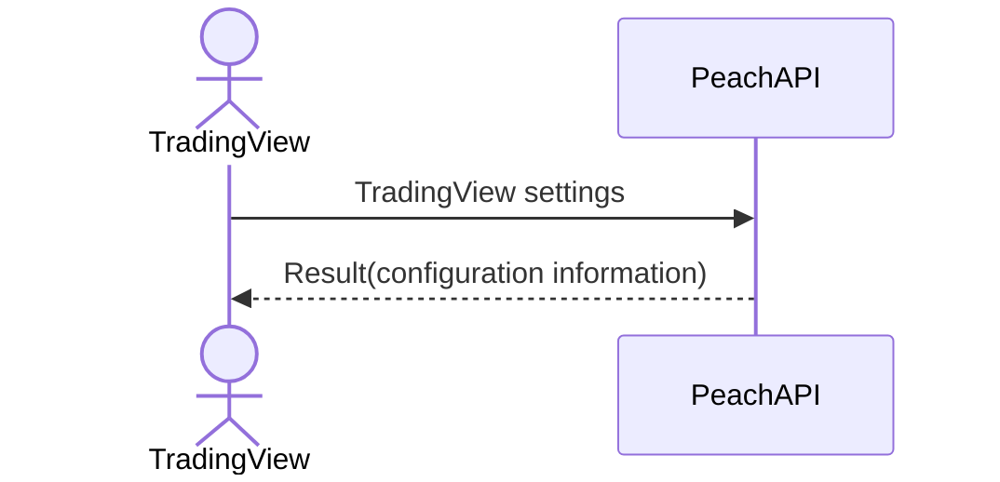

# System_Overview_Design_120_Get_Datafeed_Configuration_Data_(TV)

## Processing Overview

---

The API retrieves various settings of the TradingView chart.

## Data Flow

## List of Tables, etc.

---

## Processing Details

1. token authentication

   Confirm the validity of the token.

   Refer to supplementary material "S-01. Login status check".

2. Mapping of data to the datafeed configuration DTO

   | Datafeed configuration DTO | Value | Description |
   |--------------------------|---------------------------------------------------------|--------------------------------------------------------|
   | supports_search          | tradingview.supports_search of "External Configuration Information"          | Indicates whether search is supported                 |
   | supports_marks           | tradingview.supports_marks of "External Configuration Information"           | Indicates whether marks are supported               |
   | supports_timescale_marks | tradingview.supports_timescale_marks of "External Configuration Information" | Indicates whether timescale marks are supported |
   | supports_time            | tradingview.supports_time of "External Configuration Information"            | Indicates whether time is supported                 |
   | exchanges                | tradingview.exchanges of "External Configuration Information"                | List of exchanges in use                             |
   | symbols_types            | tradingview.symbols_types of "External Configuration Information"            | Types of currency pairs in use                           |
   | supported_resolutions    | tradingview.supported_resolutions of "External Configuration Information"    | List of supported chart types                 |

## External Configuration Information

| Setting name                               | Value (reference)                                                   | Remarks                                                   |
|--------------------------------------|--------------------------------------------------------------|--------------------------------------------------------|
| tradingview.supports_search          | `true`                                                       | Indicates whether search is supported                 |
| tradingview.supports_marks           | `true`                                                       | Indicates whether marks are supported               |
| tradingview.supports_timescale_marks | `true`                                                       | Indicates whether timescale marks are supported |
| tradingview.supports_time            | `true`                                                       | Indicates whether time is supported                 |
| tradingview.exchanges                | `CTFX`                                                       | List of exchanges in use                             |
| tradingview.symbols_types            | `FOREX`                                                      | Types of currency pairs in use                           |
| tradingview.supported_resolutions    | `1S`,`1`,`5`,`15`,`30`,`60`,`120`,`240`,`480`,`1D`,`1W`,`1M` | List of supported chart types                 |

## Update Conditions

---

## Revision History

| Update Date     | Updated By | Update Content |
|------------|--------|----------|
| 2024/07/16 | Hung   | Newly created |
