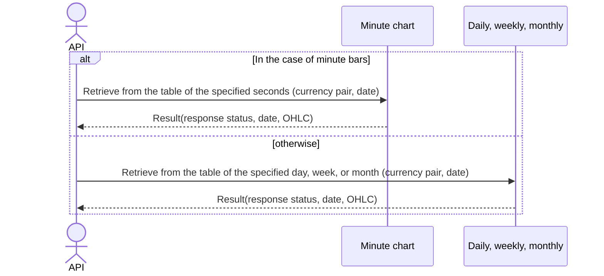

# System_Overview_Design_121_Get_Bars_(TV)

## Processing Overview

---

The API retrieves OHLC (high, low, close, open) information.

   1. Receive request information ("BidAsk average", "currency pair CD", "chart type", "start time*", "end time*")

   2. Retrieve cache data

   3. Return response information ("response status", "datetime", "high", "low", "open", "close")

For request and response properties, etc., refer to the separate document "Peach API".

* is optional

Chart type:
- 1S: 1 second, 1: 1 minute, 5: 5 minutes, 10: 10 minutes, 15: 15 minutes, 30: 30 minutes, 60: 1 hour, 120: 2 hours, 240: 4 hours, 480: 8 hours, 1D: daily, 1W: weekly, 1M: monthly

Synchronize (synchronized) so that the API cache data retrieval processing and the data cache processing of another thread do not access the cache at the same time.

## Data Flow

## Specification Changes

---

## List of Tables, etc.

---

| #  | Table Name    | Table Caption | Schema  | Reference (x) | Remarks |
|----|---------------|--------------|-----------|---------|------|
| 1  | t_chart_1     | 1-second bar        | plum_info | x       | -    |
| 2  | t_chart_60    | 1-minute bar        | plum_info | x       | -    |
| 3  | t_chart_300   | 5-minute bar        | plum_info | x       | -    |
| 4  | t_chart_600   | 10-minute bar       | plum_info | x       | -    |
| 5  | t_chart_900   | 15-minute bar       | plum_info | x       | -    |
| 6  | t_chart_1800  | 30-minute bar       | plum_info | x       | -    |
| 7  | t_chart_3600  | 1-hour bar      | plum_info | x       | -    |
| 8  | t_chart_7200  | 2-hour bar      | plum_info | x       | -    |
| 9  | t_chart_14400 | 4-hour bar      | plum_info | x       | -    |
| 10 | t_chart_28800 | 8-hour bar      | plum_info | x       | -    |
| 11 | t_chart_day   | Daily bar         | plum_info | x       | -    |
| 12 | t_chart_week  | Weekly bar         | plum_info | x       | -    |
| 13 | t_chart_month | Monthly bar         | plum_info | x       | -    |

## Processing Details

### Data retrieval

1. Validation check

   | Parameter | Required | Length | Range | Format (type, email, etc.) | Memo                                                                           |
   |------------|------|------|------|--------------------|--------------------------------------------------------------------------------|
   | bid_ask    | x    | 3    | -    | Character               | `BID`,`MID`,`ASK` only                                                          |
   | symbol     | x    | 6    | -    | Character               |                                                                                |
   | resolution | x    | 3    | -    | Character               | `1S`, `1`, `5`, `10`, `15`, `30`, `60`, `120`, `240`, `480`, `1D`, `1W`, `1M` |
   | from       | *1   | -    | -    | Numeric               | UNIX timestamp (UTC) Example: 1721037907                                   |
   | to         | *1   | -    | -    | Numeric               | UNIX timestamp (UTC) Example: 1721037907, to >= from                       |

   *1 If from is set, to is required (and vice versa).

   In case of error, return status code (`422`), message (`CODE:30020`).

2. Historical data retrieval

   1. Refer to "Cache mapping configuration information" and determine the corresponding cache information

   2. Map the TradingView widget "resolution" to PeachAPI "chart_type"
      | TradingView widget | PeachAPI |
      |--------------------------|----------|
      | 1S                       | 1S       |
      | 1                        | 1M       |
      | 5                        | 5M       |
      | 10                       | 10M      |
      | 15                       | 15M      |
      | 30                       | 30M      |
      | 60                       | 60M      |
      | 120                      | 120M     |
      | 240                      | 240M     |
      | 480                      | 480M     |
      | 1D                       | DAY      |
      | 1W                       | WEEK     |
      | 1M                       | MONTH    |

   3. If the parameter "resolution" is the corresponding chart type (`1S`, `1`, `5`, `15`, etc.), retrieve data that matches the following conditions from the corresponding cache information (`cache_set_1s`, `cache_set_1m`, `cache_set_5m`, `cache_set_15m`, etc.) ("historical data list")

      - Search "currency pair CD" by the parameter "symbol".

      - If the parameter "from" is specified, search data whose "chart datetime" is greater than or equal to the parameter "from".

      - If the parameter "to" is specified, search data whose "chart datetime" is less than or equal to the parameter "to".

      - If the parameter "from" or the parameter "to" is not specified, search all cached data.

      The sort order is chart datetime (ascending).
       
   4. Map the "historical data list" to the "Bar DTO"

      | Bar DTO | Value of "historical data list"                   | Description                               | Remarks                                                                                                                                            |
      |---------|----------------------------------------------------|------------------------------------|-------------------------------------------------------------------------------------------------------------------------------------------------|
      | s       | ok                                                 | Status when data is available |                                                                                                                                                 |
      | t       | "date" of the corresponding cache information, (Unix epoch time) | Chart datetime                       |                                                                                                                                                 |
      | o       | Same "open"                                         | Open                               | If the parameter "bid_ask" is `BID`, the value of "bid_open"; if `ASK`, the value of "ask_open"; if `MID`, the value of ("ask_open" + "bid_open")/2     |
      | h       | Same "high"                                         | High                               | If the parameter "bid_ask" is `BID`, the value of "bid_high"; if `ASK`, the value of "ask_high"; if `MID`, the value of ("ask_high" + "bid_high")/2     |
      | l       | Same "low"                                          | Low                               | If the parameter "bid_ask" is `BID`, the value of "bid_low"; if `ASK`, the value of "ask_low"; if `MID`, the value of ("ask_low" + "bid_low")/2         |
      | c       | Same "close"                                        | Close                               | If the parameter "bid_ask" is `BID`, the value of "bid_close"; if `ASK`, the value of "ask_close"; if `MID`, the value of ("ask_close" + "bid_close")/2 |

      Return the "Bar DTO" as the response.
   
   5. When no bars are found within the specified range

      - Find the maximum timestamp among bars that have a date before the "from" query parameter, and calculate it as the next available timestamp.

         Example:
         For the "From" parameter, it is August 24, 2024.

            Contents of the data cache:
               August 20, 2024
               August 21, 2024
               August 22, 2024
               August 23, 2024
               August 26, 2024
               August 27, 2024
            There is no data for the 24th and 25th because they are Saturday and Sunday.
            Because August 23, 2024 is the latest date before August 24, 2024, "nextTime" is set to the Unix timestamp corresponding to August 23, 2024.

      - Map data to the "Bar DTO".   
         | Bar DTO  | Value                                                    | Description                   |
         |----------|-------------------------------------------------------|------------------------|
         | s        | no_data                                               | Status when there is no data |
         | t        | Empty list                                            |                        |
         | o        | Empty list                                            |                        |
         | h        | Empty list                                            |                        |
         | l        | Empty list                                            |                        |
         | c        | Empty list                                            |                        |
         | nextTime | Processing result of "When no bars are found within the specified range" |                        |

         Return the "Bar DTO" as the response.

## External Configuration Information

---

## Cache mapping configuration information

| Chart type | Table Name    | Cache namespace name |
|--------------|---------------|----------------------------|
| 1S           | t_chart_1     | cache_set_1s               |
| 1M           | t_chart_60    | cache_set_1m               |
| 5M           | t_chart_300   | cache_set_5m               |
| 10M          | t_chart_600   | cache_set_10m              |
| 15M          | t_chart_900   | cache_set_15m              |
| 30M          | t_chart_1800  | cache_set_30m              |
| 60M          | t_chart_3600  | cache_set_60m              |
| 120M         | t_chart_7200  | cache_set_120m             |
| 240M         | t_chart_14400 | cache_set_240m             |
| 480M         | t_chart_28800 | cache_set_480m             |
| DAY          | t_chart_day   | cache_set_day              |
| WEEK         | t_chart_week  | cache_set_week             |
| MONTH        | t_chart_month | cache_set_month            |

## Update Conditions

---

## Revision History

---
| Update Date     | Updated By | Update Content |
|------------|--------|----------|
| 2024/07/16 | Hung   | Newly created |
