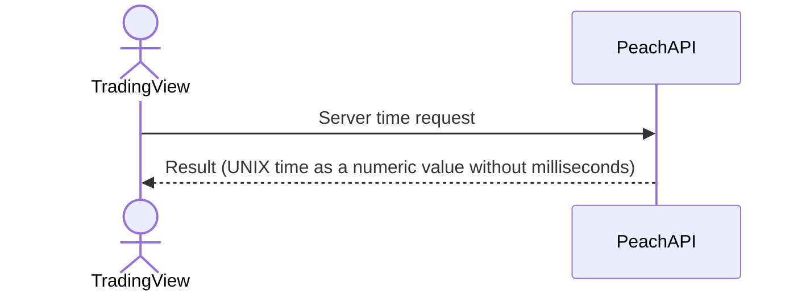

# System_Overview_Design_122_Get_Server_Time_(TV)

## Processing Overview

---

The API retrieves the Epoch Unix timestamp from the server.

## Data Flow

## List of Tables, etc.

---

## Processing Details
1. Map to the response "DTO" and return

   | DTO | Server time               | Description            |
   |-----|----------------------------|-----------------|
   | t   | UNIX time as a numeric value without milliseconds | Example: 1445324591 |

   Return the "DTO" as the response.

## External Configuration Information

## Update Conditions

---

## Revision History

---
| Update Date     | Updated By | Update Content |
|------------|--------|----------|
| 2024/07/16 | Hung   | Newly created |
