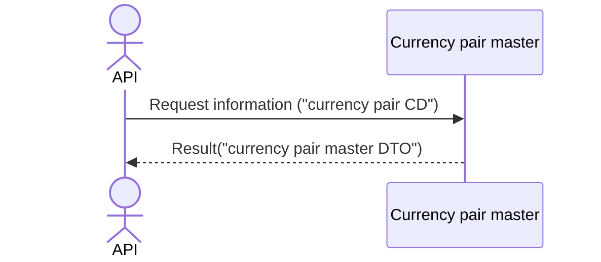

# System_Overview_Design_123_Get_Symbol_Information_(TV)

## Processing Overview

The API retrieves currency pair information based on the specified symbol information.

   1. Receive request information ("currency pair CD")

   2. Retrieve information from the "currency pair master" ("currency pair CD", "currency pair name (Japanese)", "currency rate unit")

   3. Return response information ("currency pair master DTO")

For request and response properties, etc., refer to the separate document "Peach API".

## Data Flow

## List of Tables, etc.

| # | Table Name | Table Caption   | Schema | Reference (x) | Remarks |
|---|------------|----------------|----------|---------|------|
| 1 | m_ccypairs | Currency pair master | plum     | x       | -    |
| 2 | M_SEASON   | Season master     | plum     | x       | -    |

## Processing Details

### Currency pair retrieval

1. token authentication

   Confirm the validity of the token.

   Refer to supplementary material "S-01. Login status check".

2. Request body validation check

   | Parameter | Required | Length | Range | Format (type, email, etc.) | Memo |
   |------------|------|------|------|--------------------|------|
   | symbol     | x    | 6    | -    | Character               |      |

   In case of error, return status code (`422`), message (`CODE:30020`).

3. Currency pair retrieval

   Retrieve from [1] under the following conditions ("currency pair").

      - "Currency pair CD" matches the parameter "symbol".

      - "Deleted" matches `0`.

   If data cannot be retrieved, return status code (`404`), message (`CODE:30404`).

4. Map the "currency pair" to the "currency pair master DTO"

    | Currency pair master DTO     | Value of "currency pair"                                    | Description                                                                                                                       |
    |-----------------------|-----------------------------------------------------|--------------------------------------------------------------------------------------------------------------------------|
    | name                  | "ccypair_cd" of [1]                                 | Currency pair CD                                                                                                               |
    | description           | Same "ccypair_jp"                                    | Description of the currency pair. Displayed in the legend of the chart of this currency pair                                                                 |
    | timezone              | tradingview.timezone of "External Configuration Information"              | Default timezone                                                                                                 |
    | exchange              | tradingview.exchanges of "External Configuration Information"             | Short name of the exchange where this currency pair is traded (the actual listed exchange). This name is displayed in the legend of the chart of this currency pair     |
    | minmov                | `1`                                                 | Number of units that constitute 1 tick                                                                                             |
    | pricescale            | 10^ "rate_unit" of [1]                              | Must be `10^n`, where `n` is the number of digits after the decimal point. Example: if the price is `1.01`, set "pricescale" to `100` |
    | type                  | tradingview.symbols_types of "External Configuration Information"        | Type of currency pair used                                                                                                 |
    | session               | *1                                                 | Session                                                                                                               |
    | has_intraday          | tradingview.has_intraday of "External Configuration Information"          | If the value is set to `true`, the symbol includes minute-level historical data                                           |
    | visible_plots_set     | tradingview.visible_plots_set of "External Configuration Information"     | The symbol supports open, high, low, close, and price, but has no volume                                                     |
    | supported_resolutions | tradingview.supported_resolutions of "External Configuration Information" | List of supported chart types                                                                                   |
    | intraday_multipliers  | tradingview.intraday_multipliers of "External Configuration Information"  | Array of chart types (in minutes) directly supported by the data feed                                                    |
    | has_seconds           | tradingview.has_seconds of "External Configuration Information"           | Boolean value indicating whether the symbol includes seconds of historical data                                                           |

    *1: Set the session under the following conditions.
    
      - Retrieve from [2] under the following conditions ("season information").

         - "Season CD" is either `1: daylight saving time` or `2: standard time`

         - The current time is included in the period from "system start date" to "system end date"

      - If data could be retrieved:
         If "season CD" is `1: daylight saving time`, set the "trading hours of daylight saving time" of the external configuration information; otherwise, set the "trading hours of standard time" of the external configuration information.

      - If data cannot be retrieved:
         Return `システムエラー`.

   Return the "currency pair master DTO" as the response.

## External Configuration Information

| Setting name                            | Value (reference)                                                   | Remarks                                                                                                                 |
|-----------------------------------|--------------------------------------------------------------|----------------------------------------------------------------------------------------------------------------------|
| tradingview.exchanges             | `CTFX`                                                       | Short name of the exchange where this currency pair is traded (the actual listed exchange). This name is displayed in the legend of the chart of this currency pair |
| tradingview.symbols_types         | `FOREX`                                                      | Type of currency pair used                                                                                             |
| tradingview.timezone              | `Asia/Tokyo`                                                 | Default timezone                                                                                             |
| tradingview.has_intraday          | `true`                                                       | If the value is set to `true`, the symbol includes minute-level historical data                                       |
| tradingview.visible_plots_set     | `ohlc`                                                       | The symbol supports open, high, low, close, and price, but has no volume                                                 |
| tradingview.supported_resolutions | `1S`,`1`,`5`,`15`,`30`,`60`,`120`,`240`,`480`,`1D`,`1W`,`1M` | List of supported chart types                                                                               |
| tradingview.intraday_multipliers  | `1`,`5`,`15`,`30`,`60`,`120`,`240`,`480`                     | Array of chart types (in minutes) directly supported by the data feed                                                |
| tradingview.has_seconds           | `true`                                                       | Boolean value indicating whether the symbol includes seconds of historical data                                                       |
| tradingview.time_summer           | `${TIME_SUMMER:0700-3000:2\|0600-3000:345\|0600-2940:6}`     | Trading hours of daylight saving time                                                                                                     |
| tradingview.time_winter           | `${TIME_WINTER:0700-3100:2\|0700-3100:345\|0700-3040:6}`     | Trading hours of standard time                                                                                                     |

## Update Conditions

---

## System Error

---

| Item Name        | Value                             | Description             |
|---------------|--------------------------------|------------------|
| status        | 500                            | Status code |
| error code    | E_SERVER                       | Error code     |
| error message | システムエラーが発生しました。 | Message       |

## Revision History

| Update Date     | Updated By | Update Content |
|------------|--------|----------|
| 2024/07/26 | Hung   | Newly created |
