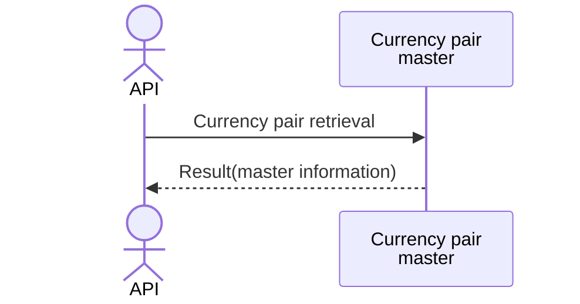

# System_Overview_Design_124_Get_Symbol_List_(TV)

## Processing Overview

---

The API retrieves currency pair information based on the specified symbol information.

   1. Receive request information ("currency pair CD*", "limit*")

   2. Retrieve data from the "currency pair master" ("currency pair CD", "currency pair name (Japanese)", "type", "exchange")

      Retrieve data whose "currency pair CD" or "currency pair name (Japanese)" matches the complete name or part of the "query" entered in the parameter.

   3. Return response information ("currency pair CD", "currency pair name (Japanese)", "type", "exchange")

For request and response properties, etc., refer to the separate document "Peach API".

* is optional

## Data Flow

For request and response properties, etc., refer to the separate document "Peach API".

## List of Tables, etc.

---

| # | Table Name | Table Caption   | Schema | Reference (x) | Remarks |
|---|------------|----------------|----------|---------|------|
| 1 | m_ccypairs | Currency pair master | plum     | x       | -    |

## Processing Details

1. token authentication

   Confirm the validity of the token.

   Refer to supplementary material "S-01. Login status check".

2. Request body validation check

   | Parameter | Required | Length | Range                      | Format (type, email, etc.) | Memo             |
   |------------|------|------|---------------------------|--------------------|------------------|
   | query      | -    | 10   | -                         | Character               | Currency pair search text |
   | limit      | -    | -    | 1 to the maximum count of External Configuration Information | Numeric               |                  |

   In case of error, return status code (`422`), message (`CODE:30020`).

3. Default value setting of parameters

   If no value is set in the parameter, as follows

   | Parameter | Default value                             |
   |------------|------------------------------------|
   | limit      | "Default retrieval count" of External Configuration Information |

4. Currency pair master information retrieval

   1. Retrieve data from [1] that matches the following conditions

      - "Currency pair CD" or "currency pair name (Japanese)" matches the complete name or partial name of the name "query" entered in the parameter.

      - The condition that "is_deleted" is `0`.

      - The sort order is "priority" ascending.

    2. Map each data in the "currency pair master" to the following "currency pair master DTO" and add it to the "currency pair master list DTO"

        | Currency pair master DTO | Value of "currency pair master"    | Description             |
        |-------------------|---------------------------|------------------|
        | symbol            | "ccypair_cd" of [1]       | Currency pair CD       |
        | description       | Same "ccypair_jp"          | Currency pair name (Japanese) |
        | type              | Type of "External Configuration Information" |                  |
        | exchange          | Exchange of "External Configuration Information" |                  |

      Return the "currency pair master list DTO" as the response.

## External Configuration Information

---

| Setting name           | Value (reference) | Remarks           |
|------------------|------------|----------------|
| Maximum count         | `100`      | Unit (count)     |
| Default retrieval count | `100`      | Unit (count)     |
| Exchange           | `CTFX`     | Exchange name       |
| Type           | `FOREX`    | Symbol type |

## Update Conditions

---

## Revision History

---
| Update Date     | Updated By    | Update Content |
|------------|-----------|----------|
| 2024/07/29 | Tri Trinh | Newly created |
