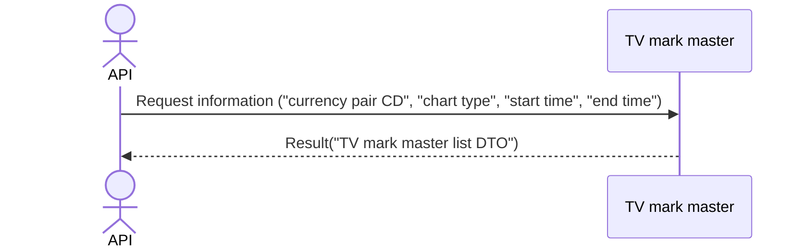

# System_Overview_Design_125_Get_Marks_List_(TV)

## Processing Overview

---

The API retrieves marks to display on TradingView ("mark ID", "mark datetime", "mark description", "mark label", "mark color").

   1. Receive request information ("currency pair CD", "chart type", "start time", "end time")

   2. Retrieve information from the "TV mark master" ("mark ID", "mark datetime", "mark description", "mark label", "mark color")

   3. Return response information ("TV mark master list DTO")

For request and response properties, etc., refer to the separate document "Peach API".

Marks are displayed at the top of the chart.

## Data Flow

## List of Tables, etc.

---

| # | Table Name | Table Caption   | Schema  | Reference (x) | Remarks |
|---|------------|----------------|-----------|---------|------|
| 1 | m_tv_mark  | TV mark master | plum_info | x       | -    |

## Processing Details

1. token authentication

   Confirm the validity of the token.

   Refer to supplementary material "S-01. Login status check".

2. Validation check

   | Parameter | Required | Length | Range | Format (type, email, etc.) | Memo                                                                     |
   |------------|------|------|------|--------------------|--------------------------------------------------------------------------|
   | symbol     | x    | 6    | -    | Character               |                                                                          |
   | resolution | x    | 3    | -    | Character               | `1S`, `1`, `5`, `15`, `30`, `60`, `120`, `240`, `480`, `1D`, `1W`, `1M` |
   | from       | x    | -    | -    | Numeric               | UNIX timestamp (UTC) Example: 1721037907                             |
   | to         | x    | -    | -    | Numeric               | UNIX timestamp (UTC) Example: 1721037907, to >= from                 |

   In case of error, return status code (`422`), message (`CODE:30020`).

3. Mark retrieval

   Retrieve from [1] under the following conditions ("mark list").

   - "Chart type" matches the parameter "resolution".

   - "Currency pair CD" matches the parameter "symbol".

   - If the parameter "from" is specified, "mark datetime" is greater than or equal to the parameter "from".

   - If the parameter "to" is specified, "mark datetime" is less than or equal to the parameter "to".

4. Map the "mark list" to the "TV mark master DTO" and add it to the "TV mark master list DTO"

   | TV mark master DTO | Value of "mark list" | Description           | Remarks                             |
   |-------------------|----------------------|----------------|----------------------------------|
   | color             | "color" of [1]       | Mark color     | Example: "green" is buy, "red" is sell |
   | id                | Same "id"             | Mark ID       |                                  |
   | label             | Same "label"          | Mark label | Example: "B" is buy, "S" is sell       |
   | text              | Same "text"           | Mark description   |                                  |
   | time              | Same "mark_at"        | Mark datetime   | (Unix epoch time)            |

   Return the "TV mark master list DTO" as the response.

## External Configuration Information

---

## Update Conditions

## Revision History

---
| Update Date     | Updated By | Update Content |
|------------|--------|----------|
| 2024/07/19 | Hung   | Newly created |
