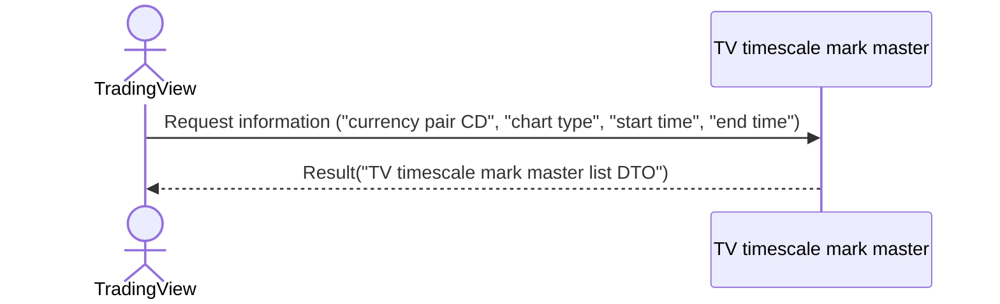

# System_Overview_Design_126_Get_Timescale_Marks_List_(TV)

## Processing Overview

---

The API retrieves timescale marks to display on TradingView.

   1. Receive request information ("currency pair CD", "chart type", "start time", "end time")

   2. Retrieve the "TV timescale mark master" ("timescale mark ID", "timescale mark color", "timescale mark label", "timescale mark datetime", "tooltip")

   3. Return response information ("TV timescale mark master list DTO")

For request and response properties, etc., refer to the separate document "Peach API".

## Data Flow

## List of Tables, etc.

---

| # | Table Name          | Table Caption                 | Schema  | Reference (x) | Remarks |
|---|---------------------|------------------------------|-----------|---------|------|
| 1 | m_tv_timescale_mark | TV timescale mark master | plum_info | x       | -    |

## Processing Details

1. token authentication

   Confirm the validity of the token.

   Refer to supplementary material "S-01. Login status check".

2. Validation check

   | Parameter | Required | Length | Range | Format (type, email, etc.) | Memo                                                                     |
   |------------|------|------|------|--------------------|--------------------------------------------------------------------------|
   | symbol     | x    | 6    | -    | Character               |                                                                          |
   | resolution | x    | 3    | -    | Character               | `1S`, `1`, `5`, `15`, `30`, `60`, `120`, `240`, `480`, `1D`, `1W`, `1M` |
   | from       | x    | -    | -    | Numeric               | UNIX timestamp (UTC) Example: 1721037907                             |
   | to         | x    | -    | -    | Numeric               | UNIX timestamp (UTC) Example: 1721037907, to >= from                 |

   In case of error, return status code (`422`), message (`CODE:30020`).

3. Timescale mark retrieval

   Retrieve from [1] under the following conditions ("timescale mark list").

   - "Chart type" matches the parameter "resolution".

   - "Currency pair CD" matches the parameter "symbol".

   - If the parameter "from" is specified, "timescale mark datetime" is greater than or equal to the parameter "from".

   - If the parameter "to" is specified, "timescale mark datetime" is less than or equal to the parameter "to".

4. Map the "timescale mark list" to the "TV timescale mark master DTO" and add it to the "TV timescale mark master list DTO"

   | TV timescale mark master DTO | Value of "timescale mark list" | Description                         | Remarks                       |
   |---------------------------------|------------------------------------|------------------------------|----------------------------|
   | id                              | "id" of [1]                        | Timescale mark ID       |                            |
   | color                           | Same "color"                        | Timescale mark color     | Example: rgba(255, 99, 71, 0.2) |
   | label                           | Same "label"                        | Timescale mark label | Example: "B" is buy, "S" is sell |
   | time                            | Same "timescale_mark_at"            | Timescale mark datetime   | (Unix epoch time)      |
   | tooltip                         | Same "tooltip"                      | Tooltip                 |                            |
   
   Return the "TV timescale mark master list DTO" as the response.

## External Configuration Information

---

## Update Conditions

## Revision History

---
| Update Date     | Updated By | Update Content |
|------------|--------|----------|
| 2024/07/26 | Hung   | Newly created |
