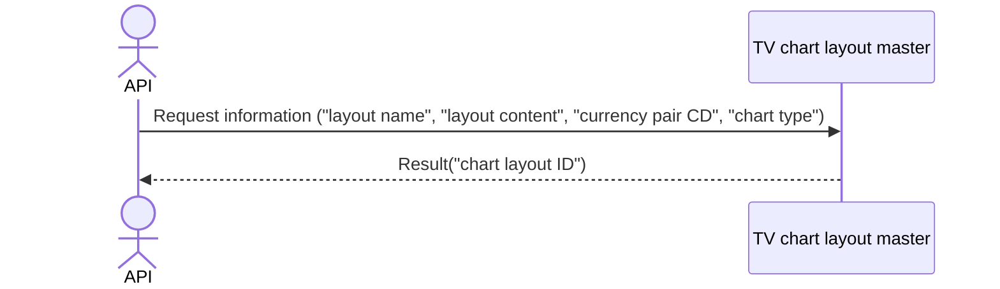

# System_Overview_Design_127_Register_Chart_Layout_(TV)

## Processing Overview

---

The API registers chart layout information.

   1. Receive request information ("layout name", "layout content", "currency pair CD", "chart type")

   2. Register the same information in the "TV chart layout master"

   3. Return response information ("chart layout ID")

For request and response properties, etc., refer to the separate document "Peach API".

## Data Flow

## List of Tables, etc.

---

| # | Table Name        | Table Caption               | Schema | Reference (x) | Remarks |
|---|-------------------|----------------------------|----------|---------|------|
| 1 | m_tv_chart_layout | TV chart layout master | plum     | x       | -    |
| 2 | m_ccypairs        | Currency pair master             | plum     | x       | -    |

## Processing Details

1. token authentication

   Confirm the validity of the token.

   Refer to supplementary material "S-01. Login status check".

2. Request body validation check

   | Parameter | Required | Length | Range | Format (type, email, etc.) | Memo                                 |
   |------------|------|------|------|--------------------|--------------------------------------|
   | name       | x    | 64   | -    | Character               |                                      |
   | content    | x    | -    | -    | Character               |                                      |
   | symbol     | x    | 6    | -    | Character               |                                      |
   | resolution | x    | 3    | -    | Character               | 1S,1,5,15,30,60,120,240,480,1D,1W,1M |

   In case of error, return status code (`422`), message (`CODE:30020`).

3. Retrieve data from [2] that matches the following conditions

   - "Currency pair CD" matches the parameter "symbol".

   - "Deleted" matches `0`.

   If data cannot be retrieved, return status code (`404`), message (`CODE:30404`).

4. Registration of [1]

   For update items, refer to the following `Update Conditions (register)`.

   Return the value of "chart layout ID" of [1] in the response.

## External Configuration Information

---

## Update Conditions

### m_tv_chart_layout register

   | Item Name      | Register                 |
   |-------------|----------------------|
   | customer_no | "Customer NO" of Token    |
   | name        | Parameter "name" |
   | content     | Same "content"        |
   | ccypair_cd  | Same "symbol"         |
   | chart_type  | Same "resolution"     |

---

## Revision History

---
| Update Date     | Updated By    | Update Content |
|------------|-----------|----------|
| 2024/08/01 | Tri Trinh | Newly created |
