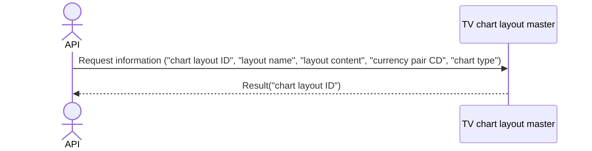

# System_Overview_Design_128_Update_Chart_Layout_(TV)

## Processing Overview

---

The API updates chart layout information.

   1. Receive request information ("chart layout ID", "layout name", "layout content", "currency pair CD", "chart type")

   2. Update the same information in the "TV chart layout master"

   3. Return response information ("chart layout ID")

For request and response properties, etc., refer to the separate document "Peach API".

## Data Flow

## List of Tables, etc.

---

| # | Table Name        | Table Caption               | Schema | Reference (x) | Remarks |
|---|-------------------|----------------------------|----------|---------|------|
| 1 | m_tv_chart_layout | TV chart layout master | plum     | x       | -    |
| 2 | m_ccypairs        | Currency pair master             | plum     | x       | -    |

## Processing Details

1. token authentication

   Confirm the validity of the token.

   Refer to supplementary material "S-01. Login status check".

2. Path parameter check

   Refer to supplementary material "S-11. Path parameter check".

   If the path parameter "chart layout ID" is not a number, return status code (`422`), message (`CODE:30020`).

3. Request body validation check

   | Parameter | Required | Length | Range | Format (type, email, etc.) | Memo                                 |
   |------------|------|------|------|--------------------|--------------------------------------|
   | name       | x    | 64   | -    | Character               |                                      |
   | content    | x    | -    | -    | Character               |                                      |
   | symbol     | x    | 6    | -    | Character               |                                      |
   | resolution | x    | 3    | -    | Character               | 1S,1,5,15,30,60,120,240,480,1D,1W,1M |

   In case of error, return status code (`422`), message (`CODE:30020`).

4. Retrieve data from [1] that matches the following conditions

   - "Chart layout ID" matches the "chart layout ID" in the path parameter.

   If it does not exist, return status code (`404`), message (`CODE:30404`).

5. Retrieve data from [2] that matches the following conditions

   - "Currency pair CD" matches the parameter "symbol".

   - "Deleted" matches `0`.

   If data cannot be retrieved, return status code (`404`), message (`CODE:30404`).

6. Update of [1]

   Update the data of [1] whose "id" (chart layout ID) matches the path parameter "chart layout ID".

   For update items, refer to the following `Update Conditions (update)`.

   Return the value of "chart layout ID" of [1] in the response.

## External Configuration Information

---

## Update Conditions

### m_tv_chart_layout update

   | Item Name     | Update                 |
   |------------|----------------------|
   | name       | Parameter "name" |
   | content    | "content" of [1]     |
   | ccypair_cd | Same "symbol"         |
   | chart_type | Same "resolution"     |

---

## Revision History

---
| Update Date     | Updated By    | Update Content |
|------------|-----------|----------|
| 2024/08/01 | Tri Trinh | Newly created |
