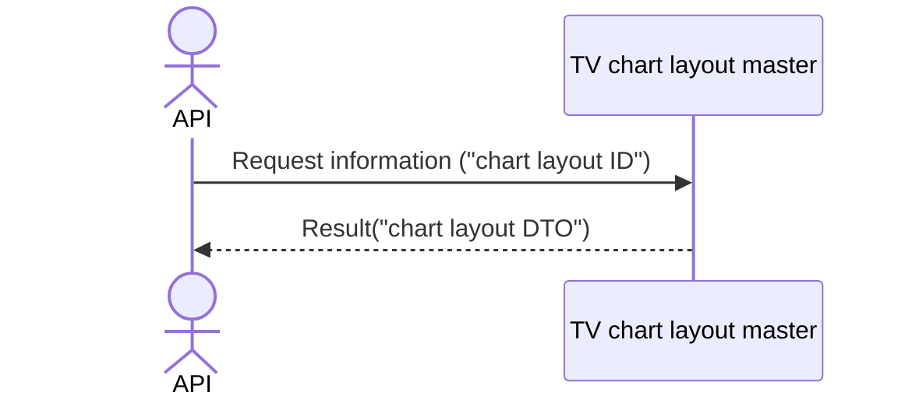

# System_Overview_Design_129_Get_Chart_Layout_(TV)

## Processing Overview

---

The API retrieves chart layout information.

   1. Receive request information ("chart layout ID")

   2. Retrieve the "TV chart layout master" with "chart layout ID" as the condition

      Retrieve "chart layout ID", "layout name", "update datetime", "layout content" ("chart layout DTO").

   3. Return response information ("chart layout DTO")

For request and response properties, etc., refer to the separate document "Peach API".

## Data Flow

## List of Tables, etc.

---

| # | Table Name        | Table Caption               | Schema | Reference (x) | Remarks |
|---|-------------------|----------------------------|----------|---------|------|
| 1 | m_tv_chart_layout | TV chart layout master | plum     | x       | -    |

## Processing Details

1. token authentication

   Confirm the validity of the token.

   Refer to supplementary material "S-01. Login status check".

2. Path parameter check

   Refer to supplementary material "S-11. Path parameter check".

   If the path parameter "chart layout ID" is not a number, return status code (`422`), message (`CODE:30020`).

3. Chart layout retrieval

   Retrieve from [1] under the following conditions ("chart layout").

   - "Chart layout ID" matches the "chart layout ID" in the path parameter.

   If data cannot be retrieved, return status code (`404`), message (`CODE:30404`).

4. Map the "chart layout" to the "chart layout DTO" and return

     | Chart layout DTO | Value of "chart layout"    | Description                 |
     |-----------------------|-------------------------------|----------------------|
     | id                    | "chart layout ID" of [1] | Chart layout ID |
     | name                  | Same "layout name"            | Layout name         |
     | timestamp             | Same "update datetime" (UNIX time)      | Update datetime             |
     | content               | Same "layout content"        | Layout content     |

   Return the "chart layout DTO" as the response.

## External Configuration Information

---

## Update Conditions

---

## Revision History

---
| Update Date     | Updated By    | Update Content |
|------------|-----------|----------|
| 2024/08/05 | Tri Trinh | Newly created |
