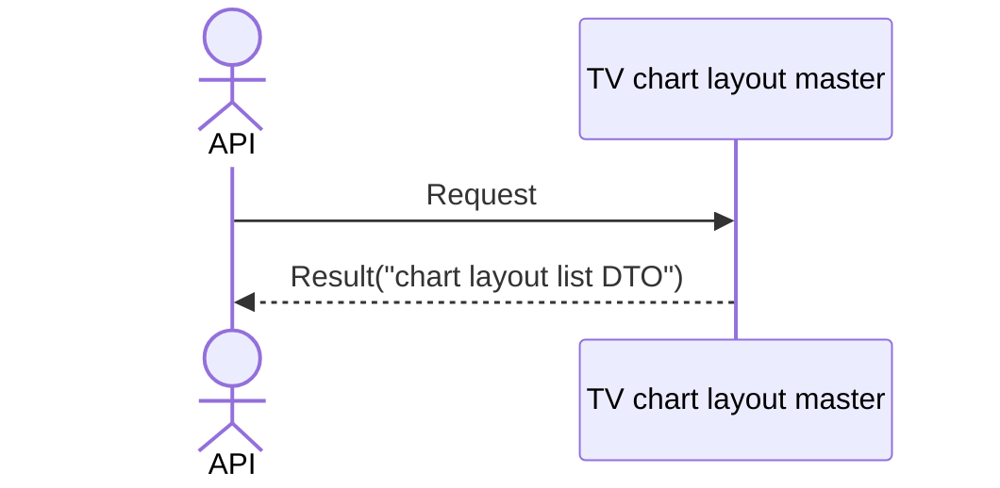

# System_Overview_Design_130_Get_Chart_Layout_List_(TV)

## Processing Overview

---

The API retrieves chart layout list information.

   1. Receive request information

   2. Retrieve the "TV chart layout master" ("chart layout ID", "layout name", "chart type", "currency pair CD", "update datetime")

      Retrieve data that has a "customer NO" matching the "customer NO" of the token.

   3. Return response information ("chart layout list DTO")

For request and response properties, etc., refer to the separate document "Peach API".

## Data Flow

## List of Tables, etc.

---

| # | Table Name        | Table Caption               | Schema | Reference (x) | Remarks |
|---|-------------------|----------------------------|----------|---------|------|
| 1 | m_tv_chart_layout | TV chart layout master | plum     | x       | -    |

## Processing Details

1. token authentication

   Confirm the validity of the token.

   Refer to supplementary material "S-01. Login status check".

2. Chart layout list retrieval

   Retrieve from [1] under the following conditions ("chart layout list").

      - "Customer NO" matches the customer NO of Token.
      
         The sort order is "update datetime" descending.

3. Map the "chart layout list" to the "chart layout DTO" and add it to the "chart layout list DTO"

     | Chart layout DTO | Value of "chart layout list" | Description                 |
     |-----------------------|----------------------------------|----------------------|
     | id                    | "chart layout ID" of [1]    | Chart layout ID |
     | name                  | Same "layout name"               | Layout name         |
     | resolution            | Same "chart type"             | Chart type       |
     | symbol                | Same "currency pair CD"                 | Currency pair CD           |
     | timestamp             | Same "update datetime" (UNIX time)         | Update datetime             |

   Return the "chart layout list DTO" as the response.

## External Configuration Information

---

## Update Conditions

---

## Revision History

---
| Update Date     | Updated By    | Update Content |
|------------|-----------|----------|
| 2024/07/31 | Tri Trinh | Newly created |
