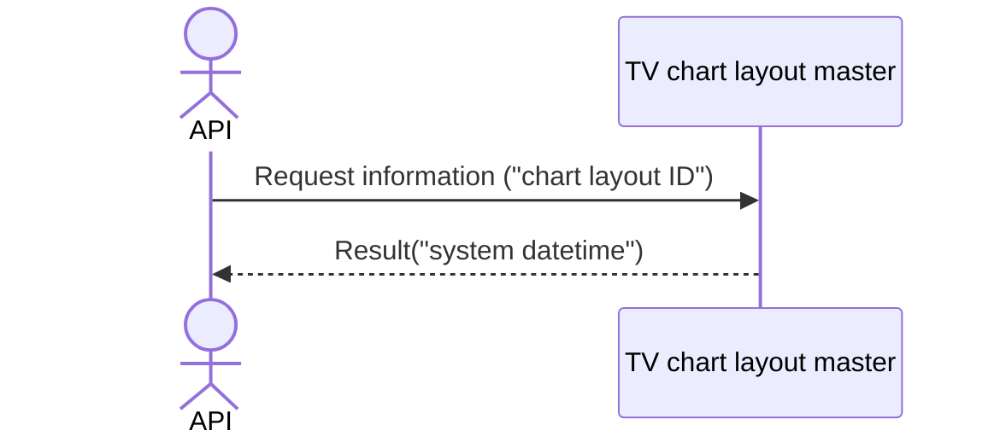

# System_Overview_Design_131_Delete_Chart_Layout_(TV)

## Processing Overview

---

The API deletes chart layout information.

   1. Receive request information ("chart layout ID")

   2. Delete from the "TV chart layout master" with "chart layout ID" as the condition

   3. Return response information ("system datetime")

For request and response properties, etc., refer to the separate document "Peach API".

## Data Flow

## List of Tables, etc.

---

| # | Table Name        | Table Caption               | Schema | Reference (x) | Remarks |
|---|-------------------|----------------------------|----------|---------|------|
| 1 | m_tv_chart_layout | TV chart layout master | plum     | x       | -    |

## Processing Details

1. token authentication

   Confirm the validity of the token.

   Refer to supplementary material "S-01. Login status check".

2. Path parameter check

   Refer to supplementary material "S-11. Path parameter check".

   If the path parameter "chart layout ID" is not a number, return status code (`422`), message (`CODE:30020`).

3. Retrieve data from [1] that matches the following conditions

   - "Chart layout ID" matches the "chart layout ID" in the path parameter.

   If it does not exist, return status code (`404`), message (`CODE:30404`).

4. Delete the data of [1]

   Return `[system datetime]` as the response.

## External Configuration Information

---

## Update Conditions

---

## Revision History

---
| Update Date     | Updated By    | Update Content |
|------------|-----------|----------|
| 2024/08/05 | Tri Trinh | Newly created |
