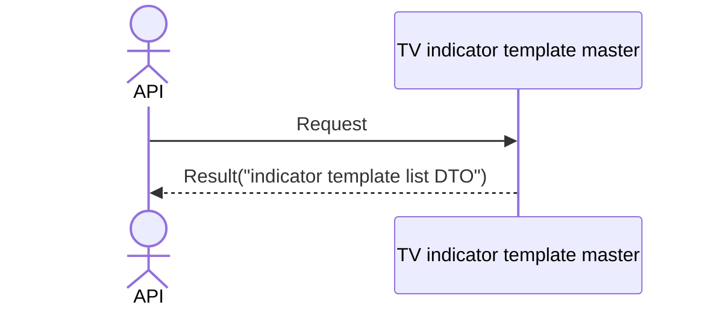

# System_Overview_Design_132_Get_Indicator_Template_List_(TV)

## Processing Overview

---

The API retrieves indicator template list information.

   1. Receive request information

   2. Retrieve the "TV indicator template master" ("indicator template name")

      Retrieve data that has a "customer NO" matching the "customer NO" of the token.

   3. Return response information ("indicator template list DTO")

For request and response properties, etc., refer to the separate document "Peach API".

## Data Flow

## List of Tables, etc.

---

| # | Table Name              | Table Caption                       | Schema | Reference (x) | Remarks |
|---|-------------------------|------------------------------------|----------|---------|------|
| 1 | m_tv_indicator_template | TV indicator template master | plum     | x       | -    |

## Processing Details

1. token authentication

   Confirm the validity of the token.

   Refer to supplementary material "S-01. Login status check".

2. Indicator template retrieval

   Retrieve from [1] under the following conditions ("indicator template list").

   - "Customer NO" matches the customer NO of Token.

3. Map the "indicator template list" to the "indicator template DTO" and add it to the "indicator template list DTO"

     | Indicator template DTO | Value of "indicator template list" | Description                       |
     |-------------------------------|------------------------------------------|----------------------------|
     | name                          | "indicator template name" of [1]      | Indicator template name |

   Return the "indicator template list DTO" as the response.

## External Configuration Information

---

## Update Conditions

---

## Revision History

---
| Update Date     | Updated By    | Update Content |
|------------|-----------|----------|
| 2024/07/18 | Tri Trinh | Newly created |
