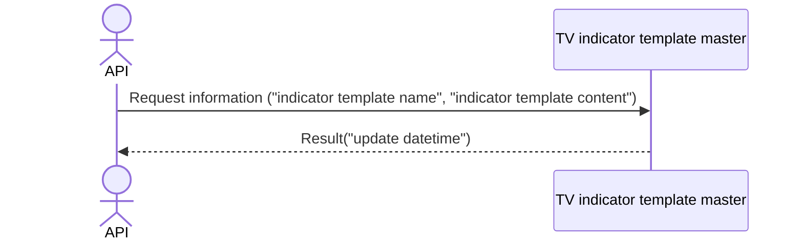

# System_Overview_Design_133_Register_Update_Indicator_Template_(TV)

## Processing Overview

---

The API registers or updates indicator template information.

   1. Receive request information ("indicator template name", "indicator template content")

   2. Register or update the same information in the "TV indicator template master"
   
   3. Return response information ("update datetime")

For request and response properties, etc., refer to the separate document "Peach API".

## Data Flow

## List of Tables, etc.

---

| # | Table Name              | Table Caption                       | Schema | Reference (x) | Remarks |
|---|-------------------------|------------------------------------|----------|---------|------|
| 1 | m_tv_indicator_template | TV indicator template master | plum     | x       | -    |

## Processing Details

1. token authentication

   Confirm the validity of the token.

   Refer to supplementary material "S-01. Login status check".

2. Request body validation check

   | Parameter | Required | Length | Range | Format (type, email, etc.) | Memo |
   |------------|------|------|------|--------------------|------|
   | name       | x    | 64   | -    | Character               |      |
   | content    | x    | -    | -    | Character               |      |

   In case of error, return status code (`422`), message (`CODE:30020`).

3. Register or update of [1]

   1. Retrieve data from [1] that matches the following conditions

      - "Customer NO" matches the customer NO of Token.

      - "Indicator template name" matches the parameter "name".

   2. New registration or update
   
      If data could be retrieved, update [1].

         For update items, refer to the following `Update Conditions (update)`.

      If data cannot be retrieved, register [1].

         For update items, refer to the following `Update Conditions (register)`.

      Return the value of "update datetime" of [1] in the response.

## External Configuration Information

---

## Update Conditions

### m_tv_indicator_template

   | Item Name      | Register                 | Update                    |
   |-------------|----------------------|-------------------------|
   | customer_no | "Customer NO" of Token    | -                       |
   | name        | Parameter "name" | -                       |
   | content     | Same "content"        | Parameter "content" |

---

## Revision History

---
| Update Date     | Updated By    | Update Content |
|------------|-----------|----------|
| 2024/07/23 | Tri Trinh | Newly created |
