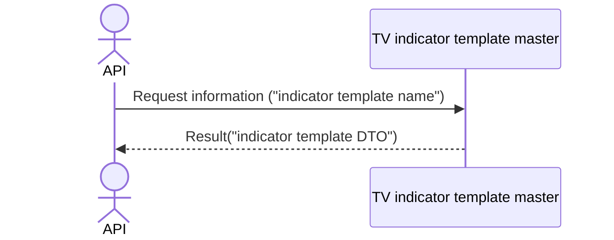

# System_Overview_Design_134_Get_Indicator_Template_(TV)

## Processing Overview

---

The API retrieves indicator template information.

   1. Receive request information ("indicator template name")

   2. Retrieve the "TV indicator template master" with "indicator template name" as the condition

      Retrieve "indicator template name", "indicator template content" ("indicator template DTO").

   3. Return response information ("indicator template DTO")

For request and response properties, etc., refer to the separate document "Peach API".

## Data Flow

## List of Tables, etc.

---

| # | Table Name              | Table Caption                       | Schema | Reference (x) | Remarks |
|---|-------------------------|------------------------------------|----------|---------|------|
| 1 | m_tv_indicator_template | TV indicator template master | plum     | x       | -    |

## Processing Details

1. token authentication

   Confirm the validity of the token.

   Refer to supplementary material "S-01. Login status check".

2. Validation check

   | Parameter | Required | Length | Range | Format (type, email, etc.) | Memo |
   |------------|------|------|------|--------------------|------|
   | name       | x    | 64   | -    | Character               |      |

   In case of error, return status code (`422`), message (`CODE:30020`).

3. Indicator template retrieval

   Retrieve from [1] under the following conditions ("indicator template").

   - "Customer NO" matches the customer NO of Token.

   - "Indicator template name" matches the parameter "name".

   If data cannot be retrieved, return status code (`404`), message (`CODE:30404`).

4. Map the "indicator template" to the "indicator template DTO"

   | Indicator template DTO | Value of "indicator template"   | Description                           |
   |-------------------------------|--------------------------------------|--------------------------------|
   | name                          | "indicator template name" of [1]  | Indicator template name     |
   | content                       | Same "indicator template content" | Indicator template content |

   Return the "indicator template DTO" as the response.

## External Configuration Information

---

## Update Conditions

---

## Revision History

---
| Update Date     | Updated By    | Update Content |
|------------|-----------|----------|
| 2024/07/25 | Tri Trinh | Newly created |
