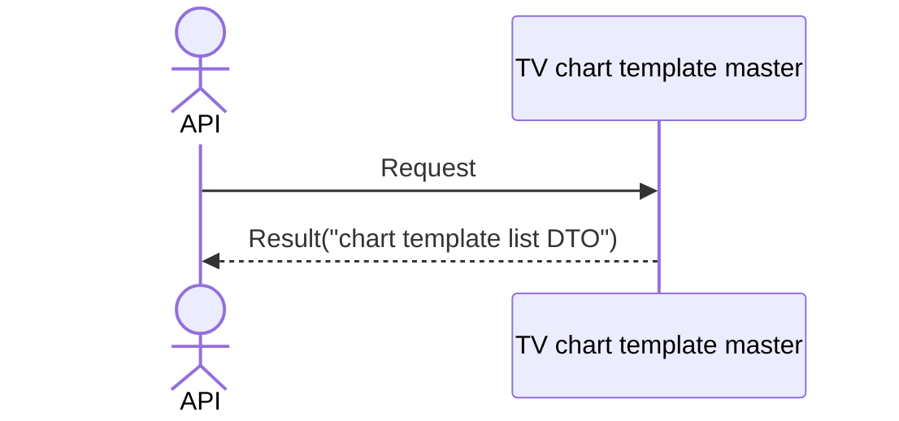

# System_Overview_Design_136_Get_Chart_Template_List_(TV)

## Processing Overview

---

The API retrieves chart template list information.

   1. Receive request information

   2. Retrieve the "TV chart template master" ("chart template name")

      Retrieve data that has a "customer NO" matching the "customer NO" of the token.

   3. Return response information ("chart template list DTO")

For request and response properties, etc., refer to the separate document "Peach API".

## Data Flow

## List of Tables, etc.

---

| # | Table Name           | Table Caption                 | Schema | Reference (x) | Remarks |
|---|----------------------|------------------------------|----------|---------|------|
| 1 | m_tv_chart_templates | TV chart template master | plum     | x       | -    |

## Processing Details

1. token authentication

   Confirm the validity of the token.

   Refer to supplementary material "S-01. Login status check".

2. Chart template retrieval

   Retrieve from [1] under the following conditions ("chart template list").

   - "Customer NO" matches the customer NO of Token.

3. Map the "chart template list" to the "chart template DTO" and add it to the "chart template list DTO"

     | Chart template DTO | Value of "chart template list" | Description                   |
     |-------------------------|------------------------------------|------------------------|
     | name                    | "chart template name" of [1]    | Chart template name |

   Return the "chart template list DTO" as the response.

## External Configuration Information

---

## Update Conditions

---

## Revision History

---
| Update Date     | Updated By    | Update Content |
|------------|-----------|----------|
| 2024/08/06 | Tri Trinh | Newly created |
