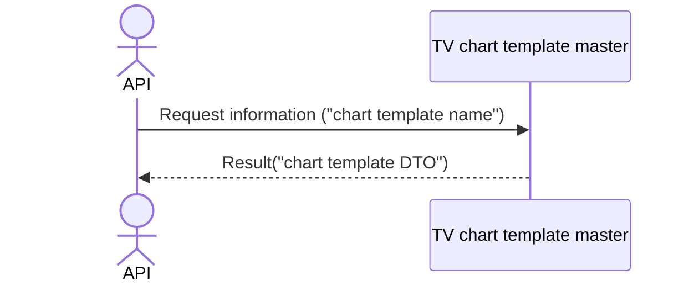

# System_Overview_Design_138_Get_Chart_Template_(TV)

## Processing Overview

---

The API retrieves chart template information.

   1. Receive request information ("chart template name")

   2. Retrieve the "TV chart template master" with "chart template name" as the condition

      Retrieve "chart template name", "chart template content" ("chart template DTO").

   3. Return response information ("chart template DTO")

For request and response properties, etc., refer to the separate document "Peach API".

## Data Flow

## List of Tables, etc.

---

| # | Table Name           | Table Caption                 | Schema | Reference (x) | Remarks |
|---|----------------------|------------------------------|----------|---------|------|
| 1 | m_tv_chart_templates | TV chart template master | plum     | x       | -    |

## Processing Details

1. token authentication

   Confirm the validity of the token.

   Refer to supplementary material "S-01. Login status check".

2. Validation check

   | Parameter | Required | Length | Range | Format (type, email, etc.) | Memo |
   |------------|------|------|------|--------------------|------|
   | name       | x    | 64   | -    | Character               |      |

   In case of error, return status code (`422`), message (`CODE:30020`).

3. Chart template retrieval

   Retrieve from [1] under the following conditions ("chart template").

   - "Customer NO" matches the customer NO of Token.

   - "Chart template name" matches the parameter "name".

   If data cannot be retrieved, return status code (`404`), message (`CODE:30404`).

4. Map the "chart template" to the "chart template DTO"

   | Chart template DTO | Value of "chart template"     | Description                       |
   |-------------------------|----------------------------------|----------------------------|
   | name                    | "chart template name" of [1]  | Chart template name     |
   | content                 | Same "chart template content" | Chart template content |

   Return the "chart template DTO" as the response.

## External Configuration Information

---

## Update Conditions

---

## Revision History

---
| Update Date     | Updated By    | Update Content |
|------------|-----------|----------|
| 2024/08/07 | Tri Trinh | Newly created |
