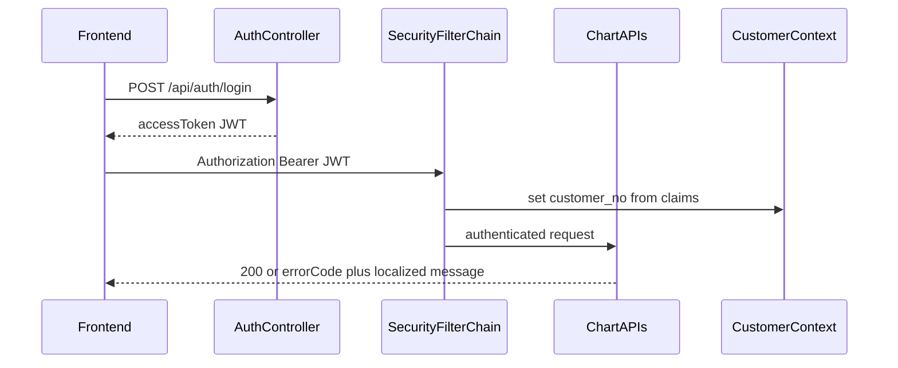

# Adjust plan — auth, errors, REST

Working notes to evolve this app beyond the design-doc stub. Locked choices: **1A** (JWT Bearer + FE) + **2A** (errorCode + MessageSource i18n).

### Request headers (locked — Postman / FE)

| Header | Value | Purpose |
|---|---|---|
| **`Authorization`** | `Bearer <jwt>` | Auth after login. One space after `Bearer`; no second colon. Example: `Authorization: Bearer eyJhbGciOi…` |
| **`Accept-Language`** | e.g. `en`, `ja` | Picks localized `message` from the message bundle |

Notes:

- Header name is **`Authorization`** (HTTP standard), not `Authentication`.
- Login itself (`POST /api/auth/login`) needs **no** Bearer — only JSON body `{ "username", "password" }`.
- After Step 4, stub `X-Customer-No` is **removed**. Chart and Postman use Bearer only.

---

## 1. Mentor notes (translated)

| Original (VN) | English |
|---|---|
| Chỉ coi spring.io / Baeldung | Only follow [spring.io](https://spring.io) / [Baeldung](https://www.baeldung.com) as reference |
| Dùng Spring Security | Use Spring Security |
| Dùng access type bearer token | Use Bearer token (`Authorization: Bearer …`) |
| Spring Boot có authenticate | Spring Boot must authenticate requests |
| Tổ chức DB thế nào | Organize the DB for users/auth (how tables are structured) |
| Encryption BCRYPT | Hash passwords with **BCrypt** |
| 3 lỗi cơ bản: ok 200 / not found 404 / sai tên biến | Basic cases: success **200**; missing resource **404**; wrong/missing field name (validation) |
| Response trả về: error code với msg | Error body returns **errorCode** and **message** |
| msg phải được localization (message bundle) | Messages must be localized via a **message bundle** (`MessageSource` / `messages_*.properties`) |
| Made sure all our API are REST | Ensure APIs follow REST (resources, HTTP verbs, status codes) |

---

## 2. Compare notes vs current app

Steps 1–5 of this file are **done**. Reader map: [`structure.md`](structure.md).

| Note | Current app | Match? |
|---|---|---|
| Spring Security | `SecurityFilterChain` + JWT filter | Yes (local stand-in) |
| Bearer token | `Authorization: Bearer <jwt>` | Yes |
| Authenticate in Boot | `/api/**` except health + login | Yes |
| Auth DB | Flyway **V7** `m_app_user` | Yes |
| BCrypt | `BCryptPasswordEncoder` + seed users | Yes |
| 200 OK | Happy paths 200 (layout register 201) | Yes |
| 404 | `{ errorCode: CODE:30404, message }` | Yes |
| Wrong field name | **422** `CODE:30020` (Peach), not HTTP 400 | Different status (kept) |
| errorCode + msg | Always both | Yes |
| Message bundle i18n | `messages.properties` / `messages_ja.properties` | Yes |
| All APIs REST | **Mixed** — see §3 (UDF kept on purpose) | Partial by design |

---

## 3. Are our APIs REST today?

### What “REST” means here

- Resource-oriented URLs (nouns), HTTP verbs for actions (`GET` read, `POST` create, `PUT` update, `DELETE` remove).
- Stateless requests; auth via header (Bearer after this plan).
- Status codes: **200/201** success, **401** unauthenticated, **404** missing resource, **422** (or 400) validation.
- JSON bodies; no RPC verbs in the path when a resource model fits.

### Current map

| Area | Paths | REST? | Notes |
|---|---|---|---|
| Chart layouts | `POST/PUT/GET/DELETE /api/layouts` (+ `/{id}`) | **Yes** | Classic collection + item |
| Indicator templates | `GET /api/indicator-templates` (upsert/get by name next) | **Yes** (list); keep collection style | Prefer `POST` upsert + `GET /{name}` + later `DELETE` by name |
| Health | `GET /api/health` | OK | Ops endpoint |
| Auth (planned) | `POST /api/auth/login` | Common auth style | Not a CRUD resource; acceptable; do not invent `GET /login` |
| TradingView UDF datafeed | `GET /api/config`, `/history`, `/time`, `/symbols`, `/search`, `/marks`, `/timescale_marks` | **Protocol, not classic REST** | Paths follow [TradingView UDF](https://www.tradingview.com/charting_library/), not Peach REST resource design. **Keep as-is** so the widget works. |
| Extra | `GET /curpairs` | Resource-ish GET | Outside `/api`; leave open |

**Verdict:** Layout/template (Peach CRUD) APIs are already REST-shaped. Datafeed endpoints are **intentionally UDF**, not REST — do not “REST-ify” them (e.g. do not rename `/history` to `/bars` in a way that breaks the library). New work (auth, templates 133–135, chart templates 136–139) must stay REST: nouns, verbs, consistent status codes, Bearer auth.

### REST adjustments to enforce going forward

1. **CRUD resources** under `/api/{collection}` and `/api/{collection}/{idOrName}` only — no `/api/doDeleteLayout`.
2. **Auth:** only `POST /api/auth/login` (and later logout/refresh if needed); no `X-Customer-No`.
3. **Errors:** same JSON shape on REST resources (`errorCode` + localized `message`); UDF history error stays `{ s: "error" }` for the widget.
4. **CORS:** allow the verbs REST needs (`GET`, `POST`, `PUT`, `DELETE`, `OPTIONS`) and `Authorization` (today [`WebConfig`](backend/src/main/java/com/task/chart/config/WebConfig.java) only allows GET/OPTIONS on `/api/**` — fix as part of auth work).
5. **Do not** wrap UDF responses in a generic `ApiResponse` envelope.

---

## 4. Implementation plan — JWT Bearer + i18n (1A + 2A)

### Locked decisions

- **1A:** Local users in DB, BCrypt passwords, JWT Bearer on `/api/**`. Frontend sends `Authorization: Bearer …`.
- **Minimal login UI** (enough to test, not a product): username + password, Login, Demo fill-in (`demo`/`demo`), Logout that clears the token and shows the form again. Chart mounts only after a successful login. Token in `sessionStorage`.
- **2A:** Handled API errors return `{ "errorCode": "...", "message": "..." }` with `message` from MessageSource (`Accept-Language`).
- Stand-in for S-01, not Peach SSO. Keep `CustomerContext`; fill it from JWT claims so layout/template tenant code stays the same.
- **Do not REST-ify UDF** (`/history`, `/config`, …). New Peach APIs stay REST.

### Code to replace / extend

- Remove: `CustomerNoInterceptor`, `WebAuthConfig` interceptor registration.
- Keep: `CustomerContext` — set from JWT filter.
- Errors: `GlobalExceptionHandler` / `ErrorResponse` — always both fields via MessageSource.
- FE: `frontend/src/api.ts` — drop `X-Customer-No`; send Bearer.
- CORS: allow `POST|PUT|DELETE` + `Authorization` on `/api/**`.

### Dependencies (`pom.xml`)

**Step 1:** `spring-security-crypto` (BCrypt only — does not lock `/api`).

**Step 2:** `spring-boot-starter-security`, JJWT (`jjwt-api` / `jjwt-impl` / `jjwt-jackson`), `spring-security-test` (test).

### DB — Flyway V7 `m_app_user`

| Column | Type | Notes |
|---|---|---|
| `id` | identity PK | |
| `username` | VARCHAR(64) UNIQUE | |
| `password_hash` | VARCHAR(100) | BCrypt |
| `customer_no` | BIGINT NOT NULL | same tenant as layouts |
| `enabled` | BOOLEAN NOT NULL DEFAULT TRUE | |
| `created_at` | TIMESTAMPTZ | |

Seed two demo users (BCrypt via seed component or known hash):

| Username | Password | customer_no |
|---|---|---|
| `demo` | `demo` | 1 |
| `demo2` | `demo2` | 2 |

### Security wiring

1. `SecurityFilterChain`: CSRF off; STATELESS; permit `GET /api/health`, `POST /api/auth/login`, OPTIONS; authenticate other `/api/**`; `/curpairs` stays open.
2. `BCryptPasswordEncoder` bean.
3. `UserDetailsService` from `m_app_user`.
4. `JwtService`: claims `sub` + `customer_no`; secret + TTL in `application.yml`.
5. `JwtAuthenticationFilter`: Bearer → SecurityContext + `CustomerContext`.
6. `POST /api/auth/login` → `{ accessToken, tokenType, expiresIn }`; bad credentials → **401** with localized auth error.
7. Stop accepting `X-Customer-No` for auth.

### i18n errors (2A)

1. `messages.properties` (EN) + `messages_ja.properties`.
2. Keys for validation, not_found, server, unauthorized, bad_credentials, bad_request.
3. Stable codes: `CODE:30020`, `CODE:30404`, `E_SERVER`, `E_UNAUTHORIZED`, …
4. Always return `errorCode` + localized `message`.
5. Validation / wrong JSON field → **422** + `CODE:30020` (keep Peach status).
6. Do not force UDF history into `ErrorResponse`.

### Frontend — minimal login UI (enough to test)

Not a product login page. No register, remember-me, or SSO.

1. `api.ts`: drop `X-Customer-No`; send `Authorization: Bearer`; add `apiPost` for login.
2. `auth.ts`: `login(username, password)`, `logout()`, `getToken()` via `sessionStorage`.
3. Simple overlay in `index.html` / `main.ts` (or a tiny `login.ts`):
   - Username + password fields
   - **Login** → `POST /api/auth/login` → store token → hide overlay → `initChart()`
   - **Demo** button fills `demo` / `demo`
   - On 401 from login, show the localized `message` from the error body
   - **Logout** (small control near the existing toolbars) clears token and re-shows the form (does not destroy the widget if simpler to reload the page)
4. If a stored token exists on load, skip the form and open the chart; on datafeed 401, logout and show the form again.
5. Prefill is convenience only — user can type another seeded user later (e.g. customer `2`) without editing source.

### Seed a second user for UI testing

V7 also seeds `demo2` / `demo2` with `customer_no=2` so the login form can prove tenant isolation without SQL.

### Tests & docs

- MockMvc: login helper / Bearer instead of `X-Customer-No`.
- Tests: login 200; bad password 401; config without Bearer 401; with Bearer 200; error body has both fields; `Accept-Language: ja`.
- Update `checklist.md` Shared auth row + error shape.
- Update `README.md`: login URL, demo user, Bearer, `Accept-Language`.

### Manual verify (Postman)

1. `POST http://127.0.0.1:8080/api/auth/login`  
   Body: `{ "username":"demo","password":"demo" }` → token.
2. `GET /api/config` + `Authorization: Bearer <token>` → **200**.
3. Same without header → **401** `{ errorCode, message }`.
4. `Accept-Language: ja` → Japanese `message`.
5. Open Vite chart → login overlay → Demo or type `demo`/`demo` → chart loads; Network shows Bearer on `/api/config`.
6. Logout → overlay returns; Login as `demo2` → layouts list is empty / other tenant’s data hidden.

### Out of scope

- Real Peach S-01 / SSO.
- Register, refresh-token rotation, logout denylist / JWT revoke.
- Polished branded login page.
- REST-ifying TradingView UDF paths.
- Indicator upsert/get (133–134) except that they must use Bearer + REST shapes when built.

---

## 5. Implementation steps

Do one step at a time. After each step: automated test + the manual checks listed for that step. Stub `X-Customer-No` stays until **Step 2**.

| Step | Name | Done when |
|---|---|---|
| **1** | Auth DB foundation | V7 `m_app_user` exists; `demo` / `demo2` seeded with BCrypt; chart still uses stub header |
| **2** | Spring Security + JWT login API | `POST /api/auth/login` returns Bearer; `/api/**` requires JWT; stub interceptor removed; CORS verbs fixed |
| **3** | Localized error responses | All handled errors return `{ errorCode, message }` from message bundles |
| **4** | Minimal login UI + FE Bearer | Overlay Login/Demo/Logout; `api.ts` sends Bearer; chart after login |
| **5** | Tests + docs | MockMvc suite green with Bearer; `checklist.md` + `README.md` updated |

### Step 1 — Auth DB foundation (this slice)

- Add `spring-security-crypto` only (BCrypt; **not** full Security filter yet — avoids locking `/api` before login exists).
- Flyway **V7** `m_app_user`.
- Entity + repository.
- Startup seed: `demo`/`demo` → customer 1, `demo2`/`demo2` → customer 2 (insert if missing).
- Extend `FlywayMigrationTest`.
- **Do not** remove `X-Customer-No` yet. Chart and Postman with the stub header keep working.

### Step 2 — Security + JWT login (next)

- `spring-boot-starter-security` + JJWT; `app.jwt.*` yml.
- `SecurityFilterChain`, `JwtService`, filter, `AuthController`.
- Remove stub interceptor; set `CustomerContext` from JWT.
- Fix CORS for POST/PUT/DELETE + Authorization.

### Step 3 — i18n errors

- `messages.properties` / `messages_ja.properties`.
- Unify `ErrorResponse` to always include `errorCode` + localized `message`.

### Step 4 — FE login UI

- `auth.ts`, overlay (Login / Demo / Logout), Bearer in `api.ts`, boot chart after token.

### Step 5 — Tests + docs

- Rewrite MockMvc auth headers; checklist + README.

### Work checklist (mirrors steps)

- [x] **Step 1** — crypto + V7 + entity/repo + BCrypt seed + migration test
- [x] **Step 2** — Security + JWT + login API; remove stub; CORS
- [x] **Step 3** — MessageSource error bodies
- [x] **Step 4** — Minimal login UI + Bearer
- [x] **Step 5** — Tests + checklist + README
- [x] Confirm layout/template APIs stay REST; leave UDF paths unchanged

---

## 6. Before/after vs current setup (review before coding)

Do **not** implement Steps 2–5 until Step 1 is verified. UDF paths stay. Layout CRUD URLs stay.

| Area | Current | After |
|---|---|---|
| Auth mechanism | `CustomerNoInterceptor` on `/api/**` except health | Spring Security filter chain + JWT filter |
| Credential | Header `X-Customer-No: 1` (any positive long works) | `POST /api/auth/login` then `Authorization: Bearer <jwt>` |
| Who is the customer | Header value **is** the customer id | JWT claim `customer_no` from `m_app_user` |
| Password | None | BCrypt on `m_app_user.password_hash` |
| Users table | None | Flyway **V7** `m_app_user`; seeds `demo`→customer 1, `demo2`→customer 2 |
| Open routes | `/api/health`, `/curpairs`, CORS OPTIONS | Same plus `POST /api/auth/login` |
| FE chart boot | `main.ts` creates widget immediately | Overlay login first (or reuse session token) then widget |
| FE API helper | `api.ts` always sends `X-Customer-No: 1` | Sends Bearer; `apiPost` for login |
| Login UI | None | Username, password, Login, Demo fill, Logout |
| CORS `/api/**` | GET + OPTIONS only | GET POST PUT DELETE OPTIONS + `Authorization` |
| Error JSON (validation/404) | Often `{ "message": "CODE:30020" }` only | `{ "errorCode": "CODE:30020", "message": "<localized>" }` |
| Error JSON (500) | `{ "errorCode": "E_SERVER", "message": "システムエラー…" }` hard-coded JP | Same codes; message from bundle (EN default, JA if `Accept-Language: ja`) |
| 401 body | Spring default / empty-ish `ResponseStatusException` | `{ "errorCode": "E_UNAUTHORIZED", "message": "…" }` |
| UDF `/history` error | `{ s: "error" }` | **Unchanged** (widget contract) |
| UDF paths | `/config` `/history` `/time` `/symbols` `/search` `/marks` `/timescale_marks` | **Unchanged** |
| Layout REST | `/api/layouts` CRUD | Unchanged paths; auth header changes |
| Tests (~all `SystemOverviewDesign*`) | `.header(X-Customer-No, "1")` | Login (or test JWT helper) then Bearer; 401 cases drop invalid customer header |
| `CustomerNoInterceptor` / `WebAuthConfig` interceptor | In use | **Deleted**; `CustomerContext` kept, set by JWT filter |
| Docs | `checklist.md` / `README.md` say stub header | JWT stand-in + demo users + login overlay |

### Files expected to change (when permitted)

**Add:** V7 SQL; `AppUser` entity/repo; `JwtService`, `JwtAuthenticationFilter`, `SecurityConfig`, `AuthController` + DTOs; `messages.properties` / `messages_ja.properties`; `frontend/src/auth.ts` + small login overlay styles; second seed user.

**Edit:** `pom.xml`; `application.yml`; `WebConfig` CORS; `GlobalExceptionHandler` + `ErrorResponse` usage; `ErrorCodes`; all MockMvc tests using `X-Customer-No`; `frontend/src/api.ts`; `frontend/src/main.ts`; `frontend/index.html` if overlay markup lives there; `checklist.md`; `README.md`.

**Delete:** `CustomerNoInterceptor.java`, interceptor registration in `WebAuthConfig` (file may go away); `CustomerNoInterceptorTest`.

### What will not change

- TradingView widget datafeed URLs and `{ s, bars }` history JSON
- Layout/template URL design
- Postgres chart masters V1–V6
- Mock bars / quotes
- Peach validation **status** 422 and codes `CODE:30020` / `CODE:30404` (message text becomes localized; code stays in `errorCode`)

### Risks

- Every existing MockMvc test that sends `X-Customer-No` must be updated or the suite fails.
- Chart will **401** until FE login exists — implement backend + FE in the same slice.
- Error body shape change can break anyone asserting `"message": "CODE:30020"` — tests will switch to `errorCode`.
- JWT secret in yml is local-demo only; not production SSO.
