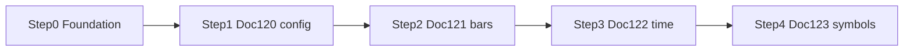

# Docs 120–123 — Auth and DB first, then one file per step

Design sources:

- [System_Overview_Design_120_Get_Datafeed_Configuration_Data_(TV).md](System_Overview_Design/System_Overview_Design_120_Get_Datafeed_Configuration_Data_(TV).md)
- [System_Overview_Design_121_Get_Bars_(TV).md](System_Overview_Design/System_Overview_Design_121_Get_Bars_(TV).md)
- [System_Overview_Design_122_Get_Server_Time_(TV).md](System_Overview_Design/System_Overview_Design_122_Get_Server_Time_(TV).md)
- [System_Overview_Design_123_Get_Symbol_Information_(TV).md](System_Overview_Design/System_Overview_Design_123_Get_Symbol_Information_(TV).md)

120’s first processing step is token auth (S-01), so that file cannot be tested honestly until a token check exists. 120 does **not** need a database (its table list is empty). Postgres is required to **test 123** (`m_ccypairs`, `m_season`). 121 lists 13 `t_chart_*` tables; this slice keeps mock bars and does **not** build that cache.

S-01 login is not in this repo. Stub it. Do not build real SSO.



| Setup | 120 config | 121 history | 122 time | 123 symbols |
|---|---|---|---|---|
| Auth (S-01 stub) | Required in the doc | Not mentioned | Not mentioned | Required in the doc |
| Postgres | Not used | Doc lists 13 `t_chart_*` tables — keep mock bars | None | `m_ccypairs`, `m_season` |

Keep existing UDF paths so the widget still works: `GET /api/config`, `/api/history`, `/api/time`, `/api/symbols`. Do not wrap those bodies in `ApiResponse`.

---

## Step 0 — Foundation (do this before 120)

### Auth stub (needed to test 120 step 1)

- Interceptor on `/api/**` except `GET /api/health`.
- Skip CORS `OPTIONS` (no header on preflight).
- Require header `X-Customer-No` (positive numeric customer id). Missing or invalid → **401**.
- Store the id in a request-scoped holder (`CustomerContext`) for later APIs.
- Frontend `api.ts` sends `X-Customer-No: 1` on every `/api` call so the widget still loads.
- `/curpairs` stays open (not under `/api`).

### Postgres (needed to test 123, not 120)

- Root `docker-compose.yml`: Postgres 16, database `chart`, user/password local-only.
- JPA + Flyway in the backend. Hibernate `ddl-auto: none` (Flyway owns the schema).
- **V1** `m_ccypairs`: `ccypair_cd` (PK, 6 chars), `ccypair_jp`, `rate_unit`, `is_deleted`, `priority`. Seed five demo pairs (`USDJPY` … `AUDUSD`, `is_deleted=0`, JPY `rate_unit=3`, others `5`).
- **V2** `m_season`: `season_cd` (`1` DST / `2` standard), `start_at`, `end_at`. Seed one row covering “now” as standard time so 123 can resolve a session.
- `@RestControllerAdvice`: `422` `{ "message": "CODE:30020" }`, `404` `{ "message": "CODE:30404" }`, `500` `{ "errorCode": "E_SERVER", "message": "システムエラーが発生しました。" }`. Do not wrap UDF history `{ s, bars }`.

### Test Step 0

DBeaver:

- Host `127.0.0.1`, port `5432`, database `chart`, user `chart`
- `SELECT * FROM m_ccypairs;` → 5 rows
- `SELECT * FROM m_season;` → 1 row

Postman / curl:

- `GET http://127.0.0.1:8080/api/health` **without** header → **200**
- `GET http://127.0.0.1:8080/api/config` **without** header → **401**
- `GET http://127.0.0.1:8080/api/config` with `X-Customer-No: 1` → **200** (current config JSON; Step 1 will reshape it)

Do not start Step 1 until health is open and config is gated.

---

## Step 1 — 120 Get datafeed configuration

**Path:** keep `GET /api/config` (widget `onReady`).

Bind the doc’s “External Configuration Information” in `app.tradingview.*`. Map yml → `DatafeedConfigResponse`.

- `CTFX` → `exchanges: [{ "value": "CTFX", "name": "CTFX", "desc": "CTFX" }]`
- `FOREX` → `symbols_types: [{ "name": "FOREX", "value": "FOREX" }]`
- Resolutions exactly: `1S`, `1`, `5`, `15`, `30`, `60`, `120`, `240`, `480`, `1D`, `1W`, `1M`
- Keep `supports_group_request: false`
- Keep `supports_marks` and `supports_timescale_marks` **false** in yml until docs 125/126 exist (doc reference is `true`; enabling it makes the library call missing `/marks` APIs)

No table. No DBeaver for this step.

### Test Step 1

```
GET http://127.0.0.1:8080/api/config
Header: X-Customer-No: 1
```

- 200, JSON matches flags + `CTFX` + `FOREX` + the 12 resolutions
- Same URL without header → 401
- MockMvc asserts the same body
- Widget Network: `/api/config` 200, chart still loads, no `/marks` request

---

## Step 2 — 121 Get bars

**Path:** keep `GET /api/history`. Keep body `{ s, bars[{time,open,high,low,close,volume}], noData }` — the widget depends on this, not Peach `{ t,o,h,l,c }` arrays.

Keep `MockBarGeneratorImpl`. Do **not** create 13 `t_chart_*` tables.

Align without breaking the chart:

- Accept `bid_ask=BID|MID|ASK` as an alias of existing `price=bid|ask|mid`
- Validate: unknown `bid_ask` / missing `symbol` / unsupported resolution / `from` without `to` / `to < from` → 422 `CODE:30020`
- Allow `to` alone with `countBack` (widget paging); do not require `from` when only `to` is set
- Keep `countBack` (widget uses it; the doc uses `from`/`to`)
- Same auth stub as other `/api` routes
- Still mock bars (no `t_chart_*` tables); response stays `{ s, bars[{time,open,high,low,close,volume}] }`

### Test Step 2

```
GET /api/history?symbol=USD/JPY&resolution=1D&countBack=10&price=mid
Header: X-Customer-No: 1
```

- `s=ok`, 10 bars, OHLC consistent
- `bid_ask=ASK` → different closes than MID
- `bid_ask=FOO` → 422
- `from` set, `to` omitted → 422
- unknown symbol → existing `{ s: "error" }` (not the 422 envelope)

DBeaver: none for bars. Optional: `SELECT * FROM m_ccypairs WHERE ccypair_cd = 'USDJPY';`

---

## Step 3 — 122 Get server time

**Path:** keep `GET /api/time`.

Doc field is `t`; frontend reads `serverTime`. Return **both** with the same unix-seconds value. No table.

### Test Step 3

```
GET /api/time
Header: X-Customer-No: 1
```

- 200, `serverTime` and `t` equal, within a few seconds of now
- Widget time still works

DBeaver: none.

---

## Step 4 — 123 Get symbol information

**Path:** keep `GET /api/symbols?symbol=` (widget resolve). Doc says body + length 6; the widget sends `USD/JPY`. Accept **6-char `ccypair_cd` and display names**. Resolve against `m_ccypairs` where `is_deleted = 0`. Missing/blank → 422; unknown → 404 `CODE:30404`.

Work:

- Entity + `CcypairRepository` / `SeasonRepository`
- `pricescale = 10^rate_unit` from DB
- `name` = `ccypair_cd`, `description` = `ccypair_jp`
- Session from `m_season` vs now: DST → `app.tradingview.time-summer`, else winter; no matching season → 500 `E_SERVER`
- Other fields from `app.tradingview.*` (`timezone=Asia/Tokyo`, `exchange=CTFX`, `type=FOREX`, `visible_plots_set=ohlc`, …)
- Keep extra library fields on `SymbolInfoDto` (`ticker`, multipliers, `data_status`, …)

### Test Step 4

Postman:

```
GET /api/symbols?symbol=USDJPY
Header: X-Customer-No: 1
```

- 200, `pricescale=1000`, `exchange=CTFX`, `timezone=Asia/Tokyo`, `type=FOREX`
- `symbol=USD/JPY` still 200 (widget)
- `symbol=ETHUSD` → 404 `CODE:30404`
- no header → 401

DBeaver:

- `SELECT * FROM m_ccypairs WHERE ccypair_cd = 'USDJPY';`
- Temporarily `UPDATE m_season` so now falls in no range → API 500; restore seed row → 200

Widget: search/resolve `USD/JPY` still opens a chart.

---

## Order and done criteria

0. Foundation green (DBeaver seed + health open + config 401 without token)
1. 120 Postman JSON + widget `config`
2. 121 Postman bars / 422 cases
3. 122 Postman `t` + `serverTime`
4. 123 Postman + DBeaver pair/season

Run `.\mvnw.cmd test` after each step. Do not start 121 until 120’s 401/200 pair is proven.
