# Docs 120–134 — Auth and DB first, then one file per step

Design sources:

- [System_Overview_Design_120_Get_Datafeed_Configuration_Data_(TV).md](System_Overview_Design/System_Overview_Design_120_Get_Datafeed_Configuration_Data_(TV).md)
- [System_Overview_Design_121_Get_Bars_(TV).md](System_Overview_Design/System_Overview_Design_121_Get_Bars_(TV).md)
- [System_Overview_Design_122_Get_Server_Time_(TV).md](System_Overview_Design/System_Overview_Design_122_Get_Server_Time_(TV).md)
- [System_Overview_Design_123_Get_Symbol_Information_(TV).md](System_Overview_Design/System_Overview_Design_123_Get_Symbol_Information_(TV).md)
- [System_Overview_Design_124_Get_Symbol_List_(TV).md](System_Overview_Design/System_Overview_Design_124_Get_Symbol_List_(TV).md)
- [System_Overview_Design_125_Get_Marks_List_(TV).md](System_Overview_Design/System_Overview_Design_125_Get_Marks_List_(TV).md)
- [System_Overview_Design_126_Get_Timescale_Marks_List_(TV).md](System_Overview_Design/System_Overview_Design_126_Get_Timescale_Marks_List_(TV).md)
- [System_Overview_Design_127_Register_Chart_Layout_(TV).md](System_Overview_Design/System_Overview_Design_127_Register_Chart_Layout_(TV).md)
- [System_Overview_Design_128_Update_Chart_Layout_(TV).md](System_Overview_Design/System_Overview_Design_128_Update_Chart_Layout_(TV).md)
- [System_Overview_Design_129_Get_Chart_Layout_(TV).md](System_Overview_Design/System_Overview_Design_129_Get_Chart_Layout_(TV).md)
- [System_Overview_Design_130_Get_Chart_Layout_List_(TV).md](System_Overview_Design/System_Overview_Design_130_Get_Chart_Layout_List_(TV).md)
- [System_Overview_Design_131_Delete_Chart_Layout_(TV).md](System_Overview_Design/System_Overview_Design_131_Delete_Chart_Layout_(TV).md)
- [System_Overview_Design_132_Get_Indicator_Template_List_(TV).md](System_Overview_Design/System_Overview_Design_132_Get_Indicator_Template_List_(TV).md)
- [System_Overview_Design_133_Register_Update_Indicator_Template_(TV).md](System_Overview_Design/System_Overview_Design_133_Register_Update_Indicator_Template_(TV).md)
- [System_Overview_Design_134_Get_Indicator_Template_(TV).md](System_Overview_Design/System_Overview_Design_134_Get_Indicator_Template_(TV).md)

120’s first processing step is token auth (S-01), so that file cannot be tested honestly until a token check exists. 120 does **not** need a database (its table list is empty). Postgres is required to **test 123+** (`m_ccypairs`, `m_season`). 121 lists 13 `t_chart_*` tables; this slice keeps mock bars and does **not** build that cache. 124 reuses `m_ccypairs`. 125 adds `m_tv_mark`. 126 adds `m_tv_timescale_mark`. 127–131 share `m_tv_chart_layout` (create in 127; update/get/list/delete reuse it). 132–134 share **`m_tv_indicator_template`** (create in 132; upsert/get reuse it). Docs **135–139** (indicator delete + chart templates) are out of this slice.

S-01 login is not in this repo. Stub it. Do not build real SSO.

```mermaid
flowchart LR
  F[Step0 Foundation]
  S120[Step1 Doc120 config]
  S121[Step2 Doc121 bars]
  S122[Step3 Doc122 time]
  S123[Step4 Doc123 symbols]
  S124[Step5 Doc124 search]
  S125[Step6 Doc125 marks]
  S126[Step7 Doc126 timescale marks]
  S127[Step8 Doc127 register layout]
  S128[Step9 Doc128 update layout]
  S129[Step10 Doc129 get layout]
  S130[Step11 Doc130 list layouts]
  S131[Step12 Doc131 delete layout]
  S132[Step13 Doc132 indicator list]
  S133[Step14 Doc133 indicator upsert]
  S134[Step15 Doc134 get indicator]
  F --> S120 --> S121 --> S122 --> S123 --> S124 --> S125 --> S126 --> S127 --> S128 --> S129 --> S130 --> S131 --> S132 --> S133 --> S134
```



| Setup | 120–126 datafeed | 127–131 layouts | 132–134 indicator templates |
|---|---|---|---|
| Auth (S-01 stub) | Required where doc says so | Required | Required |
| Postgres | V1–V4 (+ mock bars for 121) | `m_tv_chart_layout` + `m_ccypairs` on write | `m_tv_indicator_template` |

Keep existing UDF paths so the widget still works: `GET /api/config`, `/api/history`, `/api/time`, `/api/symbols`, `/api/search`, `/api/marks`, `/api/timescale_marks`, layout REST `POST|PUT|GET|DELETE /api/layouts` (+ `/{id}`) for 127–131, and indicator-template REST under `/api/indicator-templates` for 132–134. Do not wrap UDF bodies in `ApiResponse`. Layout register/update responses return a compact id payload (not `ApiResponse` unless Peach later requires it).
---

## Step 0 — Foundation (do this before 120)

### Auth stub (needed to test 120 step 1)

- Interceptor on `/api/**` except `GET /api/health`.
- Skip CORS `OPTIONS` (no header on preflight).
- Require header `X-Customer-No` (positive numeric customer id). Missing or invalid → **401**.
- Store the id in a request-scoped holder (`CustomerContext`) for later APIs.
- Frontend `api.ts` sends `X-Customer-No: 1` on every `/api` call so the widget still loads.
- `/curpairs` stays open (not under `/api`).

### Postgres (needed to test 123, not 120)

- Root `docker-compose.yml`: Postgres 16, database `chart`, user/password local-only.
- JPA + Flyway in the backend. Hibernate `ddl-auto: none` (Flyway owns the schema).
- **V1** `m_ccypairs`: `ccypair_cd` (PK, 6 chars), `ccypair_jp`, `rate_unit`, `is_deleted`, `priority`. Seed five demo pairs (`USDJPY` … `AUDUSD`, `is_deleted=0`, JPY `rate_unit=3`, others `5`).
- **V2** `m_season`: `season_cd` (`1` DST / `2` standard), `start_at`, `end_at`. Seed one row covering “now” as standard time so 123 can resolve a session.
- `@RestControllerAdvice`: `422` `{ "message": "CODE:30020" }`, `404` `{ "message": "CODE:30404" }`, `500` `{ "errorCode": "E_SERVER", "message": "システムエラーが発生しました。" }`. Do not wrap UDF history `{ s, bars }`.

### Test Step 0

DBeaver:

- Host `127.0.0.1`, port `5432`, database `chart`, user `chart`
- `SELECT * FROM m_ccypairs;` → 5 rows
- `SELECT * FROM m_season;` → 1 row

Postman / curl:

- `GET http://127.0.0.1:8080/api/health` **without** header → **200**
- `GET http://127.0.0.1:8080/api/config` **without** header → **401**
- `GET http://127.0.0.1:8080/api/config` with `X-Customer-No: 1` → **200** (current config JSON; Step 1 will reshape it)

Do not start Step 1 until health is open and config is gated.

### Come back later (unchecked)

- [ ] Replace S-01 stub (`X-Customer-No`) with real login / token validation (SSO). Keep `/api/health` open; decide how the frontend obtains and sends the real credential instead of hardcoding customer `1`.

---

## Step 1 — 120 Get datafeed configuration

**Path:** keep `GET /api/config` (widget `onReady`).

Bind the doc’s “External Configuration Information” in `app.tradingview.*`. Map yml → `DatafeedConfigResponse`.

- `CTFX` → `exchanges: [{ "value": "CTFX", "name": "CTFX", "desc": "CTFX" }]`
- `FOREX` → `symbols_types: [{ "name": "FOREX", "value": "FOREX" }]`
- Resolutions exactly: `1S`, `1`, `5`, `15`, `30`, `60`, `120`, `240`, `480`, `1D`, `1W`, `1M`
- Keep `supports_group_request: false`
- Keep `supports_marks` and `supports_timescale_marks` **false** in yml until docs 125/126 exist (doc reference is `true`; enabling it makes the library call missing `/marks` APIs)

No table. No DBeaver for this step.

### Test Step 1

```
GET http://127.0.0.1:8080/api/config
Header: X-Customer-No: 1
```

- 200, JSON matches flags + `CTFX` + `FOREX` + the 12 resolutions
- Same URL without header → 401
- MockMvc asserts the same body
- Widget Network: `/api/config` 200, chart still loads, no `/marks` request

### Come back later (unchecked)

- [x] Set `supports_marks: true` after Step 6 (`GET /api/marks`, doc 125) + `getMarks` (done in Step 6).
- [ ] Set `supports_timescale_marks: true` to match doc 120 **after** Step 7 (`GET /api/timescale_marks`, doc 126) is live and the datafeed implements `getTimescaleMarks`.
- [ ] Re-verify widget Network: with both flags true, library calls marks + timescale-marks endpoints and chart still loads (no missing-route errors).

---

## Step 2 — 121 Get bars

**Path:** keep `GET /api/history`. Keep body `{ s, bars[{time,open,high,low,close,volume}], noData }` — the widget depends on this, not Peach `{ t,o,h,l,c }` arrays.

Keep `MockBarGeneratorImpl`. Do **not** create 13 `t_chart_*` tables.

Align without breaking the chart:

- Accept `bid_ask=BID|MID|ASK` as an alias of existing `price=bid|ask|mid`
- Validate: unknown `bid_ask` / missing `symbol` / unsupported resolution / `from` without `to` / `to < from` → 422 `CODE:30020`
- Allow `to` alone with `countBack` (widget paging); do not require `from` when only `to` is set
- Keep `countBack` (widget uses it; the doc uses `from`/`to`)
- Same auth stub as other `/api` routes
- Still mock bars (no `t_chart_*` tables); response stays `{ s, bars[{time,open,high,low,close,volume}] }`

### Test Step 2

```
GET /api/history?symbol=USD/JPY&resolution=1D&countBack=10&price=mid
Header: X-Customer-No: 1
```

- `s=ok`, 10 bars, OHLC consistent
- `bid_ask=ASK` → different closes than MID
- `bid_ask=FOO` → 422
- `from` set, `to` omitted → 422
- unknown symbol → existing `{ s: "error" }` (not the 422 envelope)

DBeaver: none for bars. Optional: `SELECT * FROM m_ccypairs WHERE ccypair_cd = 'USDJPY';`

### Come back later (unchecked)

- [x] Phase 1: Redis `cache_set_*`, synchronized writer/reader, Peach `{ t,o,h,l,c }` + `nextTime`, bid_/ask_, strict validation + FE.
- [x] Phase 2: Flyway V8 `t_chart_*` warehouse; writer UPSERTs DB then Redis; history reads Redis (warms from DB).
- [ ] Point history symbol lookup at `m_ccypairs` only (drop duplicate catalog source) if mentor requires a single source of truth.

---

## Step 3 — 122 Get server time

**Path:** keep `GET /api/time`.

Doc field is `t`; frontend reads `serverTime`. Return **both** with the same unix-seconds value. No table.

### Test Step 3

```
GET /api/time
Header: X-Customer-No: 1
```

- 200, `serverTime` and `t` equal, within a few seconds of now
- Widget time still works

DBeaver: none.

### Come back later (unchecked)

- [ ] Peach-only body `{ "t": <unixSeconds> }` if a Peach client must not see `serverTime` — then change `frontend/src/datafeed/datafeed.ts` to read `t` (or map in an adapter) so the widget still works.

---

## Step 4 — 123 Get symbol information

**Path:** keep `GET /api/symbols?symbol=` (widget resolve). Doc says body + length 6; the widget sends `USD/JPY`. Accept **6-char `ccypair_cd` and display names**. Resolve against `m_ccypairs` where `is_deleted = 0`. Missing/blank → 422; unknown → 404 `CODE:30404`.

Work:

- Entity + `CcypairRepository` / `SeasonRepository`
- `pricescale = 10^rate_unit` from DB
- Chart header display: `name` / `ticker` = `USD/JPY` form; keep `provider_symbol` = `ccypair_cd`
- `description` = `ccypair_jp`
- Session from `m_season` vs now: DST → `app.tradingview.time-summer`, else winter; no matching season → 500 `E_SERVER`
- Other fields from `app.tradingview.*` (`timezone=Asia/Tokyo`, `exchange=CTFX`, `type=FOREX`, `visible_plots_set=ohlc`, …)
- Keep extra library fields on `SymbolInfoDto` (`ticker`, multipliers, `data_status`, …)

### Test Step 4

Postman:

```
GET /api/symbols?symbol=USDJPY
Header: X-Customer-No: 1
```

- 200, `pricescale=1000`, `exchange=CTFX`, `timezone=Asia/Tokyo`, `type=FOREX`
- `symbol=USD/JPY` still 200 (widget)
- `symbol=ETHUSD` → 404 `CODE:30404`
- no header → 401

DBeaver:

- `SELECT * FROM m_ccypairs WHERE ccypair_cd = 'USDJPY';`
- Temporarily `UPDATE m_season` so now falls in no range → API 500; restore seed row → 200

Widget: search/resolve `USD/JPY` still opens a chart.

### Come back later (unchecked)

- [ ] Strict doc `name` = `ccypair_cd` (`USDJPY`) if Peach requires CD in `name` — keep chart header as `USD/JPY` via `ticker` / frontend only, and re-check widget legend.
- [ ] Strict length-6 validation on `symbol` (reject `USD/JPY` at validation) only if Peach clients never send display names; otherwise keep normalize-to-CD (preferred for the widget).
- [ ] Align search / history / quotes with DB-backed pairs (Step 5 covers search; history/quotes still use in-memory catalog until cleaned up).
- [ ] Manual re-verify: DBeaver season-out-of-range → 500 `E_SERVER`; deleted pair → 404; widget Network `/api/symbols` after those DB edits.

---

## Step 5 — 124 Get symbol list (search)

**Path:** keep `GET /api/search` (widget `searchSymbols`). Do **not** invent a second search URL.

Today search still uses the in-memory `CurrencyPairService` / `SymbolCatalog`. Step 5 switches retrieval to **`m_ccypairs`** so it matches the markdown and stays consistent with Step 4 resolve.

### Requirements coverage (doc 124)

| Doc requirement | Plan |
|---|---|
| Token auth (S-01) | Existing `X-Customer-No` on `/api/**` |
| `query` optional, max length **10** | Longer → **422** `CODE:30020` |
| `limit` optional, range **1 … max** | Out of range → **422**; bind max from yml |
| Default `limit` when omitted | `app.tradingview.search-default-limit` = **100** |
| Max count | `app.tradingview.search-max-limit` = **100** |
| Match `ccypair_cd` **or** `ccypair_jp` (full or partial) | Case-insensitive contains on CD; contains on Japanese name |
| `is_deleted = 0` only | Repository filter |
| Sort by `priority` ascending | `ORDER BY priority ASC` |
| DTO: `symbol`, `description`, `type`, `exchange` | `symbol` = `ccypair_cd`, `description` = `ccypair_jp`, `type`/`exchange` from yml (`FOREX` / `CTFX`) |
| Table `m_ccypairs` | Already from Step 0 / 4 — no new migration |

### Widget-safe extras (keep chart working)

Doc list DTO is only four fields. TradingView `SearchSymbolResultItem` also needs `full_name` and `ticker` so pick → resolve → history still works:

- Keep `full_name` / `ticker` as display form `USD/JPY` (slash)
- `symbol` stays **`USDJPY`** per doc (CD)
- Widget already sends `exchange` / `type` query params; keep filtering by them when present (case-insensitive) so CTFX/FOREX search does not go empty again

Frontend `datafeed.ts` already calls `/search` with `query`, `exchange`, `type`, `limit`. No UI redesign. Optionally raise default `limit` from `50` to omit and use server default **100**, or leave `50` (valid within 1–100).

### Work

- Bind `search-default-limit` / `search-max-limit` (and reuse `exchanges` / `symbols-types`) in `AppProperties`
- `CcypairRepository` search query: deleted=0, optional query on CD/JP, order by priority, limit
- Replace in-memory search path in `ChartDataServiceImpl.search` with DB (catalog may remain for history/mock quotes until a later cleanup)
- MockMvc: `SystemOverviewDesign124Test`

### Test Step 5

**Automated (high value):** `SystemOverviewDesign124Test`

- Missing token → **401**
- `limit=0` / `limit=101` / `query` length > 10 → **422** `CODE:30020`
- No `query`, no `limit` → **200**, array size **5**, order matches `priority` (`USDJPY` first)
- `query=USD` → includes `USDJPY`; excludes pairs that do not match CD/JP
- `query=円` → hits Japanese `ccypair_jp` (at least JPY-quoted pairs)
- `exchange=CTFX&type=FOREX` → still **5** (widget filter regression)
- `@Transactional`: set one pair `is_deleted=1` → that CD absent from results
- Assert each hit has doc fields `symbol`, `description`, `type=FOREX`, `exchange=CTFX` plus widget `ticker` / `full_name`

**Postman:**

```
GET http://127.0.0.1:8080/api/search?query=USD&limit=10
Header: X-Customer-No: 1
```

```
GET http://127.0.0.1:8080/api/search
Header: X-Customer-No: 1
```

- Empty query → 5 pairs, `symbol` like `USDJPY`, `description` like `米ドル/円`
- `query=ABCDEFGHIJK` (11 chars) → 422
- no header → 401

**DBeaver:**

```sql
SELECT ccypair_cd, ccypair_jp, is_deleted, priority
FROM m_ccypairs
ORDER BY priority;
```

**Widget:** open symbol search → all five pairs again; pick `USD/JPY` / CD still resolves and loads bars.

Do not start Step 6 until search is DB-backed and CTFX/FOREX filter still returns the five pairs.

---

## Step 6 — 125 Get marks list

**Path:** add `GET /api/marks` (UDF / widget `getMarks`). Enable marks only after this endpoint exists.

Doc: marks at the top of the chart from table **`m_tv_mark`**.

### Requirements coverage (doc 125)

| Doc requirement | Plan |
|---|---|
| Token auth (S-01) | Existing `X-Customer-No` |
| `symbol` required (length 6 in doc) | Blank/missing → **422**; accept **`USDJPY` and `USD/JPY`** (same normalize as 123) |
| `resolution` required | Must be in doc list `1S,1,5,15,30,60,120,240,480,1D,1W,1M` (note: no `10` here) → else 422 |
| `from`, `to` required; `to >= from` | Missing either / `to < from` → **422** `CODE:30020` |
| Filter by resolution + currency pair CD | Exact match after normalize |
| Filter `mark_at` by `[from, to]` | Inclusive on both ends (unix seconds) |
| DTO: `color`, `id`, `label`, `text`, `time` | `time` = `mark_at` epoch seconds |
| Table `m_tv_mark` | New Flyway migration + entity + repository |

### Schema (Flyway **V3**)

Create `m_tv_mark` with at least:

| Column | Purpose |
|---|---|
| `id` | PK (string or bigint serialized as string in JSON) |
| `ccypair_cd` | FK-like to pair CD (`USDJPY`) |
| `resolution` | Chart type (`1D`, `60`, …) |
| `mark_at` | timestamptz or epoch stored as bigint seconds — pick one; API always returns unix seconds |
| `color` | e.g. `green` / `red` |
| `label` | e.g. `B` / `S` |
| `text` | Mark description |

Seed **2–4** demo rows for `USDJPY` + `1D` with `mark_at` inside a fixed, documented window (so Postman/tests are deterministic). Include at least one buy (`green`/`B`) and one sell (`red`/`S`).

### Widget-safe extras

TradingView `Mark` also requires `labelFontColor` and `minSize`. Doc does not list them — return stable defaults (e.g. `#ffffff`, `14`) so the library does not drop marks. Fix existing `MarkDto` if `text` is still a `List` — library expects a **string**.

### Config + frontend

- Set `app.tradingview.supports-marks: true` (Step 1 left it false on purpose)
- Keep `supports_timescale_marks: false` until doc **126**
- Wire `getMarks` in `frontend/src/datafeed/datafeed.ts` → `GET /api/marks` with `symbol` (ticker or name), `resolution`, `from`, `to`
- No new UI screens; marks appear in the chart chrome when the library asks for them

### Work

- V3 migration + `TvMark` entity + `TvMarkRepository`
- `ChartDataController` `GET /api/marks` + service validation/mapping
- Align `MarkDto` with library (`text: string`)
- MockMvc: `SystemOverviewDesign125Test`
- Update config test / doc120 profile if needed so marks flag expectations stay honest (`supports_marks` true in default yml after this step; doc120 profile can stay as-is for 120-only asserts)

### Test Step 6

**Automated (high value):** `SystemOverviewDesign125Test`

- Missing token → **401**
- Validation matrix → **422** `CODE:30020`:
  - missing `symbol` / `resolution` / `from` / `to`
  - `resolution=10` or `resolution=2` (not in 125 list)
  - `to < from`
- Happy path with seeded range:

```
GET /api/marks?symbol=USDJPY&resolution=1D&from=<seedFrom>&to=<seedTo>
Header: X-Customer-No: 1
```

  - **200**, non-empty array
  - Each item has `id`, `time`, `color`, `label`, `text` (and defaults for library fields)
  - `time` within `[from, to]`; buy/sell colors/labels match seed
- `symbol=USD/JPY` same hits as `USDJPY`
- Range with no marks → **200** `[]` (not 404)
- Wrong resolution with same times → `[]`
- `GET /api/config` → `supports_marks: true`, `supports_timescale_marks: false`

**Postman:** same happy / 422 / empty-range cases as above.

**DBeaver:**

```sql
SELECT id, ccypair_cd, resolution, mark_at, color, label, text
FROM m_tv_mark
WHERE ccypair_cd = 'USDJPY'
ORDER BY mark_at;
```

**Widget (end-to-end value):**

1. Restart backend; confirm `/api/config` has `supports_marks: true`
2. Open `USD/JPY` on `1D` over the seeded date range
3. Network: library calls `/api/marks?...` → **200**
4. Chart shows mark pins (B/S) at the top — matches doc “Marks are displayed at the top of the chart”

Do not enable timescale marks or implement 126 in this step.

---

## Step 7 — 126 Get timescale marks list

**Path:** add `GET /api/timescale_marks` (UDF / widget `getTimescaleMarks`). Enable the config flag only after this endpoint exists.

Doc: timescale marks on the time axis from table **`m_tv_timescale_mark`**. Same query shape as marks (125), different DTO and table.

### Requirements coverage (doc 126)

| Doc requirement | Plan |
|---|---|
| Token auth (S-01) | Existing `X-Customer-No` |
| `symbol` required (length 6 in doc) | Blank/missing → **422**; accept **`USDJPY` and `USD/JPY`** (same normalize as 123/125) |
| `resolution` required | Same list as 125: `1S,1,5,15,30,60,120,240,480,1D,1W,1M` → else 422 |
| `from`, `to` required; `to >= from` | Missing either / `to < from` → **422** `CODE:30020` |
| Filter by resolution + currency pair CD | Exact match after normalize |
| Filter `timescale_mark_at` by `[from, to]` | Inclusive on both ends (unix seconds) |
| DTO: `id`, `color`, `label`, `time`, `tooltip` | `time` = `timescale_mark_at` epoch seconds |
| Table `m_tv_timescale_mark` | New Flyway **V4** + entity + repository |

### Schema (Flyway **V4**)

Create `m_tv_timescale_mark` with at least:

| Column | Purpose |
|---|---|
| `id` | PK (string; JSON `id` as string) |
| `ccypair_cd` | Pair CD (`USDJPY`) |
| `resolution` | Chart type (`1D`, `60`, …) |
| `timescale_mark_at` | bigint unix seconds |
| `color` | e.g. `rgba(255, 99, 71, 0.2)` or named color |
| `label` | e.g. `B` / `S` / short text |
| `tooltip` | Tooltip text (store as string) |

Seed **2–3** demo rows for `USDJPY` + `1D` in a fixed window (reuse or sit near the Step 6 mark window so one Postman range exercises both APIs). At least one buy-like and one sell-like label.

### Widget-safe extras

TradingView `TimescaleMark` allows optional `labelFontColor` and `tooltip` as `string | string[]`. Doc maps `tooltip` as a single string.

- JSON: return `tooltip` as a **string array** of one element (or a string if the current `TimescaleMarkDto` is adjusted consistently) so the library renders hover text.
- Align / fix existing `TimescaleMarkDto` (today it has `List<String> tooltip` + `labelFontColor`) so serialization matches what `getTimescaleMarks` expects — do not invent Peach fields beyond the doc DTO + library minimums.
- Optional stable `labelFontColor` default if the library drops marks without it.

### Config + frontend

- Set `app.tradingview.supports-timescale-marks: true`
- Keep `supports_marks: true` (from Step 6)
- Wire `getTimescaleMarks` in `frontend/src/datafeed/datafeed.ts` → `GET /api/timescale_marks` with `symbol`, `resolution`, `from`, `to`
- No new UI screens; marks appear on the timescale when the library asks

### Work

- V4 migration + `TvTimescaleMark` entity + repository
- `ChartDataController` `GET /api/timescale_marks` + service validation/mapping (reuse marks validation helpers where possible)
- Fix `TimescaleMarkDto` for library-safe JSON
- MockMvc: `SystemOverviewDesign126Test`
- Update Step 6 config assertion that expected `supports_timescale_marks: false` → true after this step (or split that assert into Step 7)

### Test Step 7

**Automated (high value):** `SystemOverviewDesign126Test`

- Missing token → **401**
- Validation matrix → **422** `CODE:30020`:
  - missing `symbol` / `resolution` / `from` / `to`
  - `resolution=10` (not in list)
  - `to < from`
- Happy path with seeded range:

```
GET /api/timescale_marks?symbol=USDJPY&resolution=1D&from=<seedFrom>&to=<seedTo>
Header: X-Customer-No: 1
```

  - **200**, non-empty array
  - Each item has `id`, `time`, `color`, `label`, `tooltip`
  - `time` within `[from, to]`
- `symbol=USD/JPY` same hits as `USDJPY`
- Empty range / wrong resolution → **200** `[]` (not 404)
- `GET /api/config` → `supports_marks: true` **and** `supports_timescale_marks: true`

**Postman:** same happy / 422 / empty cases.

**DBeaver:**

```sql
SELECT id, ccypair_cd, resolution, timescale_mark_at, color, label, tooltip
FROM m_tv_timescale_mark
WHERE ccypair_cd = 'USDJPY'
ORDER BY timescale_mark_at;
```

**Widget (end-to-end value):**

1. Restart backend; confirm `/api/config` has both marks flags true
2. Open `USD/JPY` on `1D` over the seeded range
3. Network: `/api/timescale_marks?...` → **200** (in addition to `/api/marks`)
4. Timescale shows labels/tooltips — distinct from top-of-chart marks

Do not implement chart-layout APIs in this step.

---

## Step 8 — 127 Register chart layout

**Path:** `POST /api/layouts` (JSON body). Response: chart layout id (prefer `{ "id": <number> }` so update/get share one shape; if Peach later requires a bare number, adapt behind a flag).

Doc: insert into **`m_tv_chart_layout`**, validate pair against **`m_ccypairs`**, stamp `customer_no` from the token.

### Requirements coverage (doc 127)

| Doc requirement | Plan |
|---|---|
| Token auth (S-01) | Existing `X-Customer-No` → **401** if missing |
| Body: `name` required, max **64** | Blank / over length → **422** `CODE:30020` |
| Body: `content` required | Blank/missing → **422** |
| Body: `symbol` required (length 6 in doc) | Blank → **422**; accept **`USDJPY` and `USD/JPY`** → normalize to CD |
| Body: `resolution` required | Must be in `1S,1,5,15,30,60,120,240,480,1D,1W,1M` → else 422 |
| Pair exists + `is_deleted = 0` | Else **404** `CODE:30404` |
| Register columns | `customer_no` = token customer; `name`, `content`, `ccypair_cd`, `chart_type` (= resolution) |
| Response | Chart layout **id** |

### Schema (Flyway **V5**) — create once here; Steps 9–12 reuse

| Column | Purpose |
|---|---|
| `id` | `BIGSERIAL` PK (numeric path param for 128/129/131) |
| `customer_no` | From `X-Customer-No` / `CustomerContext` |
| `name` | `VARCHAR(64)` |
| `content` | `TEXT` (TradingView layout JSON string) |
| `ccypair_cd` | `VARCHAR(6)` |
| `chart_type` | `VARCHAR(8)` (resolution) |
| `updated_at` | `TIMESTAMPTZ` not null, set on insert (needed for doc 129 `timestamp`) |

Optional `created_at` for ops; not in DTO. No soft-delete in 127–130 (doc 131 hard-deletes).

### Widget / frontend scope this step

Docs 127–131 are Peach layout CRUD, not UDF. Today `LocalStorageSaveLoadAdapter` stores charts in the browser.

- **This step:** ship backend + MockMvc/Postman. Do **not** require swapping the save-load adapter yet.
- Optional thin `apiPost('/layouts', …)` helper is fine if useful for manual FE experiments.
- Full `IExternalSaveLoadAdapter.saveChart` → `POST /api/layouts` is **Come back later** (needs list/delete Steps 11–12 for a complete server-backed Load dialog).
### Work

- V5 migration + `TvChartLayout` entity + `TvChartLayoutRepository`
- Request DTO `RegisterChartLayoutRequest` (`name`, `content`, `symbol`, `resolution`)
- `ChartLayoutController` (or dedicated methods) `POST /api/layouts`
- Persist `customer_no` from `CustomerContext`; set `updated_at = now`
- MockMvc: `SystemOverviewDesign127Test`

### Test Step 8

**Automated (high value):** `SystemOverviewDesign127Test`

- Missing token → **401**
- Validation → **422**: missing/blank `name`/`content`/`symbol`/`resolution`; `name` length 65; `resolution=10`; invalid blank symbol
- Unknown / deleted pair → **404** `CODE:30404` (`@Transactional` flip `is_deleted=1` on `USDJPY`, or use a non-seed CD)
- Happy path:

```
POST http://127.0.0.1:8080/api/layouts
Header: X-Customer-No: 1
Content-Type: application/json

{ "name": "My layout", "content": "{\"pane\":1}", "symbol": "USDJPY", "resolution": "1D" }
```

  - **200/201**, body contains numeric `id`
  - DBeaver (or repository assert): row has `customer_no=1`, `ccypair_cd=USDJPY`, `chart_type=1D`, `name`/`content` as sent, `updated_at` set
- `symbol=USD/JPY` registers same CD

**Postman:** happy + 422 + 404 as above.

**DBeaver:**

```sql
SELECT id, customer_no, name, ccypair_cd, chart_type, updated_at, left(content, 80)
FROM m_tv_chart_layout
ORDER BY id;
```

Do not start Step 9 until register returns a stable numeric id and the row is visible in Postgres.

### Come back later (unchecked)

- [ ] Wire `saveChart` in `save-load-adapter.ts` to `POST /api/layouts` (and keep localStorage as fallback) once list/delete (Steps 11–12) exist.
- [ ] Peach-exact response shape if not `{ "id": n }` (bare number / wrapped envelope).

---

## Step 9 — 128 Update chart layout

**Path:** `PUT /api/layouts/{id}` with the same JSON body as register (`name`, `content`, `symbol`, `resolution`). Response: chart layout id.

### Requirements coverage (doc 128)

| Doc requirement | Plan |
|---|---|
| Token auth (S-01) | Existing stub |
| Path `id` must be numeric (S-11) | Non-numeric → **422** `CODE:30020` |
| Body validation | Same as 127 → **422** |
| Layout exists by path id | Else **404** `CODE:30404` |
| Pair exists + `is_deleted = 0` | Else **404** `CODE:30404` |
| Update columns | `name`, `ccypair_cd`, `chart_type` from body; bump `updated_at` |
| Response | Same chart layout **id** |

### Doc quirk — `content` on update

English/Japanese **Update Conditions** say update `content` from **`[1].content`** (keep existing), while overview + validation require request `content`.

**Plan (preferred):** update **`content` from the request body** (matches overview, required field, and TradingView save semantics). Treat the update-conditions row as a likely copy/paste error.

- [ ] Come back later: if Peach insists on “name/symbol/resolution only”, stop writing `content` and add a regression test that content is unchanged.

### Customer scope

Doc does not filter by `customer_no` on update. **Plan:** still require auth; optionally require `layout.customer_no == token customer` → **404** if another customer’s id (high value with stub multi-customer headers). If Peach is id-global, drop the tenant check later.

### Work

- Reuse register request DTO (or shared `UpsertChartLayoutRequest`)
- `PUT /api/layouts/{id}` — bind `id` as `Long`; reject non-numeric via Spring conversion → mapped **422** (or explicit check)
- Service: load layout → validate pair → apply fields → save → return id
- MockMvc: `SystemOverviewDesign128Test` (can depend on inserting via repository or calling register in `@BeforeEach`)

### Test Step 9

**Automated (high value):** `SystemOverviewDesign128Test`

- Missing token → **401**
- `PUT /api/layouts/abc` → **422**
- Body validation → **422** (reuse a couple of cases from 127)
- Unknown id → **404**
- Known id + deleted/unknown symbol → **404**
- Happy path (seed via register or repo):

```
PUT http://127.0.0.1:8080/api/layouts/{id}
Header: X-Customer-No: 1
Content-Type: application/json

{ "name": "Renamed", "content": "{\"pane\":2}", "symbol": "EURUSD", "resolution": "60" }
```

  - **200**, returns same `id`
  - DB: `name=Renamed`, `content` new JSON, `ccypair_cd=EURUSD`, `chart_type=60`, `updated_at` newer than before
- Cross-customer (if implemented): create as customer `1`, `PUT` with `X-Customer-No: 2` → **404**

**Postman:** register (Step 8) → update → DBeaver verify columns.

**DBeaver:** same `SELECT` as Step 8; confirm `updated_at` moved.

Do not implement get-by-id beyond what tests need until Step 10 (tests may read via repository).

### Come back later (unchecked)

- [ ] Peach-strict: do not update `content` if update-conditions table is authoritative.
- [ ] Wire adapter `saveChart` overwrite path to `PUT /api/layouts/{id}`.

---

## Step 10 — 129 Get chart layout

**Path:** `GET /api/layouts/{id}`. Response: chart layout DTO `{ id, name, timestamp, content }`.

### Requirements coverage (doc 129)

| Doc requirement | Plan |
|---|---|
| Token auth (S-01) | Existing stub |
| Path `id` must be numeric (S-11) | Non-numeric → **422** `CODE:30020` |
| Retrieve by chart layout id | Missing → **404** `CODE:30404` |
| DTO map | `id`, `name`, `timestamp` = `updated_at` as **unix seconds**, `content` |

Doc does **not** return `symbol` / `resolution` / `customer_no` on get — do not add them unless the adapter needs them later (list API Step 11 exposes symbol/type).

### Customer scope

Same as Step 9: prefer **404** when `customer_no` ≠ token customer (unchecked come-back if Peach is global-by-id).

### Frontend

- Optional: `getChartContent(id)` → `GET /api/layouts/{id}` then use `.content` — still **Come back later** with full adapter swap.
- High-value E2E without adapter: Postman/MockMvc round-trip is enough for this step.

### Work

- Response DTO `ChartLayoutDto(id, name, timestamp, content)`
- `GET /api/layouts/{id}`
- MockMvc: `SystemOverviewDesign129Test`
- Prefer one **round-trip** test class or shared helpers: register → update → get asserts final name/content/timestamp

### Test Step 10

**Automated (high value):** `SystemOverviewDesign129Test` (+ optional cross-step `ChartLayoutRoundTripTest`)

- Missing token → **401**
- `GET /api/layouts/abc` → **422**
- Unknown id → **404** `CODE:30404`
- Happy path after register:

```
GET http://127.0.0.1:8080/api/layouts/{id}
Header: X-Customer-No: 1
```

  - **200**, `id` matches, `name`/`content` match insert, `timestamp` ≈ `updated_at` epoch (within a few seconds)
- After update (Step 9): get returns **new** name/content and a **newer** `timestamp`
- Cross-customer (if scoped): customer `2` get → **404**

**Postman sequence (highest manual value for 127–129):**

1. `POST /api/layouts` → note `id`
2. `GET /api/layouts/{id}` → matches body
3. `PUT /api/layouts/{id}` → change name/content
4. `GET /api/layouts/{id}` → reflects update + newer `timestamp`

**DBeaver:** confirm `updated_at` ↔ API `timestamp` (`EXTRACT(EPOCH FROM updated_at)`).

### Come back later (unchecked)

- [ ] Server-backed Load chart UI via Steps **11–12** + adapter `getAllCharts` / `removeChart` / `getChartContent`.
- [ ] Tenant isolation policy confirmed with Peach (filter by `customer_no` vs id-only).

---

## Step 11 — 130 Get chart layout list

**Path:** `GET /api/layouts` (collection; no path id). Response: JSON array of `{ id, name, resolution, symbol, timestamp }`.

**Status:** implemented (retroactively added to this plan). Matches doc 130 + `SystemOverviewDesign130Test`.

### Requirements coverage (doc 130)

| Doc requirement | Plan / impl |
|---|---|
| Token auth (S-01) | Existing stub → **401** if missing |
| Filter by token `customer_no` | Only rows for `CustomerContext` customer |
| Sort `updated_at` descending | Newest first |
| DTO map | `id`, `name`, `resolution` ← `chart_type`, `symbol` ← `ccypair_cd`, `timestamp` ← `updated_at` unix seconds |
| No `content` on list | Content only on get-by-id (Step 10) |
| Empty list | Customer with no rows → **200** `[]` |

### Customer scope

Doc explicitly filters by token customer. Other customers’ layouts must never appear (stronger than get-by-id’s optional tenant check — list is always tenant-scoped).

### Work (done)

- `ChartLayoutListItemDto` + `GET /api/layouts` on `ChartLayoutController`
- Repository: `findByCustomerNoOrderByUpdatedAtDesc`
- MockMvc: `SystemOverviewDesign130Test`

### Test Step 11

**Automated:** `SystemOverviewDesign130Test` — green.

- Missing token → **401**
- Customer `99` with no rows → **200** `[]`
- Register as customer `1` and `2`; list as `1` → only customer `1` rows
- After register + later update of one layout → newest `updated_at` first; each item has `id,name,resolution,symbol,timestamp` (no `content`)

**Postman:**

```
GET http://127.0.0.1:8080/api/layouts
Header: X-Customer-No: 1
```

**DBeaver:** same `SELECT` as Step 8; order by `updated_at DESC` should match API order.

Do not start Step 12 until list returns tenant-filtered, sorted rows without `content`.

### Come back later (unchecked)

- [ ] Wire adapter `getAllCharts` → `GET /api/layouts` (map `resolution`/`symbol`/`timestamp` into `ChartMetaInfo`).

---

## Step 12 — 131 Delete chart layout

**Path:** `DELETE /api/layouts/{id}`. Response: system datetime (prefer `{ "t": <unix seconds> }` to match `/api/time` style; adapt if Peach wants a bare number / other key).

### Requirements coverage (doc 131)

| Doc requirement | Plan |
|---|---|
| Token auth (S-01) | Existing stub |
| Path `id` must be numeric (S-11) | Non-numeric → **422** `CODE:30020` |
| Layout exists by path id | Else **404** `CODE:30404` |
| Delete row | Hard delete from `m_tv_chart_layout` (no soft-delete column) |
| Response | System datetime now (unix seconds) |

### Customer scope

Doc does not filter by `customer_no` on delete. **Plan:** same as get/update — require `layout.customer_no == token customer` → **404** if another customer’s id (prevents cross-tenant delete with the stub header).

### Work

- `DELETE /api/layouts/{id}` on `ChartLayoutController`
- Service: `requireOwnedLayout` → `delete` → return `Instant.now().getEpochSecond()` (or shared `SystemTimeDto`)
- MockMvc: `SystemOverviewDesign131Test`

### Test Step 12

**Automated (high value):** `SystemOverviewDesign131Test`

- Missing token → **401**
- `DELETE /api/layouts/abc` → **422**
- Unknown id → **404**
- Happy path: register → delete → **200** with `t` ≈ now; `GET /api/layouts/{id}` → **404**; list no longer contains id
- Cross-customer: create as `1`, delete as `2` → **404**; row still in DB for customer `1`

**Postman:** register → list (see id) → delete → list (gone) → get (404).

**DBeaver:** row removed after delete.

Do not start Step 13 until delete is green. After Step 12, optional come-back: wire SaveLoadAdapter layout methods (`getAllCharts` / `saveChart` / `getChartContent` / `removeChart`) — can wait until indicator templates are also done if preferred.

### Come back later (unchecked)

- [ ] Wire adapter `removeChart` → `DELETE /api/layouts/{id}`.
- [ ] Peach-exact delete response shape if not `{ "t": n }`.

---

## Step 13 — 132 Get indicator template list

**Path:** `GET /api/indicator-templates`. Response: JSON array of `{ "name": "..." }` only (doc list DTO has name alone).

Doc: read **`m_tv_indicator_template`**, filter by token `customer_no`. No sort specified — **plan:** sort by `name` ascending for stable UI (come-back if Peach wants `updated_at` desc).

### Schema (Flyway **V6**) — create once here; Steps 14–15 reuse

| Column | Purpose |
|---|---|
| `id` | `BIGINT GENERATED … IDENTITY` PK (ops only; API keys by name) |
| `customer_no` | From token |
| `name` | `VARCHAR(64)` NOT NULL |
| `content` | `TEXT` NOT NULL |
| `updated_at` | `TIMESTAMP WITH TIME ZONE` NOT NULL |

Unique constraint **`(customer_no, name)`** — upsert key for Step 14. Use `TIMESTAMP WITH TIME ZONE` (same H2/Postgres pattern as V5).

### Widget / frontend scope

TradingView `IExternalSaveLoadAdapter` study-template methods (`getAllStudyTemplates`, etc.) stay on localStorage this step. Backend + MockMvc only.

### Work

- V6 migration + `TvIndicatorTemplate` entity + repository
- `IndicatorTemplateController` `GET /api/indicator-templates`
- DTO `IndicatorTemplateListItemDto(name)` (or reuse a thin name-only record)
- Empty list for new customers → **200** `[]`
- MockMvc: `SystemOverviewDesign132Test`

### Test Step 13

- Missing token → **401**
- No rows → **200** `[]`
- After seeding two rows for customer `1` (via repository until Step 14 exists) and one for `2` → list as `1` returns only those two **names** (no `content`)

**Postman:** `GET /api/indicator-templates` + header → `[]` until Step 14 inserts data.

Do not start Step 14 until V6 migrates on H2 + Postgres and empty list is green.

### Come back later (unchecked)

- [ ] Wire `getAllStudyTemplates` → list API.
- [ ] Confirm Peach sort order if not name ASC.

---

## Step 14 — 133 Register / update indicator template

**Path:** `POST /api/indicator-templates` (JSON body `{ name, content }`). Upsert by `(customer_no, name)`. Response: update datetime (prefer `{ "t": <unix seconds> }` from row `updated_at` after save).

### Requirements coverage (doc 133)

| Doc requirement | Plan |
|---|---|
| Token auth (S-01) | Existing stub |
| Body `name` required, max **64** | Blank / over length → **422** |
| Body `content` required | Blank/missing → **422** |
| Lookup by token customer + name | If found → update `content` + bump `updated_at`; name stays |
| If not found → register | Set `customer_no`, `name`, `content`, `updated_at` |
| Response | Update datetime of the row |

Doc update-conditions: on update, **name** and **customer_no** are not rewritten (only `content`). On register, all three plus timestamp.

### Work

- Request DTO `UpsertIndicatorTemplateRequest(name, content)`
- Service upsert; return `updated_at` epoch
- MockMvc: `SystemOverviewDesign133Test`

### Test Step 14

- Missing token → **401**
- Validation → **422** (blank name/content; name length 65)
- First POST → **200/201**, `t` set; DBeaver/repo: one row
- Second POST same name, new content → same row id; `content` updated; `t` newer; list still one name
- Different customer same name → separate row (unique per customer)

**Postman:**

```
POST http://127.0.0.1:8080/api/indicator-templates
Header: X-Customer-No: 1
Content-Type: application/json

{ "name": "My RSI", "content": "{\"studies\":[]}" }
```

Do not start Step 15 until upsert is idempotent on `(customer_no, name)`.

### Come back later (unchecked)

- [ ] Wire `saveStudyTemplate` → POST upsert.
- [ ] Peach-exact response shape / HTTP status (200 vs 201 on insert).

---

## Step 15 — 134 Get indicator template

**Path:** `GET /api/indicator-templates/{name}` (URL-encode names with spaces). Response: `{ name, content }`.

Doc validates query/path **`name`**: required, max 64 → **422** if blank/over length. Retrieve by token customer + name → else **404** `CODE:30404`.

Prefer path param so it mirrors layout get-by-key style; if Peach uses `?name=`, switch without changing service logic.

### Requirements coverage (doc 134)

| Doc requirement | Plan |
|---|---|
| Token auth (S-01) | Existing stub |
| `name` required, max 64 | **422** `CODE:30020` |
| Match customer + name | Else **404** `CODE:30404` |
| DTO | `name`, `content` only |

### Work

- `GET /api/indicator-templates/{name}`
- Response DTO `IndicatorTemplateDto(name, content)`
- MockMvc: `SystemOverviewDesign134Test`

### Test Step 15

- Missing token → **401**
- Blank / overlong name → **422**
- Unknown name → **404**
- After Step 14 upsert → **200** with matching `name`/`content`
- Cross-customer: template owned by `1`, get as `2` → **404**

**Postman:** upsert → get by name → change content via upsert → get shows new content.

**DBeaver:**

```sql
SELECT id, customer_no, name, updated_at, left(content, 80)
FROM m_tv_indicator_template
ORDER BY customer_no, name;
```

### Come back later (unchecked)

- [ ] Wire `getStudyTemplateContent` → GET by name.
- [ ] Doc **135** delete indicator template (out of this slice; needed for full study-template adapter `removeStudyTemplate`).

---

## Order and done criteria

0. Foundation green (DBeaver seed + health open + config 401 without token)
1. 120 Postman JSON + widget `config`
2. 121 Postman bars / 422 cases
3. 122 Postman `t` + `serverTime`
4. 123 Postman + DBeaver pair/season
5. 124 Postman/MockMvc search from `m_ccypairs` + widget still lists five pairs under CTFX/FOREX
6. 125 `m_tv_mark` + `/api/marks` + `supports_marks: true` + marks visible on chart
7. 126 `m_tv_timescale_mark` + `/api/timescale_marks` + `supports_timescale_marks: true` + timescale marks on chart
8. 127 V5 `m_tv_chart_layout` + `POST /api/layouts` + customer_no + pair 404
9. 128 `PUT /api/layouts/{id}` + path/body validation + content update + pair 404
10. 129 `GET /api/layouts/{id}` + DTO `timestamp` unix + Postman register→update→get round-trip
11. 130 `GET /api/layouts` list by customer + sort `updated_at` DESC + list DTO (no content)
12. 131 `DELETE /api/layouts/{id}` + S-11 path check + owned-row delete + system time response
13. 132 V6 `m_tv_indicator_template` + `GET /api/indicator-templates` name-only list
14. 133 `POST /api/indicator-templates` upsert by (customer, name) + `updated_at` response
15. 134 `GET /api/indicator-templates/{name}` + name validation + 404 miss

Run `.\mvnw.cmd test` after each step. Do not start 121 until 120’s 401/200 pair is proven. Do not start 125 until 124’s DB search + widget filter regression is green. Do not start 127 until 126’s timescale endpoint + config flag are green. Do not start 128 until 127 returns a numeric id persisted in Postgres. Do not call Step 10 “done” until the Postman round-trip shows update reflected on get. Do not start 132 until 131 delete is green. Do not start 134 until 133 upsert can create the row get must return.

Each of Steps 0–4 (and 7–15 as marked) has a **Come back later (unchecked)** checklist for Peach-strict or widget-deferred work (real S-01, `t_chart_*` / columnar bars, Peach-only `{t}`, strict `name`/length-6, catalog→DB for history, SaveLoadAdapter server wiring for layouts + study templates, 128 content quirk, docs 135–139). Leave those boxes unchecked until you deliberately revisit them.
