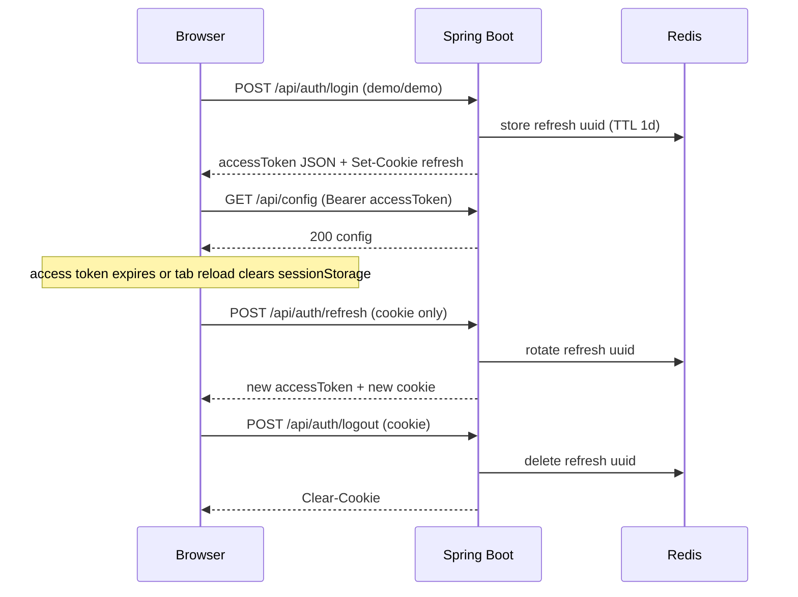

# Project structure — mentor onboarding (docs 120–139)

**Audience:** a mentor or reviewer with **no prior context** on this repo. After reading this file you should know:

- what the application does and what is demo vs production Peach
- which processes run, on which ports, and how they connect
- where each design doc (120–139) is implemented in code
- how login works (access JWT + refresh cookie) and **how to verify it step by step**
- that **Java ingest** is the only live price **and** live candle source (Redis buses → Python WS gateway)

**Suggested read order**

| Step | Section | Why |
|------|---------|-----|
| 1 | §0 Glossary | Terms used everywhere (S-01, UDF, SSOT, `customer_no`, …) |
| 2 | §1–3 | What the app is + how to start it + 5‑minute smoke test |
| 3 | §6 + **§6.1** | Auth model and **refresh-token verification** (curl, browser, tests) |
| 4 | §8–10 | **DB tables ↔ MD** (§8) + bar warehouse/ingest (§9) + Python WS (§10) |
| 5 | §13 | Map each design doc to controller/service/test |
| 6 | [`present.md`](present.md) | Spoken mentor script (same facts, deeper walkthrough) |
| 7 | [`checklist.md`](checklist.md) | Intentional gaps vs the markdown specs |
| 8 | [`test.md`](test.md) | Full Postman / DBeaver / Maven proof for every API |

**Other docs:** run commands → [`README.md`](README.md). Java file tree → [`backend/src/main/java/README.md`](backend/src/main/java/README.md). English specs → [`System_Overview_Design/`](System_Overview_Design/). Japanese originals → [`02_概要設計書/`](02_概要設計書/).

---

## 0. Glossary (zero prior context)

| Term | Meaning in this repo |
|------|----------------------|
| **S-01** | Peach supplementary design for token authentication. We **do not** call Peach SSO. We use a **local JWT stand-in**: username/password login, 1h access JWT, 1d refresh cookie. |
| **Access token** | Short-lived JWT (1 hour). Sent as `Authorization: Bearer …` on `/api/**` and `GET /curpairs`. Stored in browser **sessionStorage** (tab-scoped). |
| **Refresh token** | Opaque id (UUID), **not** a JWT. Stored in an **HttpOnly cookie** (`chart_refresh_token`) and in **Redis** (`peach:auth:refresh:{uuid}`). Used by `POST /api/auth/refresh` to mint a new access token without re-entering the password. |
| **`customer_no`** | Tenant id embedded in the JWT. Seeded users: `demo` → `1`, `demo2` → `2`. Layouts and templates are scoped to this value. |
| **UDF** | TradingView *Universal Data Feed* JSON contract (`/config`, `/history`, `/symbols`, …). |
| **Doc 120–139** | API specs in [`System_Overview_Design/`](System_Overview_Design/) (datafeed, layouts, templates). |
| **Stand-in / stub** | Local demo code so the chart loads without production Peach services or live market data. |
| **Warehouse / `t_chart_*`** | Postgres tables holding OHLC bars (doc 121). Reseeded on every Java boot in this demo. |
| **`cache_set_*` / Redis** | Hot bar cache (doc 121). `/api/history` reads here first. |
| **Quote bus** | Redis `SET peach:quote:{cd}` + `PUBLISH peach:quotes`. Header quotes only. |
| **Forming-bar bus** | Redis `SET peach:forming:{resolution}:{CD}` + `PUBLISH peach:bars`. Same candle `GET /api/history` last bar uses. |
| **SSOT (single source of truth)** | One process owns live prices **and** live candles: [`TickIngestWorker`](backend/src/main/java/com/task/chart/cache/TickIngestWorker.java). History last bar and `/ws/stream` both come from that ingest. Python does not invent prices or OHLC. |
| **Ingest** | Runtime job that turns ticks into warehouse/Redis bars + quote + forming-bar messages. Today the tick is a mock (`DemoTickEngine`); later a real Peach LP would replace only that step. |

---

## 1. What this project is

A **local demo** of TradingView Advanced Charts talking to a CTFX-style Peach chart backend.

**In one sentence:** the browser shows a TradingView chart; Java serves REST, auth, and the demo market ingest (ticks + forming bars); Python only relays Redis over WebSocket; Postgres and Redis hold demo data.

| Layer | Technology | What it does for the mentor |
|-------|------------|----------------------------|
| **Browser** | Vite + TypeScript + TradingView widget | Login overlay, chart UI, sends Bearer JWT on API calls, keeps refresh cookie for silent re-login |
| **Java REST + ingest** | Spring Boot on `:8080` | Datafeed APIs (docs 120–126), layouts/templates (127–139), login/refresh/logout, `GET /curpairs`, **demo tick ingest** |
| **Python WS** | `websockets` on `:8081` | Gateway: `SUBSCRIBE peach:quotes` → `/ws/fx-quotes`; `SUBSCRIBE peach:bars` → `/ws/stream`. **Does not invent prices or OHLC.** |
| **Postgres** | Docker `:5432` | Masters (`m_ccypairs`, users, layouts, templates) + bar warehouse (`t_chart_*`) |
| **Redis** | Docker `:6379` | Bar cache (`cache_set_*`), quotes (`peach:quote:*`), forming bars (`peach:forming:*` / `peach:bars`), refresh tokens |

**What is NOT in this demo:** live market feed, Peach SSO, production bar writer. History, quotes, and login are **local mocks** so the widget can load and you can review API shape against docs 120–139.

Product specs in this slice are **120–139**. Extra pieces (login UI, `/curpairs`, Python WS, Swagger) exist so the demo runs end-to-end—they are not missing requirements from 120–139.

## 2. How the repo was initialized (stack choices)

Nothing here is Peach production. The demo was assembled as three apps plus Docker:

| Piece | Choice | Why |
|-------|--------|-----|
| Backend | **Java 21**, **Spring Boot 4.0.7**, Maven Wrapper | Team CTFX stack. Boot 4 uses `spring-boot-starter-webmvc` (not the older `spring-boot-starter-web`). Tests use `org.springframework.boot.webmvc.test.autoconfigure.AutoConfigureMockMvc`. |
| HTTP | Spring MVC `@RestController` | CTFX rule: REST JSON APIs. Datafeed paths stay **UDF names** (`/config`, `/history`, …) because the TradingView library calls those URLs. Layouts and templates are resource REST (`/api/layouts`, `/api/indicator-templates`, `/api/chart-templates`). |
| Persistence | **Spring Data JPA** + **Flyway** | `spring.jpa.hibernate.ddl-auto: none`. Schema comes only from `backend/src/main/resources/db/migration/V*.sql`. JPA maps masters; `t_chart_*` is accessed with **JdbcTemplate** so table names come from an enum, not request strings. |
| Database | **PostgreSQL 16** (Docker) | Matches Peach-ish SQL (`GENERATED BY DEFAULT AS IDENTITY`, `TIMESTAMP WITH TIME ZONE`). Tests use **H2** `MODE=PostgreSQL`. |
| Cache | **Redis 7** (Docker) | Doc 121 `cache_set_*` ZSETs, quote bus, forming-bar bus, refresh tokens. |
| Live quotes | **Python 3.10+**, `websockets` + `redis` | Gateway on 8081. Relays Java ticks and forming bars; no local price or OHLC formula. |
| Auth | **Spring Security** + **JJWT 0.12.6** + **BCrypt** | Stand-in for supplementary **S-01**. HMAC-SHA256 JWT, not Peach SSO. |
| API docs | **springdoc-openapi 3.0.2** | 3.0.x matches Boot 4 (2.8.x is Boot 3). |
| Frontend | **Vite 7** + **TypeScript 5** | No React. Vanilla TS modules. TradingView **Advanced Charts** is vendored under `frontend/charting_library/` and `frontend/datafeeds/`. |
| Compose | `docker-compose.yml` | Postgres volume `chart-pgdata`; Redis has **no** volume (cache is rebuilt on Java boot). |

Maven is **not** installed globally. Use `backend/mvnw.cmd` (Windows) or `backend/mvnw`. Node 18+ and Java 21+ are required on the host.

CTFX style for Java lives in [`.cursor/rules/ctfx-be-style.mdc`](.cursor/rules/ctfx-be-style.mdc) and [`.cursor/rules/ctfx-be-naming.mdc`](.cursor/rules/ctfx-be-naming.mdc): copyright header, History table in class Javadoc, constructor injection, DTOs not entities on the wire, methods ≤ 50 lines.

---

## 3. Runtime topology

Four processes after `docker compose up -d`:

```
Browser  →  http://127.0.0.1:5173  (Vite)
              │
              ├─ /api/**  and /curpairs  ──proxy──►  Spring Boot :8080
              │                                         │
              │                                         ├─ boot seed (MockBarGenerator) → t_chart_* + cache_set_*
              │                                         └─ TickIngestWorker (~333ms)
              │                                              1. upsert current open bars (t_chart_* + cache_set_*)
              │                                              2. SET peach:forming:* + PUBLISH peach:bars
              │                                              3. SET peach:quote:* + PUBLISH peach:quotes
              └─ /ws/**                 ──proxy──►  Python :8081
                                                       SUBSCRIBE peach:quotes → /ws/fx-quotes (header ticks)
                                                       SUBSCRIBE peach:bars   → /ws/stream (Java forming candle)

Docker
  postgres :5432  DB chart / user chart / password chart   volume chart-pgdata
  redis    :6379  cache_set_* + quote bus + forming-bar bus + refresh tokens   no volume
```

The browser **never** talks to 8080 or 8081 in normal UI use. Vite [`frontend/vite.config.ts`](frontend/vite.config.ts) proxies (auth cookies are forwarded with `cookieDomainRewrite: ''`):

| Browser path | Target | Env override |
|--------------|--------|--------------|
| `/api` | `http://BACKEND_HOST:BACKEND_PORT` default `127.0.0.1:8080` | `BACKEND_HOST`, `BACKEND_PORT` |
| `/curpairs` | same Java host (Bearer JWT) | same |
| `/ws` | `ws://WS_HOST:WS_PORT` default `127.0.0.1:8081` | `WS_HOST`, `WS_PORT` |
| `/charting_library/`, `/datafeeds/` | files on disk (Vite plugin, not Java) | — |

Vite itself: `PORT` default `5173`, `host: 127.0.0.1`, `strictPort: true`.

CORS on Java (`app.cors-origins`) allows `localhost`/`127.0.0.1` on **5173** and **3000** for `/api/**` and `/curpairs`. The widget still prefers the Vite proxy so cookies/host stay same-origin.

### Typical start order

1. **Docker** — `docker compose up -d` (Postgres + Redis). Redis is required for bar cache, the quote bus, the forming-bar bus, **and** refresh tokens.
2. **Java** — `cd backend` → `.\mvnw.cmd spring-boot:run` until log shows `Started ChartBackendApplication`. Flyway migrates DB, seeds demo users, reseeds bar cache, then ingest starts publishing ticks.
3. **Python** (optional for live ticks/candles) — `cd ws-python` → `python server.py`. It relays Redis `peach:quotes` and `peach:bars`; without Java ingest there are no new ticks or candle updates.
4. **Frontend** — `cd frontend` → `npm install` → `npm start` → open **http://127.0.0.1:5173**.
5. **Login** — overlay: **demo** / **demo** (tenant `1`) or **demo2** / **demo2** (tenant `2`).

Health (no token): `GET http://127.0.0.1:8080/api/health` → `{"status":"ok","service":"chart-backend"}`.

Swagger (open UI without token): **http://127.0.0.1:8080/swagger-ui.html**. Use **Auth → login**, copy `accessToken`, click **Authorize** (paste token only, no `Bearer` prefix). Swagger does **not** use the refresh cookie—see §6.1 for refresh testing.

### Mentor smoke test (~5 minutes)

Do this once after start order above. Each step should pass before you dig into docs 120–139.

| # | Action | Pass criteria |
|---|--------|---------------|
| 1 | Open `http://127.0.0.1:5173`, log in as `demo` / `demo` | Chart loads on USD/JPY |
| 2 | DevTools → Application → Cookies | `chart_refresh_token` present (HttpOnly) |
| 3 | DevTools → Application → Session Storage | `chart_access_token` present |
| 4 | `GET http://127.0.0.1:8080/api/config` with Bearer from login | HTTP 200 JSON |
| 5 | Same URL **without** Bearer | HTTP 401, `"errorCode": "E_UNAUTHORIZED"` |
| 6 | Click **Logout** on chart toolbar | Login overlay returns; refresh cookie gone |
| 7 | `.\mvnw.cmd test -Dtest=AuthLoginTest` (from `backend/`, Redis up) | BUILD SUCCESS |
| 8 | `docker compose exec redis redis-cli SUBSCRIBE peach:quotes` (Java running) | JSON ticks ~3/s; **stop Java → ticks stop** |
| 9 | `docker compose exec redis redis-cli SUBSCRIBE peach:bars` (Java running) | Forming-bar JSON ~3/s; `time` in ms; **stop Java → bars stop** |

Full refresh-token walkthrough (curl, Postman, silent boot): **§6.1**.

## 4. Frontend (what we used and why)

**Mentor view:** the UI is **not** React. It is plain TypeScript modules loaded by Vite. The TradingView library is vendored under `frontend/charting_library/`. All API traffic goes through `/api` (proxied to Java); live ticks through `/ws` (proxied to Python).

Package: [`frontend/package.json`](frontend/package.json) — scripts `start`/`dev` = Vite, `typecheck`, `build`. **No React, no Redux.**

| File | Role |
|------|------|
| [`frontend/index.html`](frontend/index.html) | Chart container `#tv_chart_container` + login overlay markup |
| [`frontend/src/main.ts`](frontend/src/main.ts) | Boot: login overlay or silent refresh → TradingView `widget` (`USD/JPY`, interval `1D`, `datafeed`, `library_path: /charting_library/`) |
| [`frontend/src/login.ts`](frontend/src/login.ts) | Overlay form; Demo button fills `demo`/`demo` |
| [`frontend/src/auth.ts`](frontend/src/auth.ts) | Login/refresh/logout with `credentials: 'include'`; access JWT in **sessionStorage** (`chart_access_token`); refresh in HttpOnly cookie only |
| [`frontend/src/api.ts`](frontend/src/api.ts) | `fetch` helper: Bearer + `Accept-Language`; on 401 tries `POST /api/auth/refresh` once, then logout handler |
| [`frontend/src/datafeed/datafeed.ts`](frontend/src/datafeed/datafeed.ts) | TradingView `IBasicDataFeed`: `/config`, `/symbols`, `/search`, `/history`, `/time`, `/marks`, `/timescale_marks` |
| [`frontend/src/datafeed/streaming.ts`](frontend/src/datafeed/streaming.ts) | Widget `subscribeBars` → Python `/ws/stream` (Java forming bar, relayed) |
| [`frontend/src/fx/currencyPairs.ts`](frontend/src/fx/currencyPairs.ts) | `GET /curpairs` with Bearer JWT |
| [`frontend/src/fx/fxQuotesSocket.ts`](frontend/src/fx/fxQuotesSocket.ts) | Python `/ws/fx-quotes` (~3 ticks/s from Java ingest) |
| [`frontend/src/fx/quoteStore.ts`](frontend/src/fx/quoteStore.ts) | In-memory quotes keyed by numeric `curpairCd` |
| [`frontend/src/fx/quoteToolbar.ts`](frontend/src/fx/quoteToolbar.ts) | Loads `GET /curpairs`, maps WS `curpairCd`, shows live BID/ASK/MID on the header |
| [`frontend/src/save-load-adapter.ts`](frontend/src/save-load-adapter.ts) | **Still localStorage** for layouts, study templates, and chart templates |
| [`frontend/src/theme.ts`](frontend/src/theme.ts) | Light/dark overrides |
| [`frontend/src/toolbar.ts`](frontend/src/toolbar.ts) | Theme + logout |

Widget disabled features include `use_localstorage_for_settings` and `save_chart_properties_to_local_storage`. Chart **save/load** still goes through `LocalStorageSaveLoadAdapter` until someone wires 127–139.

Two pair encodings (easy to confuse):

| Place | Identifier | Example |
|-------|------------|---------|
| Chart / datafeed 123–124 / `m_ccypairs` / `t_chart_*` | 6-char CD, slash optional on input | `USDJPY` or `USD/JPY` |
| `GET /curpairs` + Python `/ws/fx-quotes` | integer `curpairCd` as JSON number on REST, **string** `"1"` on WS | `1` = USDJPY (`m_ccypairs.priority`) |

The chart header maps WS `curpairCd` through `GET /curpairs` and shows `curpairDisplay` plus live BID/ASK/MID. That mapping is **not** in design docs 120–139.

---

## 5. Backend Spring Boot

**Mentor view:** one Spring Boot app on port 8080. Controllers are thin; business logic is in `service.impl`; database access via JPA repositories or JDBC for bar tables. Every authenticated request carries `customer_no` from the JWT (see §6).

Entry: [`ChartBackendApplication.java`](backend/src/main/java/com/task/chart/ChartBackendApplication.java) — `@SpringBootApplication`, `@EnableConfigurationProperties(AppProperties.class)`, `@EnableScheduling` (`TickIngestWorker` live ticks; scheduling **off** in tests).

Config: [`backend/src/main/resources/application.yml`](backend/src/main/resources/application.yml)

| Key | Value / meaning |
|-----|-----------------|
| `server.port` | `8080` |
| `spring.datasource.url` | `jdbc:postgresql://127.0.0.1:5432/chart` (`DB_HOST`, `DB_PORT`, `DB_NAME`, `DB_USER`, `DB_PASSWORD`) |
| `spring.data.redis` | `127.0.0.1:6379` (`REDIS_HOST`, `REDIS_PORT`) |
| `spring.jpa.hibernate.ddl-auto` | `none` |
| `spring.flyway.locations` | `classpath:db/migration` |
| `app.jwt.secret` | HMAC key (local demo only, ≥256 bits) |
| `app.jwt.access-expiration-ms` | `3600000` (1h) — access JWT signing; login/refresh JSON `expiresIn` is **seconds** (`3600`) |
| `app.jwt.refresh-expiration-ms` | `86400000` (1d) — opaque refresh token TTL in Redis + cookie `Max-Age`; login JSON `refreshExpiresIn` is **seconds** (`86400`) |
| `app.chart-cache.tick-ms` | `333` — Java ingest interval (quotes + open-bar upsert). Tests use `3600000` and scheduling **off**. |
| `app.tradingview.*` | Doc 120 `GET /api/config` flags, CTFX/FOREX, 12 resolutions, Tokyo session strings |
| `springdoc` | `/v3/api-docs`, UI `/swagger-ui.html` |

Test override: [`backend/src/test/resources/application.yml`](backend/src/test/resources/application.yml) — H2 mem DB per UUID, Flyway on, scheduling **off**, Redis still `127.0.0.1:6379` (tests need Redis up because `ChartCacheWriter` connects).

### Package map (`com.task.chart`)

| Package | Responsibility |
|---------|----------------|
| `controller` | HTTP only. Datafeed, auth, layouts, indicator templates, chart templates, `/curpairs`. |
| `service` / `service.impl` | Business rules. Controllers do not talk to repositories. |
| `repository` | Spring Data JPA for masters. |
| `entity` | JPA rows. Never returned as API JSON. |
| `dto.request` / `dto.response` | Wire JSON. |
| `security` | JWT create/parse, Bearer filter, refresh cookie + Redis store, `SecurityConfig`, `CustomerContext`, 401 JSON. |
| `config` | CORS, BCrypt, OpenAPI, `AppProperties`, user seed. |
| `cache` | Doc 121 warehouse + Redis, plus live ingest (`TickIngestWorker`, `QuoteBus`). |
| `exception` | Typed errors + `GlobalExceptionHandler`. |
| `constants` | `ErrorCodes`, mark seed window, price component. |
| `util` | `ResolutionMapper`, `DemoMarket`. |

**Full file tree:** [`backend/src/main/java/README.md`](backend/src/main/java/README.md).

Layering: Controller → Service → Repository (or `ChartBarRepository` / `ChartCacheStore` for bars).

### REST surface (implemented)

| Doc | Method | Path | Controller |
|-----|--------|------|------------|
| — | GET | `/api/health` | `ChartDataController` (public) |
| — | POST | `/api/auth/login` | `AuthController` (public; sets HttpOnly refresh cookie) |
| — | POST | `/api/auth/refresh` | `AuthController` (public; cookie only) |
| — | POST | `/api/auth/logout` | `AuthController` (public; revokes refresh + clears cookie) |
| — | GET | `/curpairs` | `CurrencyPairController` (JWT, from `m_ccypairs`) |
| 120 | GET | `/api/config` | `ChartDataController` |
| 121 | GET | `/api/history` | same |
| 122 | GET | `/api/time` | same |
| 123 | GET | `/api/symbols` | same |
| 124 | GET | `/api/search` | same |
| 125 | GET | `/api/marks` | same |
| 126 | GET | `/api/timescale_marks` | same |
| 127 | POST | `/api/layouts` | `ChartLayoutController` |
| 128 | PUT | `/api/layouts/{id}` | same |
| 129 | GET | `/api/layouts/{id}` | same |
| 130 | GET | `/api/layouts` | same |
| 131 | DELETE | `/api/layouts/{id}` | same |
| 132 | GET | `/api/indicator-templates` | `IndicatorTemplateController` |
| 133 | POST | `/api/indicator-templates` | same |
| 134 | GET | `/api/indicator-templates/{name}` | same |
| 135 | DELETE | `/api/indicator-templates/{name}` | same |
| 136 | GET | `/api/chart-templates` | `ChartTemplateController` |
| 137 | POST | `/api/chart-templates` | same |
| 138 | GET | `/api/chart-templates/{name}` | same |
| 139 | DELETE | `/api/chart-templates/{name}` | same |

Swagger tags: Auth, Datafeed (120–126), Chart layouts (127–131), Indicator templates (132–135), Chart templates (136–139), Currency pairs.

Authenticated matchers: `/api/**` and `GET /curpairs` need a valid Bearer. Public: `OPTIONS /**`, `GET /api/health`, `POST /api/auth/login`, `POST /api/auth/refresh`, `POST /api/auth/logout`, Swagger UI + `/v3/api-docs`. CSRF off, session **STATELESS**.

---

## 6. JWT and login (S-01 stand-in)

Design docs refer to “token authentication / S-01”. This repo does **not** call Peach SSO. Instead we implement a **local dual-token** flow:

| Token | Lifetime | Where stored | How it is sent |
|-------|----------|--------------|----------------|
| **Access** | 1 hour | Browser `sessionStorage` key `chart_access_token` | Header: `Authorization: Bearer <jwt>` |
| **Refresh** | 1 day | HttpOnly cookie `chart_refresh_token` + Redis `peach:auth:refresh:{uuid}` | Browser sends cookie automatically on `POST /api/auth/refresh` and `/logout` |



### Backend flow (step by step)

1. Flyway **V7** creates `m_app_user`.
2. [`AppUserSeedRunner`](backend/src/main/java/com/task/chart/config/AppUserSeedRunner.java) inserts users if missing: `demo`/`demo` → `customer_no=1`, `demo2`/`demo2` → `customer_no=2`. Passwords hashed with BCrypt.
3. **`POST /api/auth/login`** — body `{ "username", "password" }`. Blank → 422 `CODE:30020`. Bad credentials → 401 `E_BAD_CREDENTIALS`.
4. [`JwtService`](backend/src/main/java/com/task/chart/security/JwtService.java) issues HS256 access JWT: `sub` = username, claim `customer_no`, `exp` = now + 1h.
5. [`RefreshTokenStore`](backend/src/main/java/com/task/chart/security/RefreshTokenStore.java) stores opaque refresh UUID in Redis (TTL 1d). [`AuthCookieSupport`](backend/src/main/java/com/task/chart/security/AuthCookieSupport.java) sets HttpOnly cookie `chart_refresh_token` (`Path=/`, `SameSite=Lax`).
6. Login JSON: `{ "accessToken", "tokenType": "Bearer", "expiresIn": 3600, "refreshExpiresIn": 86400 }`. The refresh value is **never** in JSON.
7. **`POST /api/auth/refresh`** — public; **no Bearer**; requires valid cookie. Rotates Redis entry + cookie; returns new access token. Missing/invalid → 401 `E_UNAUTHORIZED`.
8. **`POST /api/auth/logout`** — revokes Redis entry, clears cookie. Idempotent 200.
9. Protected routes: [`JwtAuthenticationFilter`](backend/src/main/java/com/task/chart/security/JwtAuthenticationFilter.java) validates Bearer access JWT, sets [`CustomerContext`](backend/src/main/java/com/task/chart/security/CustomerContext.java) for tenant filtering.

### Frontend behaviour

| File | Behaviour |
|------|-----------|
| [`auth.ts`](frontend/src/auth.ts) | `credentials: 'include'` on login/refresh/logout; access token in sessionStorage only |
| [`api.ts`](frontend/src/api.ts) | On HTTP 401 from an API call: try refresh **once**, retry original request; if refresh fails → logout overlay |
| [`main.ts`](frontend/src/main.ts) | On page load: if no access token but refresh cookie still valid → silent refresh, then show chart |

**Swagger** uses Bearer access token only (no cookie jar). Use §6.1 below to test refresh.

This satisfies docs 120–139 “confirm token validity” for review. It is **not** production Peach S-01.

---

### 6.1 How to verify refresh-token auth (mentor walkthrough)

**Prerequisites:** Docker running (`docker compose up -d`), Java on `:8080`. For automated tests, Redis on `127.0.0.1:6379` is required.

#### A. Automated test (recommended first)

From `backend/`:

```powershell
docker compose up -d redis
.\mvnw.cmd test -Dtest=AuthLoginTest
```

| Test | Proves |
|------|--------|
| `happyPathReturnsBearerToken` | `expiresIn: 3600`, `refreshExpiresIn: 86400`, HttpOnly cookie on login |
| `refreshWithCookieReturnsNewAccessTokenAndRotatesCookie` | Refresh returns new JWT; cookie value changes (rotation) |
| `refreshWithoutCookieReturns401` | Refresh rejected without cookie |
| `logoutClearsCookieAndRevokesRefreshToken` | Logout clears cookie; same refresh id cannot be reused |

#### B. curl (cookie jar — works without the browser)

Run from repo root. `-c` / `-b` save and replay the HttpOnly cookie.

```powershell
# 1. Login — saves cookie to cookies.txt
curl -s -c cookies.txt -X POST http://127.0.0.1:8080/api/auth/login `
  -H "Content-Type: application/json" `
  -d "{\"username\":\"demo\",\"password\":\"demo\"}"
```

**Expect:** JSON with `"expiresIn":3600,"refreshExpiresIn":86400` and a non-empty `"accessToken"`.

```powershell
# 2. Protected API — copy accessToken from step 1
curl -s http://127.0.0.1:8080/api/config -H "Authorization: Bearer <accessToken>"
```

**Expect:** HTTP 200.

```powershell
# 3. Refresh — no Bearer; cookie from jar
curl -s -b cookies.txt -c cookies.txt -X POST http://127.0.0.1:8080/api/auth/refresh
```

**Expect:** HTTP 200, **new** `accessToken`, new `Set-Cookie` for `chart_refresh_token`.

```powershell
# 4. Logout
curl -s -b cookies.txt -X POST http://127.0.0.1:8080/api/auth/logout
```

**Expect:** HTTP 200; response clears cookie (`Max-Age=0`).

```powershell
# 5. Refresh after logout — must fail
curl -s -b cookies.txt -X POST http://127.0.0.1:8080/api/auth/refresh
```

**Expect:** HTTP 401, `"errorCode":"E_UNAUTHORIZED"`.

#### C. Postman

1. **POST** `http://127.0.0.1:8080/api/auth/login` — body `{"username":"demo","password":"demo"}`, no auth.
2. Check **Cookies** tab → `chart_refresh_token` should appear.
3. Copy `accessToken` → **GET** `http://127.0.0.1:8080/api/config` with Bearer → 200.
4. **POST** `http://127.0.0.1:8080/api/auth/refresh` — **no Bearer**; Postman sends cookies automatically → 200 + new token.
5. **POST** `http://127.0.0.1:8080/api/auth/logout` → cookie cleared.
6. Repeat refresh → 401.

#### D. Browser app (`http://127.0.0.1:5173`)

Use the Vite dev server (not a static file open)—the proxy forwards auth cookies to Java.

| Scenario | Steps | Pass criteria |
|----------|-------|---------------|
| **Login sets both tokens** | Log in as `demo`/`demo` → DevTools → Application | Cookie `chart_refresh_token` + sessionStorage `chart_access_token` |
| **Silent refresh on reload** | Delete **only** `chart_access_token` in sessionStorage → reload page | Chart loads without login overlay; Network shows `POST /api/auth/refresh` → 200 |
| **API auto-refresh on 401** | Delete sessionStorage token, then change symbol / trigger API | One refresh call, then original request succeeds |
| **Server logout** | Click **Logout** on chart header | Login overlay; cookie gone; `fetch('/api/auth/refresh',{method:'POST',credentials:'include'})` in console → 401 |

#### E. Redis (optional — proves server-side revoke)

After login, an opaque key exists:

```powershell
docker compose exec redis redis-cli KEYS "peach:auth:refresh:*"
```

After logout, that key should be **gone** (revoked). After refresh, the key **value changes** (rotation).

#### F. What Swagger does *not* test

Swagger **Authorize** uses the access Bearer token only. It cannot exercise refresh/logout cookies. Use §6.1 B–D for refresh verification.

---

## 7. Errors and language

[`GlobalExceptionHandler`](backend/src/main/java/com/task/chart/exception/GlobalExceptionHandler.java) + [`ErrorCodes`](backend/src/main/java/com/task/chart/constants/ErrorCodes.java):

| HTTP | `errorCode` | When |
|------|-------------|------|
| 422 | `CODE:30020` | Validation (blank name, name > 64, bad `bid_ask`, …) |
| 404 | `CODE:30404` | Missing row or other customer’s row |
| 500 | `E_SERVER` | Unexpected |
| 401 | `E_UNAUTHORIZED` | No/invalid access JWT; missing/invalid refresh cookie on `/api/auth/refresh` |
| 401 | `E_BAD_CREDENTIALS` | Login failed |

Body is always `{ "errorCode", "message" }`. Messages from `messages.properties` / `messages_ja.properties` via `Accept-Language`. History **unknown symbol** stays UDF `{ "s": "error" }`, not 404.

Peach datetime fields that the docs call “update datetime” / “system datetime” are returned as `{ "t": <unix seconds> }` (`SystemDatetimeResponse`). Upsert uses the **row** `updated_at`. Delete uses **clock now**.

---

## 8. Database and Flyway

On first Java start against empty Postgres, Flyway applies V1→current and records versions in `flyway_schema_history`. Do **not** edit an already-applied `V*` file; add `V10__…`. Hibernate will not create tables (`spring.jpa.hibernate.ddl-auto: none`).

**Where DDL lives:** [`backend/src/main/resources/db/migration/V1__…` through `V9__…`](backend/src/main/resources/db/migration/). JPA entities in [`backend/src/main/java/com/task/chart/entity/`](backend/src/main/java/com/task/chart/entity/) mirror the `m_*` masters. The 13 bar warehouse tables are accessed via **JdbcTemplate** ([`ChartBarRepository`](backend/src/main/java/com/task/chart/cache/ChartBarRepository.java)), not JPA.

**Schema note:** Peach specs say schema `plum_info` / `plum`; this demo uses Postgres database `chart`, default schema `public`. Table and column names follow the English design docs unless noted below.

### 8.1 Flyway index (file → table → design doc)

| Version | File | Table(s) | MD doc(s) | MD table caption (Peach) |
|---------|------|----------|-----------|---------------------------|
| V1 | `V1__create_m_ccypairs.sql` | `m_ccypairs` | **123**, **124**, **127** (pair check) | Currency pair master |
| V2 | `V2__create_m_season.sql` | `m_season` | **123** | Season master (`M_SEASON` in MD) |
| V3 | `V3__create_m_tv_mark.sql` | `m_tv_mark` | **125** | TV mark master |
| V4 | `V4__create_m_tv_timescale_mark.sql` | `m_tv_timescale_mark` | **126** | TV timescale mark master |
| V5 | `V5__create_m_tv_chart_layout.sql` | `m_tv_chart_layout` | **127–131** | TV chart layout master |
| V6 | `V6__create_m_tv_indicator_template.sql` | `m_tv_indicator_template` | **132–135** | TV indicator template master |
| V7 | `V7__create_m_app_user.sql` | `m_app_user` | *(demo only — not in 120–139)* | Local JWT login stand-in for S-01 |
| V8 | `V8__create_t_chart_tables.sql` | 13× `t_chart_*` | **121** | 1-second … monthly bar tables |
| V9 | `V9__create_m_tv_chart_templates.sql` | `m_tv_chart_templates` | **136–139** | TV chart template master (plural name in MD) |

**Docs with no Postgres table:** **120** (datafeed flags from `application.yml`), **122** (server clock only). Everything else in 120–139 reads or writes at least one row above (121 via Redis first, then warehouse).

### 8.2 Master tables — columns and MD mapping

#### `m_ccypairs` (V1) — docs **123**, **124**, catalog for **121**

| Column | Type | MD / API meaning |
|--------|------|------------------|
| `ccypair_cd` PK | `VARCHAR(6)` | Currency pair CD; query `symbol` on 123/124/125/126 |
| `ccypair_jp` | `VARCHAR(64)` | Japanese description → symbol `description` (123) |
| `rate_unit` | `INTEGER` | Decimal places → `pricescale` = 10^rate_unit (123) |
| `is_deleted` | `INTEGER` | `0` = active; non-zero excluded (123/124/127) |
| `priority` | `INTEGER` | Sort order for search (124); also `GET /curpairs` |

Seed: USDJPY, EURJPY, EURUSD, GBPUSD, AUDUSD.

#### `m_season` (V2) — doc **123** session strings

| Column | Type | MD / API meaning |
|--------|------|------------------|
| `id` PK | identity | Surrogate key |
| `season_cd` | `INTEGER` | `1` = summer session, `2` = winter (MD `M_SEASON`) |
| `start_at` / `end_at` | `TIMESTAMPTZ` | Row valid for “now” → pick `session` on symbol info |

Seed: one winter row (`season_cd=2`) covering 2020–2099. No row for current time → **500** on `/api/symbols`.

#### `m_tv_mark` (V3) — doc **125**

| Column | Type | MD / API meaning |
|--------|------|------------------|
| `id` PK | `VARCHAR(32)` | Mark ID → response `id` |
| `ccypair_cd` | `VARCHAR(6)` | Currency pair CD → query `symbol` |
| `resolution` | `VARCHAR(8)` | Chart type / TV resolution (`1D`, `60`, …); MD prose says “chart type”, query param is `resolution` |
| `mark_at` | `BIGINT` | Mark datetime (unix **seconds**) → response `time` |
| `color` | `VARCHAR(32)` | Mark color |
| `label` | `VARCHAR(8)` | Mark label (e.g. B/S) |
| `mark_text` | `VARCHAR(256)` | Description → response `text` |

No `customer_no` — marks are **global demo seeds** (3 rows USDJPY 1D). Filter window: `1787011200`–`1787270400` UTC ([`MarkSeedWindow`](backend/src/main/java/com/task/chart/constants/MarkSeedWindow.java)).

#### `m_tv_timescale_mark` (V4) — doc **126**

Same pair + `resolution` filter as 125. Datetime column is `timescale_mark_at` → response `time`. `tooltip` → response `tooltip` (array in the widget).

#### `m_tv_chart_layout` (V5) — docs **127–131**

| Column | Type | MD register/update | REST / DTO |
|--------|------|--------------------|------------|
| `id` PK | identity | Chart layout ID | Response `{ "id" }` on POST; path `{id}` on GET/PUT/DELETE |
| `customer_no` | `BIGINT` | Token customer NO | Tenant scope; `demo`→1, `demo2`→2 |
| `name` | `VARCHAR(64)` | Body `name` | List/detail `name` |
| `content` | `TEXT` | Body `content` | Widget layout JSON |
| `ccypair_cd` | `VARCHAR(6)` | Body `symbol` | DTO `symbol` |
| `chart_type` | `VARCHAR(8)` | Body **`resolution`** (TV string) | DTO **`resolution`** — DB column name is Peach `chart_type`, value is still `1D`/`60`, not `DAY`/`60M` |
| `updated_at` | `TIMESTAMPTZ` | Auto on write | List/detail `timestamp` (unix seconds) |

#### `m_tv_indicator_template` (V6) — docs **132–135**

| Column | Type | MD meaning |
|--------|------|------------|
| `customer_no` | `BIGINT` | Token customer |
| `name` | `VARCHAR(64)` | Template name; unique per customer |
| `content` | `TEXT` | Study template JSON; upsert updates **content only** on duplicate name |
| `updated_at` | `TIMESTAMPTZ` | Update datetime → `{ "t": … }` on POST |

Unique: `(customer_no, name)`.

#### `m_tv_chart_templates` (V9) — docs **136–139**

Same shape as indicator templates: `customer_no`, `name`, `content`, `updated_at`, unique `(customer_no, name)`. TradingView **chart** theme templates (not 127 layouts, not 132 studies). MD table name is **plural** `m_tv_chart_templates`.

#### `m_app_user` (V7) — **not in Peach 120–139**

| Column | Purpose |
|--------|---------|
| `username` / `password_hash` | Demo login (`demo`/`demo`, `demo2`/`demo2`) |
| `customer_no` | Embedded in JWT for layout/template tenancy |

Rows seeded at boot by [`AppUserSeedRunner`](backend/src/main/java/com/task/chart/config/AppUserSeedRunner.java). Production Peach would use S-01 instead.

### 8.3 Bar warehouse — `t_chart_*` (V8) — doc **121**

Peach lists 13 bar tables (1S through month). Each has the **same column layout**:

| Column | Meaning |
|--------|---------|
| `curpair_cd` | Currency pair CD (part of PK) |
| `chart_datetime` | Candle open time, unix **seconds** (part of PK) |
| `bid_open` … `bid_close` | BID OHLC |
| `ask_open` … `ask_close` | ASK OHLC |
| `volume` | Volume (demo mock) |

MID OHLC is **not stored**; [`ChartDataServiceImpl`](backend/src/main/java/com/task/chart/service/impl/ChartDataServiceImpl.java) averages bid/ask at read time when `bid_ask=MID`.

| DB table | MD caption | TV `resolution` | Peach `chart_type` | Redis cache (hot read) |
|----------|------------|-----------------|--------------------|-------------------------|
| `t_chart_1` | 1-second bar | `1S` | `1S` | `peach:cache_set_1s:{CD}` |
| `t_chart_60` | 1-minute bar | `1` | `1M` | `peach:cache_set_1m:{CD}` |
| `t_chart_300` | 5-minute bar | `5` | `5M` | `peach:cache_set_5m:{CD}` |
| `t_chart_600` | 10-minute bar | `10` | `10M` | `peach:cache_set_10m:{CD}` |
| `t_chart_900` | 15-minute bar | `15` | `15M` | `peach:cache_set_15m:{CD}` |
| `t_chart_1800` | 30-minute bar | `30` | `30M` | `peach:cache_set_30m:{CD}` |
| `t_chart_3600` | 1-hour bar | `60` | `60M` | `peach:cache_set_60m:{CD}` |
| `t_chart_7200` | 2-hour bar | `120` | `120M` | `peach:cache_set_120m:{CD}` |
| `t_chart_14400` | 4-hour bar | `240` | `240M` | `peach:cache_set_240m:{CD}` |
| `t_chart_28800` | 8-hour bar | `480` | `480M` | `peach:cache_set_480m:{CD}` |
| `t_chart_day` | Daily bar | `1D` | `DAY` | `peach:cache_set_day:{CD}` |
| `t_chart_week` | Weekly bar | `1W` | `WEEK` | `peach:cache_set_week:{CD}` |
| `t_chart_month` | Monthly bar | `1M` | `MONTH` | `peach:cache_set_month:{CD}` |

**Runtime:** [`ChartCacheWriter`](backend/src/main/java/com/task/chart/cache/ChartCacheWriter.java) **DELETE+INSERT** demo bars for each catalog pair on every Java boot. [`TickIngestWorker`](backend/src/main/java/com/task/chart/cache/TickIngestWorker.java) upserts the **forming** open bar into warehouse + Redis. `GET /api/history` reads **Redis first** ([`ChartCacheStore`](backend/src/main/java/com/task/chart/cache/ChartCacheStore.java)); warehouse is warm storage.

### 8.4 Naming quirks (MD vs this repo)

| Topic | MD says | This repo |
|-------|---------|-----------|
| Season table | `M_SEASON` | `m_season` (Postgres lowercase) |
| Layout interval | Body `resolution` | Column `chart_type` (stores TV strings) |
| Mark / timescale interval | Prose “chart type” | Column **`resolution`** (no Peach `DAY`/`60M` codes) |
| Chart templates table | `m_tv_chart_templates` (plural) | Matches V9 |
| History response | Columnar `t,o,h,l,c` | Implemented; widget rebuilds bars in `datafeed.ts` |

### 8.5 Ops and verification

Mark seed window (unix UTC): `1787011200`–`1787270400` (2026-08-18 … 2026-08-21). Use that range in Postman/Swagger for **125/126** or responses are empty `[]`.

**Docker stop without `-v` does not wipe Postgres.** Redis has **no** volume; cache is rebuilt on Java boot.

**DBeaver:** host `127.0.0.1`, port `5432`, database `chart`, user `chart`, password `chart`.

**Tests:** [`FlywayMigrationTest`](backend/src/test/java/com/task/chart/FlywayMigrationTest.java) asserts V1–V9 objects exist. Per-doc SQL examples: [`present.md`](present.md) Part K, [`test.md`](test.md).

**Entity map:** `m_ccypairs`→`Ccypair`, `m_season`→`Season`, `m_tv_mark`→`TvMark`, `m_tv_timescale_mark`→`TvTimescaleMark`, `m_tv_chart_layout`→`TvChartLayout`, `m_tv_indicator_template`→`TvIndicatorTemplate`, `m_tv_chart_templates`→`TvChartTemplate`, `m_app_user`→`AppUser`.

---

## 9. Doc 121 bars — warehouse + Redis

Peach design: 13 chart types → 13 tables → 13 Redis namespaces.

[`CacheNamespace`](backend/src/main/java/com/task/chart/cache/CacheNamespace.java):

| TV resolution | Peach `chart_type` | Table | Redis key prefix |
|---------------|--------------------|-------|------------------|
| 1S | 1S | `t_chart_1` | `peach:cache_set_1s:{CD}` |
| 1 | 1M | `t_chart_60` | `peach:cache_set_1m:{CD}` |
| 5 | 5M | `t_chart_300` | `peach:cache_set_5m:{CD}` |
| 10 | 10M | `t_chart_600` | `peach:cache_set_10m:{CD}` |
| 15 … 480 | … | `t_chart_900` … `t_chart_28800` | matching `cache_set_*` |
| 1D / 1W / 1M | DAY / WEEK / MONTH | `t_chart_day` / `_week` / `_month` | `cache_set_day` etc. |

[`ChartCacheWriter`](backend/src/main/java/com/task/chart/cache/ChartCacheWriter.java) (`ApplicationRunner` `@Order(100)`):

1. For every namespace × every catalog pair, generate a **short mock series** (`MockBarGenerator`).
2. [`ChartBarRepository.replacePair`](backend/src/main/java/com/task/chart/cache/ChartBarRepository.java) **DELETE** that pair from the table, then INSERT. **Every Java boot wipes and reseeds warehouse rows for those pairs.** Depth examples: 1S → 900 bars (~15 min), 1m → 600 bars (~10 hours), 1D → 400 weekdays (weekends skipped for day/week/month).
3. Same series written to Redis ZSETs. **Boot seed only** — there is no scheduled `peachBarAt` refresh.

[`TickIngestWorker`](backend/src/main/java/com/task/chart/cache/TickIngestWorker.java) (`@Order(200)`, `@Scheduled` every `app.chart-cache.tick-ms` = 333): demo BID walk (`DemoTickEngine`) → upsert the **current open bar** on every namespace (DB + Redis `cache_set_*`) → `SET peach:forming:{resolution}:{CD}` + `PUBLISH peach:bars` → `SET peach:quote:{cd}` + `PUBLISH peach:quotes`. Boot also snapshots the last warehouse bar onto `peach:forming:*` so `/ws/stream` can emit the same candle history just returned. Scheduling is **off** in tests; tests call `tick()` directly.

[`ChartCacheStore`](backend/src/main/java/com/task/chart/cache/ChartCacheStore.java): history **reads Redis**. On miss it can warm from DB. The last candle is whatever ingest last wrote — no `stitchCurrentBar`.

`/api/history` query: `symbol`, `resolution`, `from`, `to`, **required** `bid_ask` = `BID|MID|ASK`. Columns are `bid_*` / `ask_*` OHLC; MID averages them. Response is dual: Peach columnar `{ s, t[], o[], h[], l[], c[] }` **and** widget `bars[]`. `s=no_data` can include `nextTime`. Widget `bars[].time` is Unix **milliseconds**.

Python does **not** write `t_chart_*` and does **not** fold ticks into OHLC. Java ingest is the only candle writer. `/ws/stream` relays `peach:bars` (same open/high/low/close/volume as the history last bar). `/ws/fx-quotes` relays `peach:quotes` (ticks for the header).

---

## 10. Python WebSocket (not in 120–139)

[`ws-python/server.py`](ws-python/server.py) + [`ws-python/market.py`](ws-python/market.py). Deps: `websockets>=14`, `redis>=5`, pytest.

Python is a **gateway**, not a market. On start it `SCAN`s `peach:quote:*` and `peach:forming:*`, then `SUBSCRIBE`s `peach:quotes` and `peach:bars`. `widget_bar()` only picks BID/ASK/MID columns from the Java payload (the same projection as `CachedChartBar.toBarDto`). It does not set open from the latest tick or reset volume.

| Path | Purpose |
|------|---------|
| `/ws/fx-quotes` | Snapshot from Redis, then fan-out each published **tick**. Payload `curpairCd` is a **string**. Rate is Java `tick-ms` (333). |
| `/ws/stream` | Subscribe/unsubscribe. Forwards Java **forming bars** (`time` in ms). First message must match `GET /api/history` last bar for that pair/resolution/`bid_ask`. |

Catalog duplicated in Python `market.py` (must match `m_ccypairs.priority`). Java `GET /curpairs` reads the same master as docs 123 / 124.

Port: `WS_PORT` default `8081`. Redis: `REDIS_HOST` / `REDIS_PORT` default `127.0.0.1:6379`. Allowed browser origins: Vite 5173 and 3000.

Prove the gateway: with Java up, `redis-cli SUBSCRIBE peach:quotes` shows ticks and `SUBSCRIBE peach:bars` shows forming candles; stop Java and Python stops receiving both.

This is demo plumbing for the header quote and live candle, not a Peach API.

---

## 11. Testing

### Auth and refresh (start here for S-01 stand-in)

Redis must be running (`docker compose up -d redis`).

```powershell
cd backend
.\mvnw.cmd test -Dtest=AuthLoginTest
```

Manual steps: **§6.1** (curl, Postman, browser). Per-API Postman details: [`test.md`](test.md) §0.3–0.3a.

### Full backend suite

From `backend/`:

```powershell
.\mvnw.cmd test
```

Per-doc classes: `SystemOverviewDesign120Test` … `SystemOverviewDesign139Test`, plus `FlywayMigrationTest`, `OpenApiDocsTest`, `AuthLoginTest`, `CurrencyPairControllerTest`, `TickIngestWorkerTest`. Long command list: [`test.md`](test.md) §0.4.

### Other

Python: `cd ws-python` → `pytest`.

Frontend: `cd frontend` → `npm run typecheck`.

H2 tests use `ON CONFLICT`-free SQL (DELETE+INSERT) so Postgres and H2 stay portable.

---

## 12. Repository tree (what a newcomer should open)

```
Task/
  README.md                 run book
  docker-compose.yml        postgres + redis
  test.md                   how to prove 120–139
  structure.md              this file (onboarding)
  present.md                spoken mentor script (docs 120–139 + extras)
  checklist.md              mentor Done / Open
  System_Overview_Design/   English specs 120–139
  02_概要設計書/              Japanese originals
  .cursor/rules/            CTFX Java / FE / git rules
  backend/
    pom.xml                 Boot 4.0.7, Java 21, JJWT, Flyway, springdoc 3.0.2
    mvnw.cmd
    src/main/resources/
      application.yml
      db/migration/V1__…V9__
      messages.properties
      messages_ja.properties
    src/main/java/com/task/chart/
      ChartBackendApplication.java
      controller/           HTTP
      service/impl/         rules
      repository/           JPA
      entity/               tables
      cache/                121 warehouse + TickIngestWorker / QuoteBus
      security/             JWT, refresh cookie, Redis refresh store, SecurityConfig
      config/               CORS, OpenAPI, BCrypt, AppProperties, user seed
  frontend/
    vite.config.ts          proxies + charting_library static
    index.html
    src/                    widget, datafeed, login, fx toolbar
    charting_library/       TradingView (do not edit)
  ws-python/
    server.py
    market.py
    requirements.txt
```

---

## 13. Design docs 120–139 — what the MD says vs where it lives

**For mentors:** each subsection below answers three questions: (1) what the markdown requires, (2) which Java class implements it, (3) which automated test proves it. Run auth first (§6.1), then pick a doc number. For a **spoken walkthrough** (what to say, what to click, what is extra vs the spec), use [`present.md`](present.md) — grouped the same way: 120, 121, 122, … 139, then extras (auth, `/curpairs`, Python WS, frontend).

Shared for almost every doc: **token** → JWT stand-in (§6); validation errors **422 `CODE:30020`**; missing tenant row **404 `CODE:30404`**.

### 120 — Get datafeed configuration

**MD:** flags, CTFX exchange, FOREX type, resolution list. **No table.**

**Code:** `ChartDataController.config` → `ChartDataServiceImpl.config` → `DatafeedConfigResponse` from `app.tradingview`. Extra: `supports_group_request: false` so the library uses `/search`.

**Test:** `SystemOverviewDesign120Test`.

### 121 — Get bars

**MD:** `t_chart_*` + `cache_set_*` + writer; `bid_ask`; columnar OHLC.

**Code:** `ChartDataController.history` → Redis/DB read → `HistoryResponse` (columnar + `bars[]`). Boot seed: `ChartCacheWriter` + `MockBarGenerator`. Live open bars: `TickIngestWorker` (not a Peach LP).

**Test:** `SystemOverviewDesign121Test`, `TickIngestWorkerTest`, `FlywayMigrationTest`.

### 122 — Get server time

**MD:** system datetime. **Code:** `{ "t": unix, "serverTime": unix }` (`serverTime` extra for the library). **Test:** `SystemOverviewDesign122Test`.

### 123 — Get symbol info

**MD:** `m_ccypairs` + `m_season`. **Code:** `SymbolCatalog` / `ChartDataServiceImpl.symbols` → `SymbolInfoDto` (library fields extra: ticker with slash, session, timezone). Accepts `USD/JPY` and `USDJPY`. **Test:** `SystemOverviewDesign123Test`.

### 124 — Get symbol list (search)

**MD:** search `m_ccypairs`. **Code:** `GET /api/search` → `SearchSymbolDto[]`. Extra ticker/filter fields for the widget. **Test:** `SystemOverviewDesign124Test`.

### 125 — Marks

**MD:** `m_tv_mark` filtered by token customer is N/A (table has no customer; marks are global demo seeds). Query `symbol`, `resolution`, `from`, `to`. **Code:** `TvMarkRepository` → `MarkDto`. Extra font fields for the library. Seed window in V3. **Test:** `SystemOverviewDesign125Test`.

### 126 — Timescale marks

Same pattern on `m_tv_timescale_mark` / V4. Tooltip may be an array for the library. **Test:** `SystemOverviewDesign126Test`.

### 127–131 — Chart layouts (`m_tv_chart_layout`)

**MD table:** customer, name, content, pair, chart type, update time.

| Doc | HTTP | Behavior |
|-----|------|----------|
| 127 | `POST /api/layouts` | Insert; app returns **201** `{ "id" }` (id extra vs a bare datetime) |
| 128 | `PUT /api/layouts/{id}` | Update; tenant check |
| 129 | `GET /api/layouts/{id}` | Full DTO; other customer → 404 |
| 130 | `GET /api/layouts` | List for token customer |
| 131 | `DELETE /api/layouts/{id}` | Hard delete; `{ "t": now }` |

**Code:** `ChartLayoutController` → `ChartLayoutServiceImpl` → `TvChartLayout` / `TvChartLayoutRepository`. **FE:** not wired (`save-load-adapter.ts` localStorage). **Tests:** `SystemOverviewDesign127Test`–`131Test`.

### 132–135 — Indicator templates (`m_tv_indicator_template`)

TradingView **study** templates. Unique `(customer_no, name)`, name max 64.

| Doc | HTTP | Behavior |
|-----|------|----------|
| 132 | `GET /api/indicator-templates` | Name-only list, **name ASC**, no `content` |
| 133 | `POST /api/indicator-templates` | Upsert: insert all columns; update **content only**; `{ "t": updated_at }` |
| 134 | `GET /api/indicator-templates/{name}` | `{ name, content }`; 422 if name > 64; 404 other customer |
| 135 | `DELETE /api/indicator-templates/{name}` | Hard delete; `{ "t": now }`; other customer 404 and **row kept** |

**Code:** `IndicatorTemplateController` → `IndicatorTemplateServiceImpl` → `TvIndicatorTemplate.applyContent`. **FE:** `getAllStudyTemplates` etc. still localStorage. **Tests:** `132`–`135`.

### 136–139 — Chart templates (`m_tv_chart_templates`)

TradingView **chart** templates (theme/layout preset), **not** the same as 127 layouts or 132 study templates. Table name in the MD is **plural** `m_tv_chart_templates`. REST noun: `/api/chart-templates`. Logic is the same shape as 132–135.

| Doc | HTTP | MD rule | Code |
|-----|------|---------|------|
| 136 | `GET /api/chart-templates` | List names for token customer | `ChartTemplateController.list` → `ChartTemplateListItemDto` (`name` only, ASC) |
| 137 | `POST /api/chart-templates` | Body `name` (req, 64), `content` (req). Upsert on customer+name. Register: customer, name, content. Update: **content only**. Return update datetime of the row | `upsert` → `{ "t": updated_at }` |
| 138 | `GET /api/chart-templates/{name}` | Validate name; load customer+name; 404 if missing; DTO `name` + `content` | `ChartTemplateDto` |
| 139 | `DELETE /api/chart-templates/{name}` | Validate; 404 if missing; delete; return **system datetime** | `{ "t": Instant.now() }` |

**Code:**

- Flyway [`V9__create_m_tv_chart_templates.sql`](backend/src/main/resources/db/migration/V9__create_m_tv_chart_templates.sql)
- Entity [`TvChartTemplate`](backend/src/main/java/com/task/chart/entity/TvChartTemplate.java)
- Repo [`TvChartTemplateRepository`](backend/src/main/java/com/task/chart/repository/TvChartTemplateRepository.java)
- Request [`UpsertChartTemplateRequest`](backend/src/main/java/com/task/chart/dto/request/UpsertChartTemplateRequest.java)
- Service [`ChartTemplateServiceImpl`](backend/src/main/java/com/task/chart/service/impl/ChartTemplateServiceImpl.java)
- HTTP [`ChartTemplateController`](backend/src/main/java/com/task/chart/controller/ChartTemplateController.java)

**FE:** `save-load-adapter.ts` still uses localStorage key `LocalStorageSaveLoadAdapter_chartTemplates`. **Tests:** `SystemOverviewDesign136Test`–`139Test`.

Spaces in `{name}`: URL-encode (`My%20Dark`).

---

## 14. What is still Open (do not assume it works in the widget)

1. **Peach S-01 SSO** — we use a **local** username/password stand-in with 1h access JWT + 1d refresh cookie (see §6). Not Peach production SSO.
2. **Live Peach bar writer** — `MockBarGenerator` boot seed + `TickIngestWorker` mock ticks (not a real LP). Wipe-on-boot still applies to historical warehouse rows.
3. **History JSON** — library still needs `bars[]`; Peach columns are extra.
4. **Strict symbol length-6** — `USD/JPY` is accepted so the widget does not 422.
5. **SaveLoadAdapter** — layouts 127–131, study templates 132–135, chart templates 136–139 are REST-ready and **not** called from the chart UI.
6. **Python pair catalog** — `market.py` still hardcodes the same five rows as `m_ccypairs`. Java `GET /curpairs` reads the master.
7. **Python WS → DB** — never. Java ingest upserts open bars and publishes `peach:bars`; the socket only forwards Redis.
8. **Access-token denylist on logout** — logout revokes **refresh** only; access JWT remains valid until its 1h expiry (acceptable for this demo).

When those change, update this file, [`test.md`](test.md), and [`checklist.md`](checklist.md) together.
